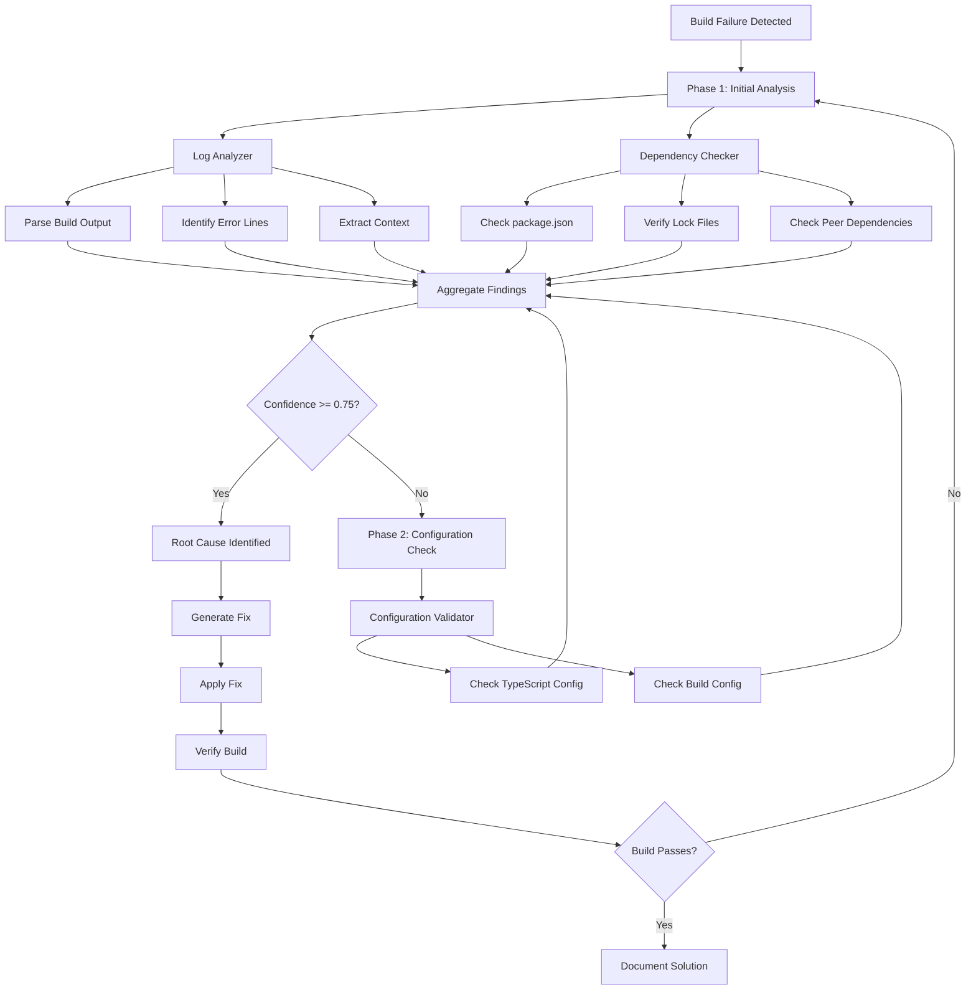
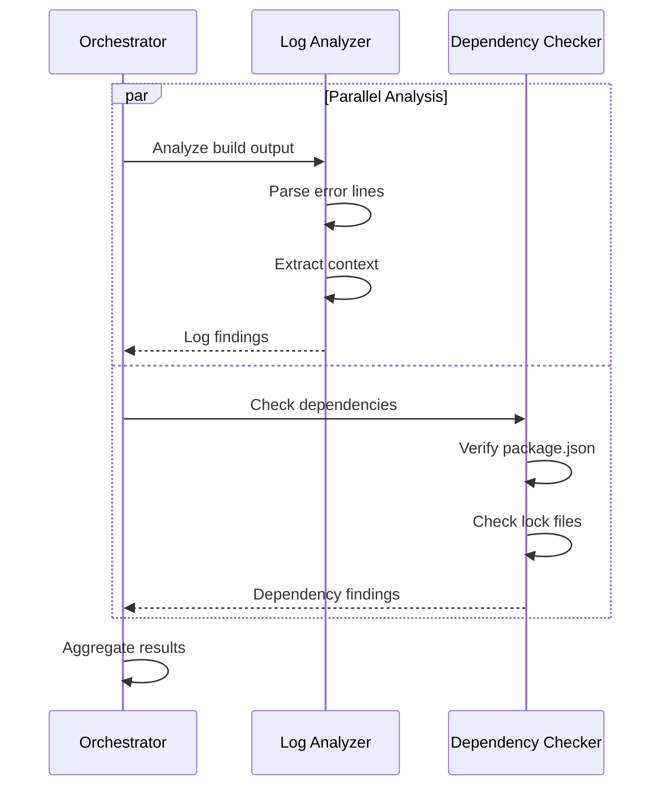

# Debug Build Workflow

**Purpose**: Build failure specific debugging workflow
**Mode**: Debug
**Related**: [`.kilocode/skills/debug/`](../skills/debug/)

---

## Overview

This workflow provides a specialized approach to debugging build and compilation failures. It coordinates Log Analyzer and Dependency Checker agents to identify root causes quickly.

## Workflow Diagram



## Trigger Conditions

| Condition                      | Priority | Description              |
| ------------------------------ | -------- | ------------------------ |
| `npm run build` exits non-zero | High     | Build command failure    |
| TypeScript compilation errors  | High     | TS errors in output      |
| Missing dependencies detected  | Medium   | Module not found errors  |
| Build timeout                  | Medium   | Build exceeds time limit |
| Memory limit exceeded          | High     | OOM during build         |

## Primary Agents

### Log Analyzer

**Role**: Analyzes build output for error patterns
**Timeout**: 60 seconds
**Retry Count**: 2

**Responsibilities**:

- Parse build output for error messages
- Identify error locations (file:line:column)
- Extract relevant context around errors
- Categorize error types

**Output Format**:

```json
{
  "agent": "log-analyzer",
  "findings": [
    {
      "category": "typescript-error",
      "file": "src/components/Header.tsx",
      "line": 42,
      "column": 15,
      "message": "Property 'title' does not exist on type 'Props'",
      "error_code": "TS2339",
      "confidence": 0.9
    }
  ],
  "confidence": 0.9
}
```

### Dependency Checker

**Role**: Validates dependency versions and compatibility
**Timeout**: 120 seconds
**Retry Count**: 1

**Responsibilities**:

- Check for version conflicts
- Identify missing dependencies
- Verify peer dependency requirements
- Check for deprecated packages

**Output Format**:

```json
{
  "agent": "dependency-checker",
  "findings": [
    {
      "category": "peer-dependency-mismatch",
      "package": "react-dom",
      "installed": "18.2.0",
      "required": ">=19.0.0",
      "required_by": "astro@5.0.0",
      "confidence": 0.95
    }
  ],
  "confidence": 0.95
}
```

## Secondary Agents

### Configuration Validator

**Role**: Validates build configuration files
**Timeout**: 30 seconds
**Retry Count**: 1

**Responsibilities**:

- Validate TypeScript configuration
- Check Astro configuration
- Verify environment variables
- Compare with reference configurations

## Common Build Error Patterns

### Pattern 1: TypeScript Errors

```
Error: src/components/Header.tsx(42,15): error TS2339: Property 'title' does not exist on type 'Props'.
```

**Analysis Steps**:

1. Log Analyzer extracts file, line, error code
2. Identify missing property or type definition
3. Check if type definition needs update

**Common Fixes**:

- Add missing property to interface
- Update type definition
- Add type assertion if appropriate

### Pattern 2: Module Not Found

```
Error: Cannot find module 'some-package' or its corresponding type declarations.
```

**Analysis Steps**:

1. Dependency Checker verifies package installation
2. Check package.json for dependency
3. Verify import path

**Common Fixes**:

- `npm install some-package`
- Add to devDependencies if types package
- Check import path spelling

### Pattern 3: Version Conflicts

```
npm ERR! Could not resolve dependency:
npm ERR! peer react@">=19" from astro@5.0.0
npm ERR! node_modules/react
npm ERR!   peer react@"^18.0.0" from some-package@1.0.0
```

**Analysis Steps**:

1. Dependency Checker identifies conflicting packages
2. Check peer dependency requirements
3. Find compatible version range

**Common Fixes**:

- Update conflicting package
- Use `--legacy-peer-deps` temporarily
- Find alternative package

### Pattern 4: Build Configuration Errors

```
Error: Invalid configuration object. Webpack has been initialized using a configuration object that does not match the API schema.
```

**Analysis Steps**:

1. Configuration Validator checks config schema
2. Compare with working configuration
3. Identify invalid options

**Common Fixes**:

- Update configuration to match API
- Remove deprecated options
- Check documentation for changes

### Pattern 5: Memory/Resource Errors

```
FATAL ERROR: Ineffective mark-compacts near heap limit Allocation failed - JavaScript heap out of memory
```

**Analysis Steps**:

1. Log Analyzer identifies memory error
2. Check build complexity
3. Review source map generation

**Common Fixes**:

- Increase Node memory: `NODE_OPTIONS="--max-old-space-size=4096"`
- Disable source maps for dev builds
- Split build into smaller chunks

## Step-by-Step Workflow

### Step 1: Capture Build Output

```bash
# Capture build output with timestamps
npm run build 2>&1 | tee evidence/{timestamp}/build-output.log

# Capture exit code
echo "Exit code: $?" >> evidence/{timestamp}/build-output.log
```

### Step 2: Run Parallel Analysis

Execute Log Analyzer and Dependency Checker in parallel:



### Step 3: Aggregate and Score

1. **Collect Agent Reports**
   - Store in `evidence/{timestamp}/agent-reports/`
   - Normalize findings format

2. **Calculate Confidence**

   ```python
   confidence = (log_confidence * 0.5) + (dep_confidence * 0.5)
   ```

3. **Cross-Validate**
   - Check if both agents point to same issue
   - Increase confidence for consensus

### Step 4: Configuration Check (if needed)

If confidence < 0.75, run Configuration Validator:

1. Check TypeScript config (`tsconfig.json`)
2. Check Astro config (`astro.config.mjs`)
3. Check environment variables
4. Compare with reference configuration

### Step 5: Generate Fix

Based on identified root cause:

````markdown
## Root Cause

[Description of the identified issue]

## Evidence

- [Evidence item 1 from Log Analyzer]
- [Evidence item 2 from Dependency Checker]

## Recommended Fix

```bash
[Commands to fix the issue]
```
````

## Verification

```bash
npm run build
```

```

### Step 6: Apply and Verify

1. Apply recommended fix
2. Run build again
3. Verify success or iterate

## Evidence Collection

### Directory Structure

```

evidence/
└── {timestamp}/
├── build-output.log
├── package-versions.json
├── agent-reports/
│ ├── log-analyzer.json
│ └── dependency-checker.json
├── aggregated-findings.json
└── root-cause-report.md

````

### Package Versions Capture

```bash
# Capture current package versions
npm list --depth=0 --json > evidence/{timestamp}/package-versions.json
````

## Confidence Threshold

**Threshold**: 0.75

**Rationale**: Build failures are usually deterministic with clear error messages. A 75% confidence threshold balances:

- Quick resolution for obvious issues
- Additional analysis for complex cases
- Avoiding false positive fixes

## Timeout Configuration

| Agent                   | Timeout | Reason                         |
| ----------------------- | ------- | ------------------------------ |
| Log Analyzer            | 60s     | Fast text processing           |
| Dependency Checker      | 120s    | May need to query npm registry |
| Configuration Validator | 30s     | Local file analysis only       |

## Error Handling

| Error Type            | Handling                                       |
| --------------------- | ---------------------------------------------- |
| Agent Timeout         | Continue with available results                |
| No Errors Found       | Check for silent failures, memory issues       |
| Multiple Root Causes  | Prioritize by confidence, address sequentially |
| Circular Dependencies | Flag for manual intervention                   |

## Related Files

- **Debug Skill**: [`.kilocode/skills/debug/SKILL.md`](../skills/debug/SKILL.md)
- **Quick Reference**: [`.kilocode/skills/debug/REFERENCE.md`](../skills/debug/REFERENCE.md)
- **Debug Workflow**: [`.kilocode/skills/debug/WORKFLOW.md`](../skills/debug/WORKFLOW.md)
- **General Debug**: [`.kilocode/workflows/debug-issue.md`](debug-issue.md)
- **Server Debug**: [`.kilocode/workflows/debug-server.md`](debug-server.md)
- **Orchestrator Template**: [`.kilocode/workflows/orchestrator-debug.md`](orchestrator-debug.md)
- **Research**: [`plans/agent-shared/parallel-debug-orchestration-research.md`](../../plans/agent-shared/parallel-debug-orchestration-research.md)
