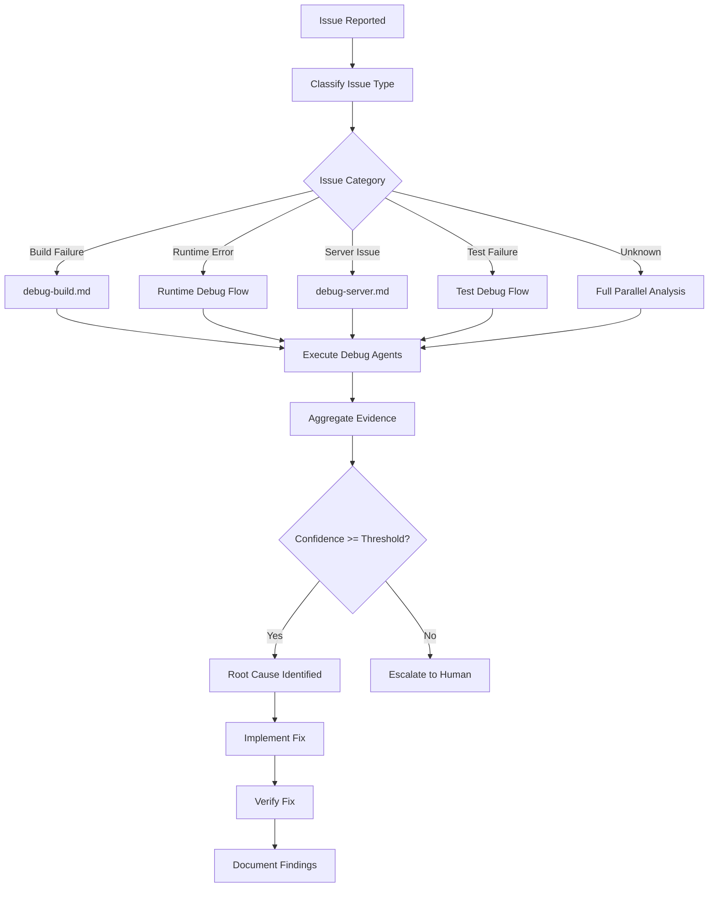
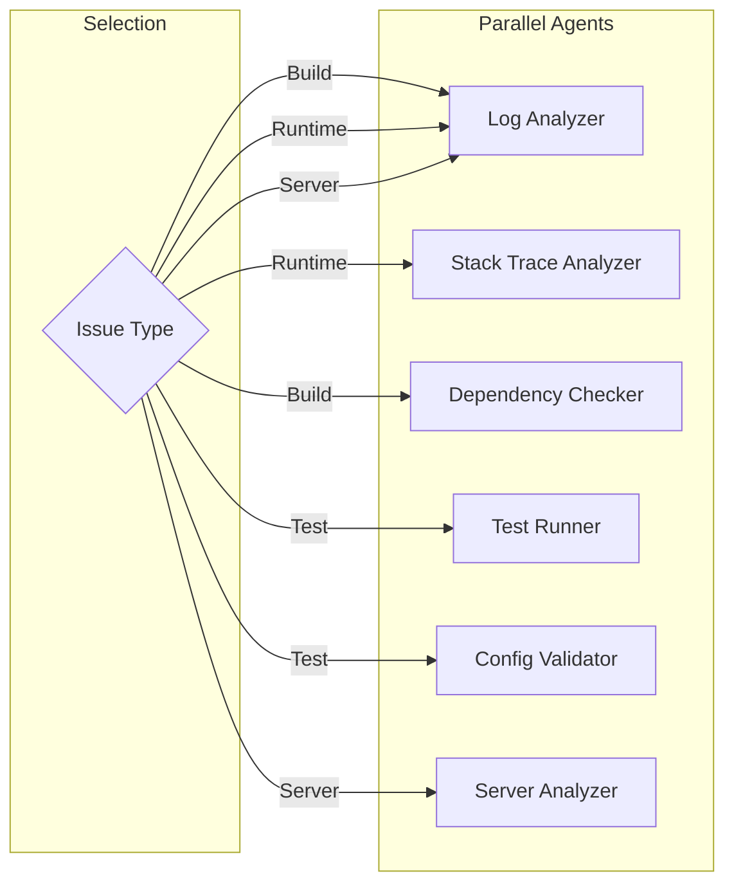

# Debug Issue Workflow

**Purpose**: General issue debugging workflow with issue classification and agent routing
**Mode**: Debug
**Related**: [`.kilocode/skills/debug/`](../skills/debug/)

---

## Overview

This workflow provides a systematic approach to debugging any type of issue. It classifies issues by type and routes them to appropriate debug agents.

## Workflow Diagram



## Issue Classification

### Classification Matrix

| Issue Type    | Indicators                                                | Primary Agents                        | Confidence Threshold |
| ------------- | --------------------------------------------------------- | ------------------------------------- | -------------------- |
| Build Failure | `npm run build` fails, TypeScript errors, missing modules | Log Analyzer + Dependency Checker     | 0.75                 |
| Runtime Error | Uncaught exceptions, process crashes, memory errors       | Stack Trace Analyzer + Log Analyzer   | 0.80                 |
| Server Issue  | Health check fails, container exits, resource limits      | Server Analyzer + Log Analyzer        | 0.85                 |
| Test Failure  | Test suite fails, assertion errors, timeout               | Test Runner + Configuration Validator | 0.70                 |
| Performance   | Slow response times, high CPU/memory usage                | Log Analyzer + Server Analyzer        | 0.70                 |
| Security      | Auth failures, suspicious patterns, vulnerabilities       | Log Analyzer + Dependency Checker     | 0.85                 |

### Classification Heuristics

```
IF error contains "build", "compile", "module not found"
  → Build Failure

IF error contains "exception", "error", "crash", "stack trace"
  → Runtime Error

IF error contains "connection refused", "timeout", "container", "service"
  → Server Issue

IF error contains "test", "assert", "expect", "spec"
  → Test Failure

IF error contains "slow", "timeout", "memory", "CPU"
  → Performance Issue

IF error contains "auth", "permission", "forbidden", "unauthorized"
  → Security Issue
```

## Step-by-Step Workflow

### Step 1: Issue Intake

1. **Gather Initial Information**
   - Error message or description
   - When the issue occurred (timestamp)
   - What was being attempted
   - Environment (dev, staging, production)

2. **Create Evidence Directory**

   ```bash
   mkdir -p evidence/{timestamp}/issue
   ```

3. **Document Initial State**
   - Save error messages to `evidence/{timestamp}/issue/error.log`
   - Record environment state
   - Note any recent changes

### Step 2: Classify Issue

1. **Analyze Error Patterns**
   - Check for known error patterns (see REFERENCE.md)
   - Identify keywords in error messages
   - Determine affected components

2. **Select Debug Path**
   - Route to specialized workflow if applicable
   - Otherwise, proceed with general analysis

### Step 3: Execute Debug Agents

Based on classification, run appropriate agents in parallel:



### Step 4: Aggregate Evidence

1. **Collect Agent Reports**
   - Each agent produces findings in standardized format
   - Store in `evidence/{timestamp}/agent-reports/`

2. **Cross-Validate Findings**
   - Look for consensus among agents
   - Identify conflicting analyses
   - Calculate confidence score

3. **Synthesize Root Cause**
   - Combine evidence from multiple sources
   - Identify most likely cause
   - Document supporting evidence

### Step 5: Report and Fix

1. **Generate Root Cause Report**

   ```markdown
   # Root Cause Analysis

   ## Issue

   [Description of the issue]

   ## Root Cause

   [Identified root cause]

   ## Evidence

   - [Evidence item 1]
   - [Evidence item 2]

   ## Confidence Score

   [0.0 - 1.0]

   ## Recommended Fix

   [Steps to fix the issue]
   ```

2. **Implement Fix** (if confidence >= threshold)
   - Apply recommended fix
   - Document changes made

3. **Verify Fix**
   - Run tests
   - Monitor for recurrence
   - Update documentation

### Step 6: Escalation (if needed)

If confidence < threshold or issue persists:

1. **Document Escalation**
   - Summarize debugging attempts
   - List all evidence gathered
   - Identify remaining unknowns

2. **Request Human Input**
   - Ask specific questions
   - Provide context for decision-making
   - Suggest next steps

## Agent Routing Details

### Build Failure Route

**Primary Agents**: Log Analyzer, Dependency Checker
**Secondary Agent**: Configuration Validator
**Workflow**: See [`debug-build.md`](debug-build.md)

### Runtime Error Route

**Primary Agents**: Stack Trace Analyzer, Log Analyzer
**Secondary Agent**: Dependency Checker
**Workflow**:

1. Parse stack trace for error location
2. Analyze logs for context
3. Check for dependency issues if indicated

### Server Issue Route

**Primary Agents**: Server Analyzer, Log Analyzer
**Secondary Agent**: Configuration Validator
**Workflow**: See [`debug-server.md`](debug-server.md)

### Test Failure Route

**Primary Agents**: Test Runner, Configuration Validator
**Secondary Agent**: Log Analyzer
**Workflow**:

1. Run failing tests in isolation
2. Check configuration differences
3. Analyze test logs for patterns

## Evidence Collection Template

```json
{
  "issue_id": "ISSUE-{timestamp}",
  "classification": "build|runtime|server|test|performance|security",
  "timestamp": "ISO-8601",
  "initial_error": "Error message or description",
  "environment": {
    "os": "operating system",
    "node_version": "Node.js version",
    "npm_version": "npm version"
  },
  "agent_reports": [
    {
      "agent": "agent-name",
      "findings": [],
      "confidence": 0.0
    }
  ],
  "aggregated_confidence": 0.0,
  "root_cause": "Identified root cause or null",
  "recommended_fix": "Fix steps or null"
}
```

## Related Files

- **Debug Skill**: [`.kilocode/skills/debug/SKILL.md`](../skills/debug/SKILL.md)
- **Quick Reference**: [`.kilocode/skills/debug/REFERENCE.md`](../skills/debug/REFERENCE.md)
- **Debug Workflow**: [`.kilocode/skills/debug/WORKFLOW.md`](../skills/debug/WORKFLOW.md)
- **Build Debug**: [`.kilocode/workflows/debug-build.md`](debug-build.md)
- **Server Debug**: [`.kilocode/workflows/debug-server.md`](debug-server.md)
- **Orchestrator Template**: [`.kilocode/workflows/orchestrator-debug.md`](orchestrator-debug.md)
- **Research**: [`plans/agent-shared/parallel-debug-orchestration-research.md`](../../plans/agent-shared/parallel-debug-orchestration-research.md)

## Confidence Thresholds

| Issue Type    | Threshold | Rationale                                        |
| ------------- | --------- | ------------------------------------------------ |
| Build Failure | 0.75      | Usually deterministic, easier to diagnose        |
| Runtime Error | 0.80      | Can have multiple causes, need higher confidence |
| Server Issue  | 0.85      | Production impact requires high confidence       |
| Test Failure  | 0.70      | Can be flaky, lower threshold acceptable         |
| Performance   | 0.70      | Often requires iterative investigation           |
| Security      | 0.85      | False positives costly, need high confidence     |

## Error Handling

| Error Type     | Handling                                      |
| -------------- | --------------------------------------------- |
| Agent Timeout  | Continue with available results, note timeout |
| Agent Failure  | Retry once, then continue without that agent  |
| No Consensus   | Escalate to human with all evidence           |
| Low Confidence | Request additional analysis or human input    |
