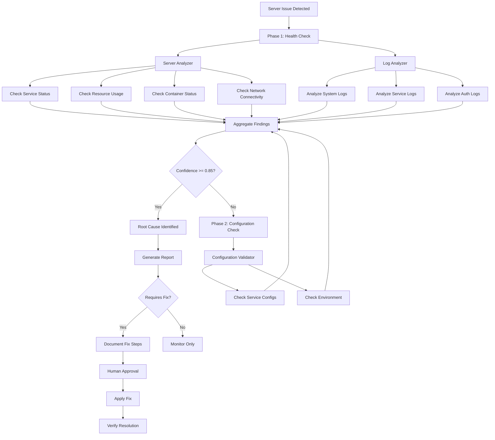
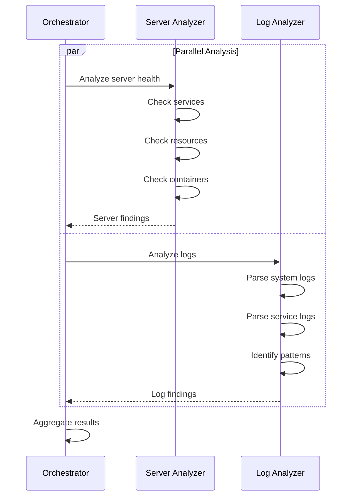

# Debug Server Workflow

**Purpose**: Server issue specific debugging workflow
**Mode**: Debug
**Related**: [`.kilocode/skills/debug/`](../skills/debug/), [`.kilocode/rules/memory-bank/servers.md`](../rules/memory-bank/servers.md)

---

## Overview

This workflow provides a specialized approach to debugging server and infrastructure issues. It coordinates Server Analyzer and Log Analyzer agents to identify root causes while respecting the server preservation rule.

## Workflow Diagram



## Trigger Conditions

| Condition                        | Priority | Description                         |
| -------------------------------- | -------- | ----------------------------------- |
| Service health check fails       | Critical | HTTP 5xx, connection refused        |
| Container exits unexpectedly     | Critical | Docker exit code != 0               |
| Resource usage exceeds threshold | High     | CPU > 90%, Memory > 90%, Disk > 85% |
| Network connectivity issues      | High     | DNS failures, timeout errors        |
| SSL certificate issues           | High     | Expired or invalid certificates     |
| Authentication failures          | Medium   | SSH, API auth failures              |

## Server Infrastructure Reference

### Server Inventory

| Server   | IP           | Purpose            | Primary Services                            |
| -------- | ------------ | ------------------ | ------------------------------------------- |
| server60 | 192.168.1.60 | Infrastructure/VPS | PM2, Nginx, Docker                          |
| server61 | 192.168.1.61 | Gateway/Traefik    | Traefik, Nginx, Docker, MariaDB, PostgreSQL |
| server62 | 192.168.1.62 | Production/Web     | PM2, Nginx, Docker, Portfolio               |

### Access Methods

| Method                  | Status     | Usage                            |
| ----------------------- | ---------- | -------------------------------- |
| Tailscale VPN (port 20) | ✅ Primary | `ssh -p 20 admin@100.91.164.109` |
| Internal Network        | ✅ Backup  | `ssh -p 226X admin@192.168.1.6X` |

### Log Locations

| Log Type        | Path                            |
| --------------- | ------------------------------- |
| Nginx Access    | `/var/log/nginx/access.log`     |
| Nginx Error     | `/var/log/nginx/error.log`      |
| PM2 Application | `/var/www/portfolio/.pm2/logs/` |
| System Auth     | `/var/log/auth.log`             |
| Docker          | `docker logs <container>`       |
| System Journal  | `journalctl -u <service>`       |

## Primary Agents

### Server Analyzer

**Role**: Analyzes server health and infrastructure status
**Timeout**: 90 seconds
**Retry Count**: 2
**Constraints**: READ-ONLY operations only

**Responsibilities**:

- Check service status (systemctl)
- Check resource usage (CPU, memory, disk)
- Check container status (Docker)
- Check network connectivity
- Verify SSL certificates

**Allowed Commands**:

```bash
# Service status
systemctl status <service>
systemctl list-units --type=service --state=failed

# Resource usage
top -bn1 | head -20
df -h
free -m

# Docker status
docker ps -a
docker stats --no-stream
docker inspect <container>

# Network
netstat -tlnp
ss -tlnp
ping -c 3 <host>
curl -I <url>

# SSL
openssl s_client -connect <host>:443 -servername <host> 2>/dev/null | openssl x509 -noout -dates
```

**Prohibited Commands** (per Server Preservation Rule):

- `docker rm`, `docker rmi`, `docker prune`
- `systemctl stop`, `systemctl disable`
- `rm`, `del`, `erase`
- Any cleanup/remove/delete operations

**Output Format**:

```json
{
  "agent": "server-analyzer",
  "server": "server61",
  "timestamp": "2026-02-14T12:00:00Z",
  "findings": [
    {
      "category": "disk-usage",
      "severity": "critical",
      "metric": "88%",
      "threshold": "85%",
      "message": "Disk usage at 88% on /dev/sda1",
      "confidence": 0.95
    },
    {
      "category": "container-status",
      "container": "dash-prometheus-1",
      "status": "exited",
      "exit_code": 255,
      "uptime": "7+ days stopped",
      "confidence": 0.9
    }
  ],
  "confidence": 0.92
}
```

### Log Analyzer

**Role**: Analyzes server logs for error patterns
**Timeout**: 60 seconds
**Retry Count**: 2

**Responsibilities**:

- Parse system logs for errors
- Parse service-specific logs
- Identify error patterns and anomalies
- Correlate events across log sources

**Log Analysis Commands**:

```bash
# System logs
journalctl -p err -n 100 --no-pager
journalctl -u nginx -n 100 --no-pager
journalctl -u docker --since "1 hour ago"

# Nginx logs
tail -n 100 /var/log/nginx/error.log
grep -E "(error|crit|alert)" /var/log/nginx/error.log | tail -50

# Docker logs
docker logs --tail 100 <container> 2>&1

# Auth logs
grep -E "(Failed|Invalid|refused)" /var/log/auth.log | tail -50
```

**Output Format**:

```json
{
  "agent": "log-analyzer",
  "server": "server61",
  "timestamp": "2026-02-14T12:00:00Z",
  "findings": [
    {
      "category": "service-error",
      "service": "nginx",
      "pattern": "connection refused",
      "count": 15,
      "first_occurrence": "2026-02-14T11:30:00Z",
      "last_occurrence": "2026-02-14T11:45:00Z",
      "sample": "2026/02/14 11:30:15 [error] 1234#0: *56 connect() failed (111: Connection refused)",
      "confidence": 0.85
    }
  ],
  "confidence": 0.85
}
```

## Secondary Agents

### Configuration Validator

**Role**: Validates server configuration files
**Timeout**: 30 seconds
**Retry Count**: 1

**Responsibilities**:

- Validate Nginx configuration
- Check Docker compose files
- Verify environment variables
- Compare with reference configurations

## Common Server Issue Patterns

### Pattern 1: High Disk Usage

**Symptoms**:

- Disk usage > 85%
- Write failures in logs
- Service degradation

**Analysis Steps**:

1. Server Analyzer checks `df -h`
2. Identify large directories: `du -sh /* | sort -hr | head -10`
3. Check Docker images: `docker system df`
4. Check log file sizes

**Common Causes**:

- Docker images/containers accumulation
- Log file growth
- Temporary files not cleaned
- Database growth

**Resolution** (requires human approval):

```bash
# Check what's using space
du -sh /var/log/* | sort -hr | head -10
docker system df

# Safe cleanup (requires approval)
# docker system prune -f  # Only with explicit approval
# journalctl --vacuum-time=7d  # Only with explicit approval
```

### Pattern 2: Container Failures

**Symptoms**:

- Container status: Exited
- Exit code != 0
- Service unavailable

**Analysis Steps**:

1. Server Analyzer checks `docker ps -a`
2. Log Analyzer checks `docker logs <container>`
3. Check container configuration
4. Verify dependencies

**Common Causes**:

- Missing environment variables
- Port conflicts
- Resource limits exceeded
- Dependency service down

**Resolution**:

```bash
# Read-only investigation
docker inspect <container>
docker logs --tail 100 <container>

# Restart requires approval
# docker restart <container>
```

### Pattern 3: Service Connection Refused

**Symptoms**:

- "Connection refused" in logs
- Service not listening on expected port
- Health check failures

**Analysis Steps**:

1. Server Analyzer checks `netstat -tlnp`
2. Check service status: `systemctl status <service>`
3. Log Analyzer checks service logs
4. Verify service configuration

**Common Causes**:

- Service not running
- Wrong port configuration
- Firewall blocking
- Service crashed

**Resolution**:

```bash
# Check if service is running
systemctl status nginx
netstat -tlnp | grep 80

# Check service logs
journalctl -u nginx -n 50
```

### Pattern 4: Memory Exhaustion

**Symptoms**:

- OOM killer in logs
- Process killed messages
- System unresponsive

**Analysis Steps**:

1. Server Analyzer checks `free -m`
2. Check top memory consumers: `ps aux --sort=-%mem | head -10`
3. Log Analyzer checks for OOM messages
4. Check container memory limits

**Common Causes**:

- Memory leak in application
- Undersized container limits
- Too many concurrent processes
- Large data processing

**Resolution**:

```bash
# Check memory usage
free -m
ps aux --sort=-%mem | head -10

# Check container limits
docker stats --no-stream
```

### Pattern 5: SSL Certificate Issues

**Symptoms**:

- Certificate expired errors
- Browser warnings
- HTTPS connection failures

**Analysis Steps**:

1. Check certificate dates: `openssl s_client ...`
2. Verify certificate chain
3. Check Let's Encrypt renewal status
4. Check certificate files

**Common Causes**:

- Certificate expired
- Renewal failed
- Wrong certificate path
- Incomplete certificate chain

## Step-by-Step Workflow

### Step 1: Issue Detection

1. **Identify Affected Server**
   - Determine which server has the issue
   - Check if issue affects multiple servers

2. **Create Evidence Directory**

   ```bash
   mkdir -p evidence/{timestamp}/server-{id}
   ```

3. **Document Initial State**
   - Record issue symptoms
   - Note time of detection
   - Identify affected services

### Step 2: Parallel Analysis

Execute Server Analyzer and Log Analyzer in parallel:



### Step 3: Evidence Collection

1. **Capture System State**

   ```bash
   # Save to evidence directory
   docker ps -a > evidence/{timestamp}/server-{id}/docker-ps.txt
   df -h > evidence/{timestamp}/server-{id}/disk-usage.txt
   free -m > evidence/{timestamp}/server-{id}/memory-usage.txt
   systemctl list-units --state=failed > evidence/{timestamp}/server-{id}/failed-services.txt
   ```

2. **Capture Logs**
   ```bash
   journalctl -p err -n 100 > evidence/{timestamp}/server-{id}/system-errors.log
   docker logs --tail 100 <container> > evidence/{timestamp}/server-{id}/container-{name}.log
   ```

### Step 4: Aggregate and Score

1. **Collect Agent Reports**
   - Store in `evidence/{timestamp}/agent-reports/`

2. **Calculate Confidence**

   ```python
   confidence = (server_confidence * 0.55) + (log_confidence * 0.45)
   ```

3. **Cross-Validate**
   - Check if both agents identify related issues
   - Increase confidence for correlated findings

### Step 5: Configuration Check (if needed)

If confidence < 0.85, run Configuration Validator:

1. Check service configuration files
2. Verify environment variables
3. Compare with reference configuration
4. Check for recent changes

### Step 6: Report and Recommend

1. **Generate Root Cause Report**

   ```markdown
   # Server Issue Analysis

   ## Server

   [server-id]

   ## Issue

   [Description of the issue]

   ## Root Cause

   [Identified root cause]

   ## Evidence

   - [Evidence item 1]
   - [Evidence item 2]

   ## Confidence Score

   [0.0 - 1.0]

   ## Recommended Actions

   1. [Action 1]
   2. [Action 2]

   ## ⚠️ Approval Required

   The following actions require explicit approval:

   - [Action requiring approval]
   ```

2. **Request Approval for Fixes**
   - Document proposed changes
   - Get explicit user approval
   - Apply changes only after approval

## Server Preservation Compliance

### Always Allowed (Read-Only)

- `docker ps`, `docker inspect`, `docker logs`
- `systemctl status`
- `journalctl`
- `cat`, `less`, `tail`, `head`
- `df`, `du`, `free`, `top`
- `netstat`, `ss`, `ping`, `curl`

### Requires Approval

- `docker restart`, `docker start`, `docker stop`
- `systemctl restart`, `systemctl start`
- Any configuration changes
- Any cleanup operations

### Never Allowed

- `docker rm`, `docker rmi`, `docker prune`
- `systemctl disable`
- `rm`, `del`, `erase`
- Any destructive operations

## Confidence Threshold

**Threshold**: 0.85

**Rationale**: Server issues can have significant production impact. A higher threshold (85%) ensures:

- Reduced risk of incorrect fixes
- Better confidence in root cause
- Appropriate escalation for uncertain cases

## Timeout Configuration

| Agent                   | Timeout | Reason                          |
| ----------------------- | ------- | ------------------------------- |
| Server Analyzer         | 90s     | Multiple system checks required |
| Log Analyzer            | 60s     | Log parsing can be intensive    |
| Configuration Validator | 30s     | Local file analysis only        |

## Related Files

- **Debug Skill**: [`.kilocode/skills/debug/SKILL.md`](../skills/debug/SKILL.md)
- **Quick Reference**: [`.kilocode/skills/debug/REFERENCE.md`](../skills/debug/REFERENCE.md)
- **Debug Workflow**: [`.kilocode/skills/debug/WORKFLOW.md`](../skills/debug/WORKFLOW.md)
- **General Debug**: [`.kilocode/workflows/debug-issue.md`](debug-issue.md)
- **Build Debug**: [`.kilocode/workflows/debug-build.md`](debug-build.md)
- **Orchestrator Template**: [`.kilocode/workflows/orchestrator-debug.md`](orchestrator-debug.md)
- **Server Infrastructure**: [`.kilocode/rules/memory-bank/servers.md`](../rules/memory-bank/servers.md)
- **Server Preservation Rule**: [`.kilocode/rules-code/server-preservation.md`](../rules-code/server-preservation.md)
- **Research**: [`plans/agent-shared/parallel-debug-orchestration-research.md`](../../plans/agent-shared/parallel-debug-orchestration-research.md)
