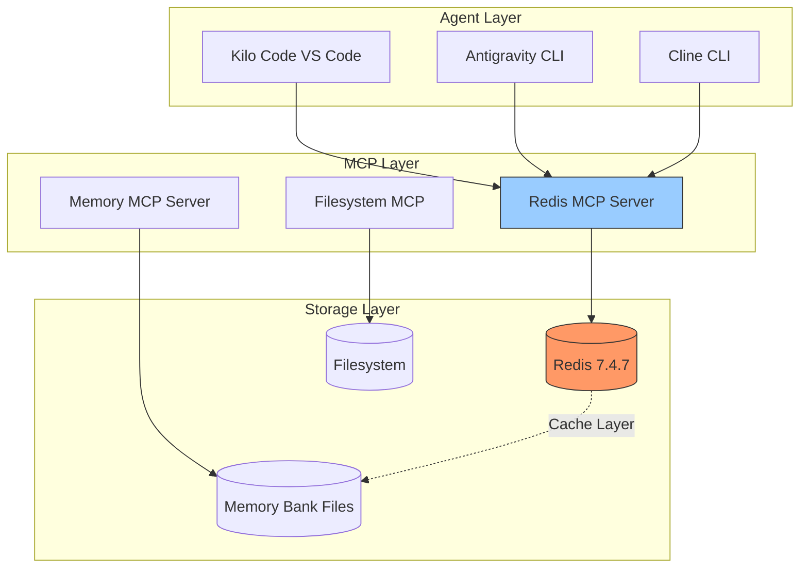

# Redis Integration for Agent Context Optimization

## Overview

### Purpose

Redis integration enables AI agents to maintain persistent context across sessions, overcoming the fundamental limitation of LLM memory resets. This implementation provides a high-performance, low-latency key-value store for caching agent state, conversation history, and task progress.

### Key Benefits

- **Session Persistence**: Store conversation context between sessions
- **Memory Bank Caching**: Cache frequently accessed memory bank data for faster retrieval
- **Task State Tracking**: Monitor ongoing task progress and resume interrupted work
- **Agent Coordination**: Share state between multiple agents working on the same project
- **Rate Limiting**: Track API usage for external services to prevent quota exhaustion

### Architecture Diagram



## Configuration

### Redis MCP Server Configuration

The Redis MCP server is configured in [`.kilocode/mcp.json`](.kilocode/mcp.json):

```json
{
  "mcpServers": {
    "redis": {
      "command": "node",
      "args": [".kilocode/mcp-servers/redis-server.js"],
      "env": {
        "REDIS_URL": "${REDIS_URL}",
        "UPSTASH_REDIS_REST_URL": "${UPSTASH_REDIS_REST_URL}",
        "UPSTASH_REDIS_REST_TOKEN": "${UPSTASH_REDIS_REST_TOKEN}"
      },
      "description": "Redis for caching and context storage - requires REDIS_URL or Upstash credentials",
      "alwaysAllow": [
        "redis_get",
        "redis_set",
        "redis_del",
        "redis_keys",
        "redis_exists",
        "redis_ttl",
        "redis_expire",
        "redis_ping"
      ]
    }
  }
}
```

### Environment Variables

| Variable                   | Purpose                      | Required         | Example                  |
| -------------------------- | ---------------------------- | ---------------- | ------------------------ |
| `REDIS_URL`                | Local Redis connection URL   | One of           | `redis://localhost:6379` |
| `UPSTASH_REDIS_REST_URL`   | Upstash cloud Redis URL      | One of           | `https://xxx.upstash.io` |
| `UPSTASH_REDIS_REST_TOKEN` | Upstash authentication token | With Upstash URL | `xxxxxx...`              |

### Docker Container Setup

The `shared-redis` container runs on the local Docker instance:

```bash
# Check Redis container status
docker ps --filter name=shared-redis

# Start Redis container if not running
docker run -d --name shared-redis -p 6379:6379 redis:7.4.7

# Test connection
docker exec shared-redis redis-cli ping
# Expected output: PONG
```

### Connection Priority

The Redis MCP server uses the following priority for connections:

1. **Upstash Redis** (if `UPSTASH_REDIS_REST_URL` and `UPSTASH_REDIS_REST_TOKEN` are set)
2. **Local Redis** (if `REDIS_URL` is set)
3. **Error** (if neither is configured)

## Available Tools

### Tool Summary

| Tool           | Description                | Parameters                                 | Returns                |
| -------------- | -------------------------- | ------------------------------------------ | ---------------------- |
| `redis_get`    | Retrieve value by key      | `key: string`                              | Value string or empty  |
| `redis_set`    | Store key-value pair       | `key: string, value: string, ttl?: number` | `OK`                   |
| `redis_del`    | Delete key(s)              | `keys: string[]`                           | Count of deleted keys  |
| `redis_keys`   | Find keys matching pattern | `pattern: string`                          | JSON array of keys     |
| `redis_exists` | Check if key(s) exist      | `keys: string[]`                           | Count of existing keys |
| `redis_ttl`    | Get remaining TTL          | `key: string`                              | Seconds or -1/-2       |
| `redis_expire` | Set TTL on existing key    | `key: string, seconds: number`             | `OK` or `Failed`       |
| `redis_ping`   | Test connection            | None                                       | `PONG`                 |

### Tool Details

#### redis_get

Retrieves a value from Redis by key.

```javascript
// Parameters
{
  "key": "agent:context:session123"
}

// Response
{
  "content": [{ "type": "text", "text": "{\"lastTask\":\"implement-feature\",\"progress\":75}" }]
}
```

**Returns**: Empty string if key does not exist.

#### redis_set

Stores a key-value pair with optional TTL (time-to-live).

```javascript
// Parameters - Without TTL
{
  "key": "agent:context:session123",
  "value": "{\"lastTask\":\"implement-feature\",\"progress\":75}"
}

// Parameters - With TTL (1 hour)
{
  "key": "agent:context:session123",
  "value": "{\"lastTask\":\"implement-feature\",\"progress\":75}",
  "ttl": 3600
}

// Response
{
  "content": [{ "type": "text", "text": "OK" }]
}
```

#### redis_del

Deletes one or more keys from Redis.

```javascript
// Parameters
{
  "keys": ["agent:context:session123", "agent:temp:data"]
}

// Response
{
  "content": [{ "type": "text", "text": "Deleted 2 key(s)" }]
}
```

#### redis_keys

Finds all keys matching a pattern.

```javascript
// Parameters
{
  "pattern": "agent:context:*"
}

// Response
{
  "content": [{ "type": "text", "text": "[\"agent:context:session123\",\"agent:context:session456\"]" }]
}
```

**Warning**: Use sparingly on large datasets as `KEYS` is O(N).

#### redis_exists

Checks if one or more keys exist.

```javascript
// Parameters
{
  "keys": ["agent:context:session123", "agent:config:main"]
}

// Response
{
  "content": [{ "type": "text", "text": "2" }]
}
```

**Returns**: Count of existing keys (0 if none exist).

#### redis_ttl

Gets the remaining time-to-live for a key.

```javascript
// Parameters
{
  "key": "agent:context:session123"
}

// Response
{
  "content": [{ "type": "text", "text": "3540" }]
}
```

**Returns**:

- Positive integer: Seconds remaining
- `-1`: Key exists but has no expiry
- `-2`: Key does not exist

#### redis_expire

Sets or updates the TTL on an existing key.

```javascript
// Parameters
{
  "key": "agent:context:session123",
  "seconds": 7200
}

// Response
{
  "content": [{ "type": "text", "text": "OK" }]
}
```

#### redis_ping

Tests the Redis connection.

```javascript
// Parameters
{}

// Response
{
  "content": [{ "type": "text", "text": "PONG" }]
}
```

## Use Cases for Agent Context

### Session Persistence

Store conversation context between sessions to enable seamless task resumption.

```javascript
// Store session context at end of session
const sessionContext = {
  sessionId: 'session-2026-02-13-001',
  lastTask: 'implement-redis-docs',
  currentStep: 'writing-troubleshooting-section',
  pendingActions: ['add-examples', 'review-formatting'],
  conversationSummary: 'User requested Redis integration documentation...',
  timestamp: new Date().toISOString(),
};

await redis_set(
  'agent:context:session-2026-02-13-001',
  JSON.stringify(sessionContext),
  86400 // 24 hours TTL
);

// Retrieve context at start of new session
const storedContext = await redis_get('agent:context:session-2026-02-13-001');
if (storedContext) {
  const context = JSON.parse(storedContext);
  // Resume from where we left off
}
```

### Memory Bank Caching

Cache frequently accessed memory bank data to reduce file I/O.

```javascript
// Cache memory bank index
const memoryBankIndex = {
  files: ['brief.md', 'product.md', 'context.md', 'architecture.md', 'tech.md'],
  lastUpdated: '2026-02-13T04:00:00Z',
  projectPhase: 'Configuration',
};

await redis_set(
  'cache:memory-bank:index',
  JSON.stringify(memoryBankIndex),
  3600 // 1 hour TTL
);

// Check cache before reading files
const cachedIndex = await redis_get('cache:memory-bank:index');
if (cachedIndex) {
  return JSON.parse(cachedIndex);
}
// Fallback to file reading if cache miss
```

### Task State Tracking

Track ongoing task progress for resumability.

```javascript
// Initialize task state
await redis_set(
  'task:progress:implement-redis-docs',
  JSON.stringify({
    taskId: 'implement-redis-docs',
    status: 'in_progress',
    steps: [
      { name: 'gather-context', status: 'completed' },
      { name: 'create-documentation', status: 'in_progress' },
      { name: 'review-documentation', status: 'pending' },
    ],
    currentStep: 'create-documentation',
    percentComplete: 50,
    startedAt: '2026-02-13T04:00:00Z',
    lastUpdated: '2026-02-13T04:15:00Z',
  }),
  172800 // 48 hours TTL
);

// Update progress
const taskState = JSON.parse(await redis_get('task:progress:implement-redis-docs'));
taskState.steps[1].status = 'completed';
taskState.currentStep = 'review-documentation';
taskState.percentComplete = 75;
taskState.lastUpdated = new Date().toISOString();
await redis_set('task:progress:implement-redis-docs', JSON.stringify(taskState), 172800);
```

### Agent Coordination

Share state between multiple agents working on the same project.

```javascript
// Agent 1: Kilo Code stores its current focus
await redis_set(
  'agent:status:kilocode',
  JSON.stringify({
    mode: 'architect',
    currentTask: 'planning-redis-integration',
    filesOpen: ['redis-integration.md', 'mcp.json'],
    lastActivity: new Date().toISOString(),
  }),
  300 // 5 minutes TTL - auto-expires if agent goes inactive
);

// Agent 2: Antigravity checks for conflicts
const otherAgents = await redis_keys('agent:status:*');
for (const agentKey of otherAgents) {
  const agentStatus = JSON.parse(await redis_get(agentKey));
  // Check for file conflicts or coordinate work
}
```

### Rate Limiting

Track API usage for external services to prevent quota exhaustion.

```javascript
// Check rate limit before API call
const rateLimitKey = 'ratelimit:firecrawl:daily';
const currentUsage = parseInt((await redis_get(rateLimitKey)) || '0');

if (currentUsage >= 100) {
  throw new Error('Daily Firecrawl API limit reached');
}

// Increment usage after successful API call
await redis_set(rateLimitKey, String(currentUsage + 1), 86400); // 24 hour TTL

// Or use atomic increment with TTL
const newCount = await redis.incr(rateLimitKey);
if (newCount === 1) {
  await redis_expire(rateLimitKey, 86400);
}
```

## Best Practices

### Key Naming Conventions

Use consistent, hierarchical key naming with colons as separators:

| Pattern                        | Purpose                 | Example                                |
| ------------------------------ | ----------------------- | -------------------------------------- |
| `agent:context:{session_id}`   | Session context storage | `agent:context:session-2026-02-13-001` |
| `agent:status:{agent_name}`    | Agent activity status   | `agent:status:kilocode`                |
| `cache:memory-bank:{type}`     | Memory bank cache       | `cache:memory-bank:index`              |
| `task:progress:{task_id}`      | Task state tracking     | `task:progress:implement-redis-docs`   |
| `ratelimit:{service}:{period}` | API rate limiting       | `ratelimit:firecrawl:daily`            |
| `temp:{purpose}:{id}`          | Temporary data          | `temp:upload:abc123`                   |

### TTL Recommendations

| Data Type           | Recommended TTL    | Rationale                          |
| ------------------- | ------------------ | ---------------------------------- |
| Session context     | 24 hours (86400s)  | Long enough for multi-day work     |
| Memory bank cache   | 1 hour (3600s)     | Balance freshness vs performance   |
| Task progress       | 48 hours (172800s) | Allow weekend breaks               |
| Agent status        | 5 minutes (300s)   | Quick detection of inactive agents |
| Rate limit counters | Period length      | Match the rate limit window        |
| Temporary data      | 1 hour (3600s)     | Auto-cleanup for transient data    |

### Error Handling Patterns

Always handle potential Redis errors gracefully:

```javascript
// Recommended pattern for Redis operations
async function safeRedisGet(key) {
  try {
    const value = await redis_get(key);
    if (!value) {
      console.warn(`Redis key not found: ${key}`);
      return null;
    }
    return JSON.parse(value);
  } catch (error) {
    console.error(`Redis get failed for ${key}:`, error);
    // Fallback to alternative storage or return default
    return null;
  }
}

async function safeRedisSet(key, value, ttl) {
  try {
    const serialized = JSON.stringify(value);
    const result = await redis_set(key, serialized, ttl);
    return result === 'OK';
  } catch (error) {
    console.error(`Redis set failed for ${key}:`, error);
    return false;
  }
}
```

### Security Considerations

1. **No Sensitive Data**: Never store API keys, passwords, or PII in Redis
2. **Environment Variables**: Keep `REDIS_URL` and tokens in `.env` files
3. **TTL for Everything**: Always set TTL to prevent indefinite data accumulation
4. **Namespace Isolation**: Use project-specific prefixes in multi-project environments
5. **Access Control**: Redis container should not be exposed to public networks

## Troubleshooting

### WSL2 Port Conflict Issue

**Symptom**: Node.js ioredis connection fails with `NOAUTH Authentication required`

**Root Cause**:

- WSL2 Redis relay listens on `127.0.0.1:6379` requiring authentication
- Docker Redis listens on `0.0.0.0:6379` without authentication
- Node.js ioredis defaults to `127.0.0.1:6379` (WSL2 relay)

**Resolution Options**:

1. **Use Docker CLI** (current workaround):

   ```bash
   docker exec shared-redis redis-cli SET test:key "value"
   docker exec shared-redis redis-cli GET test:key
   ```

2. **Configure explicit host** (recommended fix):

   ```javascript
   // In redis-server.js, change connection to:
   const redis = new Redis({
     host: '0.0.0.0', // Explicitly use Docker interface
     port: 6379,
     maxRetriesPerRequest: 3,
   });
   ```

3. **Use Upstash Redis** (cloud alternative):
   ```bash
   # Set environment variables
   export UPSTASH_REDIS_REST_URL="https://xxx.upstash.io"
   export UPSTASH_REDIS_REST_TOKEN="your-token"
   ```

### Connection Timeout Handling

**Symptom**: Redis operations timeout or hang

**Diagnosis**:

```bash
# Check if Redis container is running
docker ps --filter name=shared-redis

# Check Redis responsiveness
docker exec shared-redis redis-cli ping

# Check Redis info
docker exec shared-redis redis-cli info server
```

**Resolution**:

```bash
# Restart Redis container
docker restart shared-redis

# If container doesn't exist, create it
docker run -d --name shared-redis -p 6379:6379 redis:7.4.7
```

### Docker Container Management Commands

```bash
# View Redis logs
docker logs shared-redis --tail 50

# Check container status
docker inspect shared-redis --format '{{.State.Status}}'

# Access Redis CLI
docker exec -it shared-redis redis-cli

# Monitor Redis commands in real-time
docker exec -it shared-redis redis-cli monitor

# Check memory usage
docker exec shared-redis redis-cli info memory

# Flush all data (dangerous!)
docker exec shared-redis redis-cli FLUSHALL

# Backup Redis data
docker exec shared-redis redis-cli BGSAVE
docker cp shared-redis:/data/dump.rdb ./redis-backup-$(date +%Y%m%d).rdb
```

### Verification Status

Based on MCP verification results from [`plans/mcp-verification-results.md`](plans/mcp-verification-results.md):

| Component             | Status     | Notes                         |
| --------------------- | ---------- | ----------------------------- |
| Redis Docker CLI      | ✅ PASS    | All CRUD operations working   |
| Redis Node.js ioredis | ❌ FAIL    | WSL2 port conflict            |
| Redis MCP Server      | ⚠️ PARTIAL | Depends on ioredis connection |

**Current Workaround**: Use Docker CLI commands for Redis operations until Node.js connection is fixed.

## Integration Examples

### Complete Session Management Example

```javascript
// Initialize new session
async function initializeSession(sessionId) {
  const context = {
    sessionId,
    createdAt: new Date().toISOString(),
    tasks: [],
    conversationHistory: [],
  };
  await redis_set(
    `agent:context:${sessionId}`,
    JSON.stringify(context),
    86400 // 24 hours
  );
  return context;
}

// Add conversation turn
async function addConversationTurn(sessionId, role, message) {
  const contextJson = await redis_get(`agent:context:${sessionId}`);
  if (!contextJson) return null;

  const context = JSON.parse(contextJson);
  context.conversationHistory.push({
    role,
    message,
    timestamp: new Date().toISOString(),
  });
  context.lastActivity = new Date().toISOString();

  await redis_set(`agent:context:${sessionId}`, JSON.stringify(context), 86400);
  return context;
}

// End session and archive
async function endSession(sessionId) {
  const contextJson = await redis_get(`agent:context:${sessionId}`);
  if (contextJson) {
    // Archive to filesystem for long-term storage
    const archivePath = `.kilocode/sessions/${sessionId}.json`;
    // ... write to filesystem ...

    // Delete from Redis
    await redis_del([`agent:context:${sessionId}`]);
  }
}
```

### Task Progress Tracking Example

```javascript
// Task state machine
const TASK_STATES = {
  PENDING: 'pending',
  IN_PROGRESS: 'in_progress',
  BLOCKED: 'blocked',
  COMPLETED: 'completed',
  FAILED: 'failed',
};

async function createTask(taskId, steps) {
  const task = {
    taskId,
    status: TASK_STATES.PENDING,
    steps: steps.map((step) => ({ name: step, status: TASK_STATES.PENDING })),
    currentStepIndex: 0,
    createdAt: new Date().toISOString(),
    updatedAt: new Date().toISOString(),
  };

  await redis_set(
    `task:progress:${taskId}`,
    JSON.stringify(task),
    172800 // 48 hours
  );
  return task;
}

async function advanceTask(taskId) {
  const taskJson = await redis_get(`task:progress:${taskId}`);
  if (!taskJson) throw new Error('Task not found');

  const task = JSON.parse(taskJson);

  // Mark current step complete
  task.steps[task.currentStepIndex].status = TASK_STATES.COMPLETED;
  task.currentStepIndex++;

  // Update task status
  if (task.currentStepIndex >= task.steps.length) {
    task.status = TASK_STATES.COMPLETED;
  } else {
    task.steps[task.currentStepIndex].status = TASK_STATES.IN_PROGRESS;
    task.status = TASK_STATES.IN_PROGRESS;
  }

  task.updatedAt = new Date().toISOString();

  await redis_set(`task:progress:${taskId}`, JSON.stringify(task), 172800);
  return task;
}

async function getTaskProgress(taskId) {
  const taskJson = await redis_get(`task:progress:${taskId}`);
  if (!taskJson) return null;

  const task = JSON.parse(taskJson);
  const completedSteps = task.steps.filter((s) => s.status === TASK_STATES.COMPLETED).length;

  return {
    taskId: task.taskId,
    status: task.status,
    percentComplete: Math.round((completedSteps / task.steps.length) * 100),
    currentStep: task.steps[task.currentStepIndex]?.name || 'completed',
    totalSteps: task.steps.length,
    completedSteps,
  };
}
```

### Multi-Agent Coordination Example

```javascript
// Register agent presence
async function registerAgent(agentName, capabilities) {
  const status = {
    agent: agentName,
    capabilities,
    mode: 'active',
    currentTask: null,
    startedAt: new Date().toISOString(),
    lastHeartbeat: new Date().toISOString(),
  };

  await redis_set(
    `agent:status:${agentName}`,
    JSON.stringify(status),
    300 // 5 minutes - must heartbeat to stay active
  );
}

// Send heartbeat
async function heartbeat(agentName, currentTask = null) {
  const statusJson = await redis_get(`agent:status:${agentName}`);
  if (!statusJson) {
    throw new Error('Agent not registered');
  }

  const status = JSON.parse(statusJson);
  status.lastHeartbeat = new Date().toISOString();
  status.currentTask = currentTask;

  await redis_set(`agent:status:${agentName}`, JSON.stringify(status), 300);
}

// Check for active agents
async function getActiveAgents() {
  const agentKeys = await redis_keys('agent:status:*');
  const agents = [];

  for (const key of agentKeys) {
    const statusJson = await redis_get(key);
    if (statusJson) {
      const status = JSON.parse(statusJson);
      const lastHeartbeat = new Date(status.lastHeartbeat);
      const secondsSinceHeartbeat = (Date.now() - lastHeartbeat.getTime()) / 1000;

      if (secondsSinceHeartbeat < 300) {
        agents.push(status);
      }
    }
  }

  return agents;
}

// Request exclusive lock on a resource
async function acquireLock(agentName, resourceId, ttl = 60) {
  const lockKey = `lock:${resourceId}`;
  const existingLock = await redis_get(lockKey);

  if (existingLock && existingLock !== agentName) {
    return { acquired: false, heldBy: existingLock };
  }

  await redis_set(lockKey, agentName, ttl);
  return { acquired: true };
}

async function releaseLock(agentName, resourceId) {
  const lockKey = `lock:${resourceId}`;
  const existingLock = await redis_get(lockKey);

  if (existingLock === agentName) {
    await redis_del([lockKey]);
    return true;
  }
  return false;
}
```

---

## Related Documentation

- [MCP Verification Results](plans/mcp-verification-results.md) - Detailed test results
- [MCP Verification Checklist](plans/mcp-verification-checklist.md) - Test procedures
- [Memory Bank Documentation](.kilocode/rules/memory-bank-instructions.md) - Persistent context system
- [Server Infrastructure](.kilocode/rules/memory-bank/servers.md) - Server61 Redis service

## Version History

| Version | Date       | Changes                       |
| ------- | ---------- | ----------------------------- |
| 1.0.0   | 2026-02-13 | Initial documentation created |

---

_Last updated: 2026-02-13_
