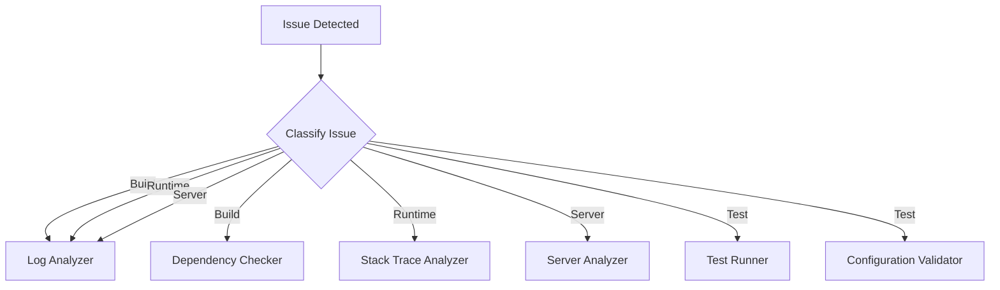

# Debug Skill

## Purpose

Systematic debugging skill for issue resolution using the 8-step debugging protocol. This skill provides structured methodologies for diagnosing and resolving build failures, runtime errors, server issues, and test failures.

## Activation

This skill is automatically activated when:

- Debug mode is selected (`/debug`)
- Issue classification indicates a debugging task
- Error patterns are detected in output

## 8-Step Debugging Protocol

### Step 1: Understand the Problem

**Objective**: Clearly define what is failing and expected behavior.

```markdown
## Problem Statement Template

**Issue**: [What is happening]
**Expected**: [What should happen]
**Impact**: [Severity: P0-Critical, P1-High, P2-Medium, P3-Low]
**Scope**: [Build, Runtime, Server, Test]
**Environment**: [Local, CI/CD, Production]
```

**Actions**:

1. Gather error messages and stack traces
2. Identify affected components
3. Document reproduction steps
4. Classify issue type (see Issue Classification below)

### Step 2: Gather Information

**Objective**: Collect all relevant evidence for analysis.

**Evidence Sources**:

| Source      | Location                        | Command            |
| ----------- | ------------------------------- | ------------------ |
| Build Logs  | `npm run build 2>&1`            | Terminal output    |
| Test Logs   | `npm run test 2>&1`             | Vitest output      |
| Lint Errors | `npm run lint 2>&1`             | ESLint output      |
| Server Logs | `/var/log/nginx/error.log`      | SSH access         |
| Docker Logs | `docker logs <container>`       | Container output   |
| PM2 Logs    | `/var/www/portfolio/.pm2/logs/` | Application logs   |
| Auth Logs   | `/var/log/auth.log`             | SSH authentication |

**Evidence Collection**:

```bash
# Create evidence directory
mkdir -p evidence/$(date +%Y%m%d_%H%M%S)

# Collect build evidence
npm run build > evidence/$(date +%Y%m%d_%H%M%S)/build.log 2>&1

# Collect test evidence
npm run test > evidence/$(date +%Y%m%d_%H%M%S)/test.log 2>&1
```

### Step 3: Formulate Hypotheses

**Objective**: Generate possible root causes based on evidence.

**Hypothesis Template**:

```markdown
## Hypothesis [N]

**Root Cause**: [Proposed explanation]
**Evidence**: [Supporting evidence]
**Confidence**: [0.0 - 1.0]
**Test**: [How to verify]
```

**Common Root Cause Categories**:

1. **Dependency Issues**: Version conflicts, missing packages
2. **Configuration Errors**: Environment variables, config files
3. **Code Errors**: Syntax, type errors, logic bugs
4. **Infrastructure Issues**: Server resources, network, permissions
5. **Integration Failures**: API changes, service unavailable

### Step 4: Test Hypotheses

**Objective**: Systematically verify or eliminate hypotheses.

**Testing Strategy**:

1. Start with highest confidence hypothesis
2. Design minimal test to verify
3. Document results
4. Eliminate or confirm hypothesis
5. Iterate until root cause found

**Test Commands**:

```bash
# Dependency check
npm ls <package>
npm outdated

# Type check
npm run typecheck

# Configuration validation
npm run validate:mcp

# Server connectivity
ssh -p 20 admin@server61 "docker ps"
```

### Step 5: Identify Root Cause

**Objective**: Confirm the definitive root cause.

**Root Cause Template**:

```markdown
## Root Cause Analysis

**Issue**: [Problem description]
**Root Cause**: [Definitive cause]
**Evidence**: [Supporting evidence]
**Affected Files**: [List of files]
**Fix Required**: [Type of fix needed]
```

### Step 6: Implement Fix

**Objective**: Apply minimal, targeted fix.

**Fix Guidelines**:

1. Make smallest possible change
2. Preserve existing functionality
3. Add tests for the fix
4. Document the change

**Fix Template**:

```markdown
## Fix Implementation

**Change**: [What was changed]
**Files**: [Affected files]
**Reason**: [Why this fixes the issue]
**Tests**: [Tests added/modified]
**Verification**: [How to verify fix works]
```

### Step 7: Verify Fix

**Objective**: Confirm fix resolves issue without side effects.

**Verification Checklist**:

- [ ] Original issue is resolved
- [ ] All tests pass
- [ ] Build succeeds
- [ ] No new lint errors
- [ ] Documentation updated

**Verification Commands**:

```bash
npm run build
npm run test
npm run lint
npm run typecheck
```

### Step 8: Document Findings

**Objective**: Record learnings for future reference.

**Documentation Template**:

```markdown
## Debug Session Report

**Date**: [Date]
**Issue**: [Problem description]
**Root Cause**: [Definitive cause]
**Fix**: [Solution applied]
**Time to Resolution**: [Duration]
**Lessons Learned**: [Key takeaways]

## Prevention

**Recommended Actions**: [How to prevent recurrence]
```

## Issue Classification

### Build Failures

**Indicators**:

- `npm run build` exits with non-zero code
- TypeScript compilation errors
- Missing dependencies
- Asset optimization failures

**Primary Agents**: Log Analyzer + Dependency Checker

**Common Patterns**:
| Error Pattern | Likely Cause | Resolution |
|---------------|--------------|------------|
| `Cannot find module` | Missing dependency | `npm install <package>` |
| `Type 'X' is not assignable` | Type mismatch | Fix type definitions |
| `Syntax error` | Invalid syntax | Fix code syntax |
| `Out of memory` | Resource limit | Increase Node memory |

### Runtime Errors

**Indicators**:

- Application crashes
- Unhandled exceptions
- Memory leaks
- Performance degradation

**Primary Agents**: Stack Trace Analyzer + Log Analyzer

**Common Patterns**:
| Error Pattern | Likely Cause | Resolution |
|---------------|--------------|------------|
| `TypeError: undefined` | Null reference | Add null checks |
| `RangeError` | Infinite loop/recursion | Fix loop conditions |
| `Network error` | Connection issue | Check network/config |
| `Timeout exceeded` | Slow operation | Optimize or increase timeout |

### Server Issues

**Indicators**:

- Service unavailable
- High resource usage
- Container failures
- Network connectivity issues

**Primary Agents**: Server Analyzer + Log Analyzer

**Common Patterns**:
| Error Pattern | Likely Cause | Resolution |
|---------------|--------------|------------|
| `ECONNREFUSED` | Service not running | Start service |
| `ENOENT` | File not found | Check paths |
| `Permission denied` | Access rights | Fix permissions |
| `Disk full` | Storage exhausted | Clean up disk |

### Test Failures

**Indicators**:

- Tests exit with failures
- Assertion errors
- Timeout errors
- Snapshot mismatches

**Primary Agents**: Test Runner + Configuration Validator

**Common Patterns**:
| Error Pattern | Likely Cause | Resolution |
|---------------|--------------|------------|
| `AssertionError` | Logic error | Fix code or test |
| `Timeout` | Slow test | Optimize or increase timeout |
| `Snapshot mismatch` | UI change | Update snapshot |
| `Module not found` | Import error | Fix import path |

## Parallel Debug Agents

For complex issues, use parallel debug agents:

### Agent Types

| Agent                   | Role                      | Best For        |
| ----------------------- | ------------------------- | --------------- |
| Log Analyzer            | Parse logs, find patterns | All issue types |
| Stack Trace Analyzer    | Analyze stack traces      | Runtime errors  |
| Dependency Checker      | Check dependencies        | Build failures  |
| Test Runner             | Execute and analyze tests | Test failures   |
| Configuration Validator | Validate configs          | All issue types |
| Server Analyzer         | Analyze server state      | Server issues   |

### When to Use Parallel Agents

Use parallel agents when:

1. Issue spans multiple components
2. Single agent confidence < 0.75
3. Time-critical debugging needed
4. Complex root cause suspected

### Agent Routing



## Confidence Thresholds

| Issue Type | Minimum Confidence | Action if Below      |
| ---------- | ------------------ | -------------------- |
| Build      | 0.75               | Add more agents      |
| Runtime    | 0.80               | Gather more evidence |
| Server     | 0.85               | Escalate to human    |
| Test       | 0.70               | Re-run tests         |

## Evidence Storage

Store all evidence in timestamped directories:

```
evidence/
├── 20260214_120000/
│   ├── build.log
│   ├── test.log
│   ├── server-status.txt
│   ├── docker-ps.txt
│   └── analysis.md
```

## Related Files

- **REFERENCE.md**: Quick reference for commands and tools
- **WORKFLOW.md**: Step-by-step debugging workflows
- **`.kilocode/rules-debug/AGENTS.md`**: 8-step protocol details
- **`.kilocode/rules/memory-bank/servers.md`**: Server infrastructure reference

## See Also

- [Parallel Debug Orchestration Research](plans/agent-shared/parallel-debug-orchestration-research.md)
- [Debug Workflows](.kilocode/workflows/debug-issue.md)
- [Server Preservation Rule](.kilocode/rules-code/server-preservation.md)
