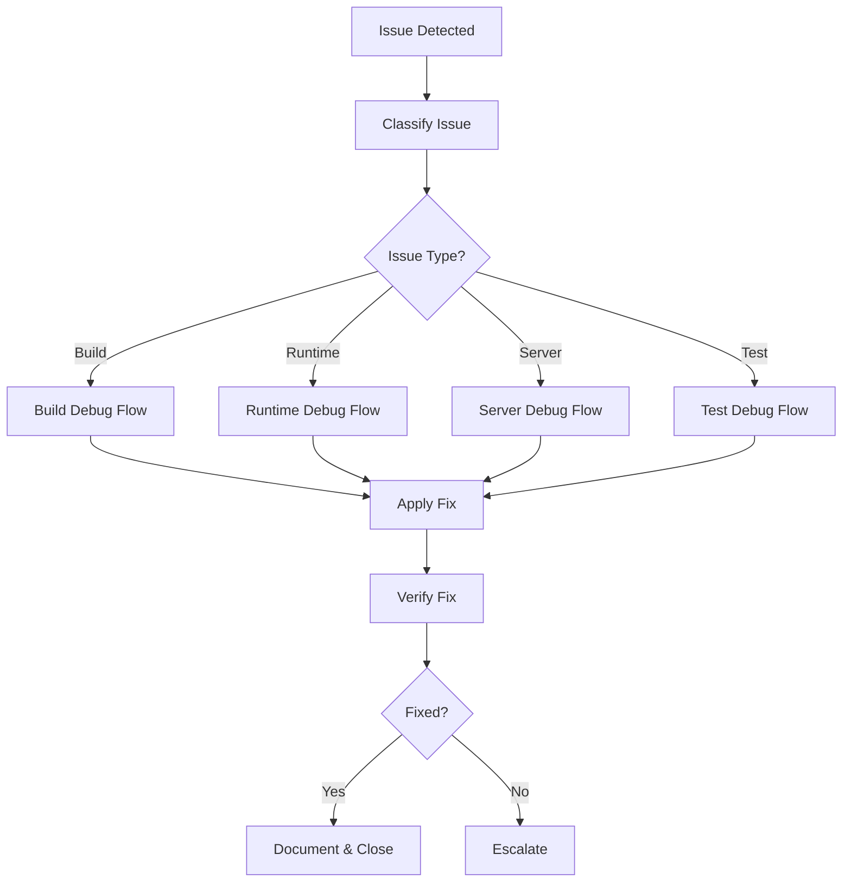
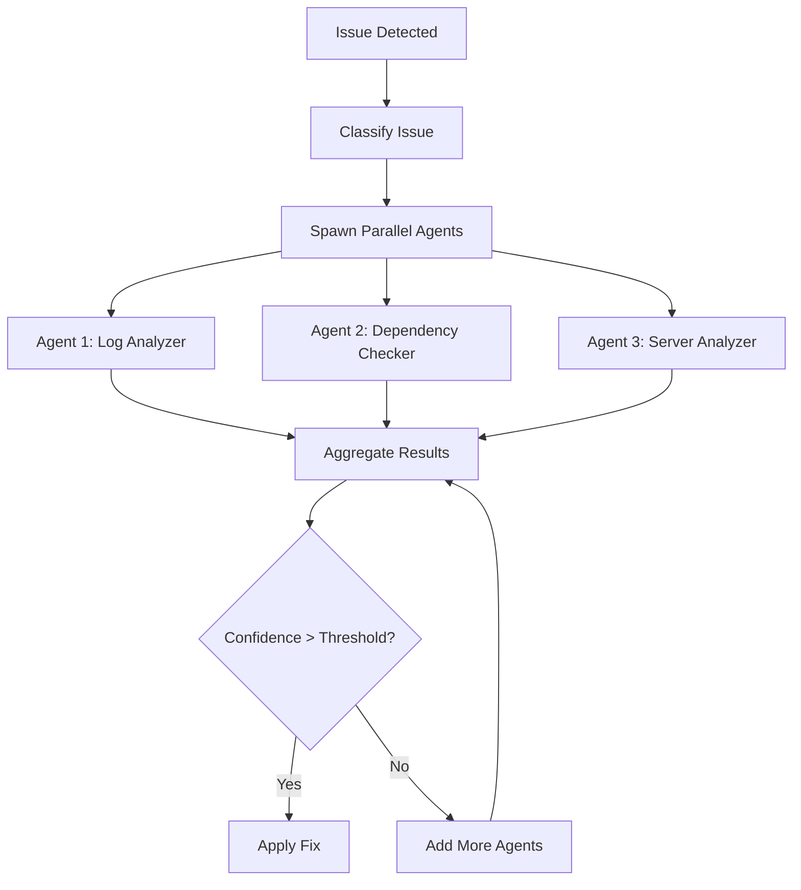

# Debug Workflow

Step-by-step debugging workflow for systematic issue resolution.

## Overview

This workflow guides you through the debugging process from issue detection to resolution. Follow these steps systematically for efficient debugging.

## Quick Start



## Phase 1: Issue Detection

### Step 1.1: Identify the Problem

1. **Capture the error**
   - Copy full error message
   - Note the timestamp
   - Identify the context (build, test, runtime, server)

2. **Document initial observations**

   ```markdown
   ## Issue Report

   **Time**: [Timestamp]
   **Context**: [Build/Test/Runtime/Server]
   **Error**: [Full error message]
   **Expected**: [What should happen]
   **Actual**: [What happened]
   ```

### Step 1.2: Classify the Issue

| Issue Type | Indicators                               | Primary Agents                       |
| ---------- | ---------------------------------------- | ------------------------------------ |
| Build      | `npm run build` fails, TypeScript errors | Log Analyzer, Dependency Checker     |
| Runtime    | Application crashes, exceptions          | Stack Trace Analyzer, Log Analyzer   |
| Server     | Service unavailable, connection errors   | Server Analyzer, Log Analyzer        |
| Test       | Test failures, assertion errors          | Test Runner, Configuration Validator |

### Step 1.3: Create Evidence Directory

```bash
# Create timestamped evidence directory
mkdir -p evidence/$(date +%Y%m%d_%H%M%S)
cd evidence/$(date +%Y%m%d_%H%M%S)

# Initialize evidence collection
echo "# Debug Session: $(date)" > analysis.md
```

## Phase 2: Evidence Collection

### Step 2.1: Collect Build Evidence

```bash
# Build output
npm run build 2>&1 | tee build.log

# Type check output
npm run typecheck 2>&1 | tee typecheck.log

# Lint output
npm run lint 2>&1 | tee lint.log

# Dependency check
npm ls 2>&1 | tee dependencies.log
npm outdated > outdated.log 2>&1
```

### Step 2.2: Collect Test Evidence

```bash
# Test output
npm run test 2>&1 | tee test.log

# Coverage report
npm run test -- --coverage 2>&1 | tee coverage.log
```

### Step 2.3: Collect Server Evidence

```bash
# Server status
ssh -p 20 admin@server61 "docker ps -a" > docker-ps.txt
ssh -p 20 admin@server61 "df -h" > disk-usage.txt
ssh -p 20 admin@server61 "free -m" > memory-usage.txt

# Container logs
ssh -p 20 admin@server61 "docker logs <container> --tail=100" > container.log

# Service status
ssh -p 20 admin@server61 "systemctl status nginx" > nginx-status.txt
ssh -p 20 admin@server61 "systemctl status docker" > docker-status.txt
```

### Step 2.4: Collect Configuration Evidence

```bash
# Environment check
node --version > versions.txt
npm --version >> versions.txt
git --version >> versions.txt

# MCP validation
npm run validate:mcp 2>&1 | tee mcp-validation.log
```

## Phase 3: Analysis

### Step 3.1: Apply Issue-Specific Analysis

#### Build Failure Analysis

1. **Check error type**
   - TypeScript error → Check types, interfaces
   - Module not found → Check imports, dependencies
   - Syntax error → Check code syntax

2. **Common patterns**

   ```
   Error: Cannot find module 'X'
   → Check: npm ls X
   → Fix: npm install X

   Error: Type 'X' is not assignable to type 'Y'
   → Check: Type definitions
   → Fix: Update types or add type assertion

   Error: Syntax error
   → Check: Line number in error
   → Fix: Fix syntax
   ```

#### Runtime Error Analysis

1. **Check error type**
   - TypeError → Null/undefined check
   - RangeError → Loop/recursion check
   - NetworkError → Connection check

2. **Common patterns**

   ```
   TypeError: Cannot read property 'X' of undefined
   → Check: Null checks before property access
   → Fix: Add optional chaining or null check

   RangeError: Maximum call stack exceeded
   → Check: Recursive functions
   → Fix: Add base case or increase stack limit
   ```

#### Server Issue Analysis

1. **Check service status**
   - Container status
   - Disk usage
   - Memory usage
   - Network connectivity

2. **Common patterns**

   ```
   ECONNREFUSED
   → Check: Service running?
   → Fix: Start service

   Disk full (ENOSPC)
   → Check: df -h
   → Fix: Clean up logs, unused files

   Container exited
   → Check: docker logs
   → Fix: Address error in logs
   ```

#### Test Failure Analysis

1. **Check failure type**
   - Assertion failure → Logic error
   - Timeout → Slow operation
   - Snapshot mismatch → UI change

2. **Common patterns**

   ```
   AssertionError: expected X to equal Y
   → Check: Test expectations vs actual
   → Fix: Update code or test

   Timeout exceeded
   → Check: Operation performance
   → Fix: Optimize or increase timeout
   ```

### Step 3.2: Formulate Hypotheses

Create a list of possible root causes:

```markdown
## Hypotheses

### Hypothesis 1

**Root Cause**: [Proposed cause]
**Evidence**: [Supporting evidence]
**Confidence**: [0.0 - 1.0]
**Test**: [How to verify]

### Hypothesis 2

...
```

### Step 3.3: Test Hypotheses

1. Start with highest confidence hypothesis
2. Design minimal test
3. Execute test
4. Document results
5. Eliminate or confirm

## Phase 4: Resolution

### Step 4.1: Implement Fix

1. **Make minimal change**
   - Fix only the identified issue
   - Don't refactor unrelated code
   - Preserve existing functionality

2. **Document the change**

   ```markdown
   ## Fix Implementation

   **Issue**: [Problem description]
   **Root Cause**: [Identified cause]
   **Fix**: [What was changed]
   **Files**: [Affected files]
   **Reasoning**: [Why this fixes the issue]
   ```

### Step 4.2: Verify Fix

Run verification checklist:

```bash
# Build verification
npm run build

# Test verification
npm run test

# Lint verification
npm run lint

# Type check verification
npm run typecheck
```

### Step 4.3: Check for Side Effects

1. Run full test suite
2. Check related functionality
3. Verify no new errors in logs
4. Test in clean environment if possible

## Phase 5: Documentation

### Step 5.1: Create Debug Report

```markdown
# Debug Session Report

**Date**: [Date]
**Duration**: [Time spent]
**Issue Type**: [Build/Runtime/Server/Test]

## Problem

[Problem description]

## Root Cause

[Identified root cause]

## Solution

[Fix applied]

## Files Changed

- [File 1]: [Change description]
- [File 2]: [Change description]

## Lessons Learned

[Key takeaways]

## Prevention

[How to prevent recurrence]
```

### Step 5.2: Update Memory Bank

If significant, update relevant memory bank files:

- `context.md` - Recent changes
- `tech.md` - New dependencies or configurations
- `servers.md` - Server state changes

## Parallel Debug Agents

### When to Use Parallel Agents

Use parallel debug agents when:

1. Issue spans multiple components
2. Single agent confidence < 0.75
3. Time-critical debugging needed
4. Complex root cause suspected

### Parallel Agent Workflow



### Agent Types and Tasks

| Agent                   | Task                      | Output                         |
| ----------------------- | ------------------------- | ------------------------------ |
| Log Analyzer            | Parse logs, find patterns | Error patterns, timestamps     |
| Stack Trace Analyzer    | Analyze stack traces      | Root cause line, function      |
| Dependency Checker      | Check dependencies        | Version conflicts, missing     |
| Test Runner             | Execute tests             | Failure details, coverage      |
| Configuration Validator | Validate configs          | Config errors, mismatches      |
| Server Analyzer         | Analyze server state      | Resource usage, service status |

### Evidence Aggregation

1. **Collect agent outputs**
   - Each agent produces structured findings
   - Include confidence score

2. **Cross-validate findings**
   - Check for agreement between agents
   - Identify contradictions

3. **Calculate aggregate confidence**

   ```
   Aggregate Confidence = Σ(Agent Confidence × Weight) / Σ(Weights)
   ```

4. **Determine consensus**
   - If agents agree: High confidence
   - If agents disagree: Investigate further

## Escalation

### When to Escalate

Escalate to human when:

1. Aggregate confidence < 0.70
2. Fix requires architectural changes
3. Issue affects production data
4. Security implications detected
5. Multiple fix attempts failed

### Escalation Process

1. **Document current state**

   ```markdown
   ## Escalation Report

   **Issue**: [Problem description]
   **Attempts**: [Fixes attempted]
   **Results**: [Outcomes]
   **Confidence**: [Current confidence level]
   **Recommendation**: [Suggested next steps]
   ```

2. **Create escalation ticket**
   - Include all evidence
   - Include debug report
   - Include attempted fixes

3. **Notify appropriate team**
   - Build issues → Development team
   - Server issues → DevOps team
   - Security issues → Security team

## Workflow Templates

### Build Failure Workflow

```bash
# 1. Capture error
npm run build 2>&1 | tee evidence/build.log

# 2. Analyze error type
# - TypeScript error → Check types
# - Module error → Check dependencies
# - Syntax error → Check code

# 3. Check dependencies
npm ls
npm outdated

# 4. Apply fix
# [Make targeted fix]

# 5. Verify
npm run build && npm run test
```

### Server Issue Workflow

```bash
# 1. Check server status
ssh -p 20 admin@server61 "docker ps -a && df -h && free -m"

# 2. Check logs
ssh -p 20 admin@server61 "docker logs <container> --tail=100"

# 3. Check services
ssh -p 20 admin@server61 "systemctl status nginx docker"

# 4. Analyze and fix
# [Make targeted fix]

# 5. Verify
ssh -p 20 admin@server61 "docker ps && curl -I localhost"
```

### Test Failure Workflow

```bash
# 1. Run failing test
npm run test -- --reporter=verbose 2>&1 | tee test.log

# 2. Analyze failure
# - Assertion error → Check logic
# - Timeout → Check performance
# - Snapshot → Check UI changes

# 3. Apply fix
# [Make targeted fix]

# 4. Verify
npm run test
```

## Related Files

- **SKILL.md**: Main debugging skill documentation
- **REFERENCE.md**: Quick reference for commands and tools
- **`.kilocode/workflows/debug-issue.md`**: General issue workflow
- **`.kilocode/workflows/debug-build.md`**: Build-specific workflow
- **`.kilocode/workflows/debug-server.md`**: Server-specific workflow
