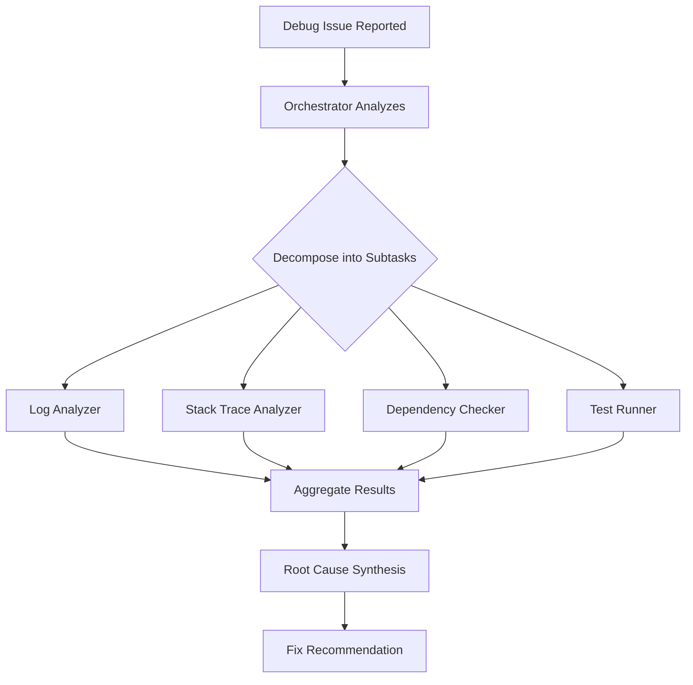
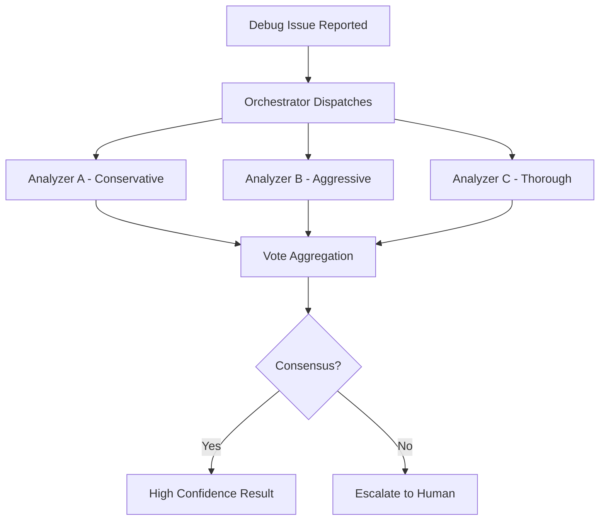
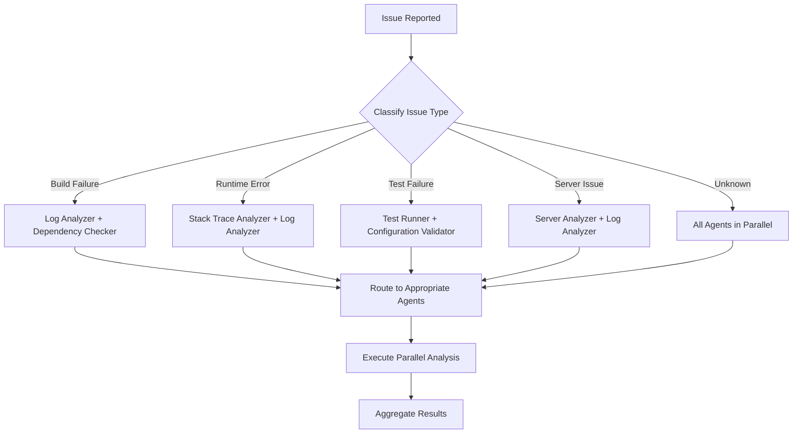
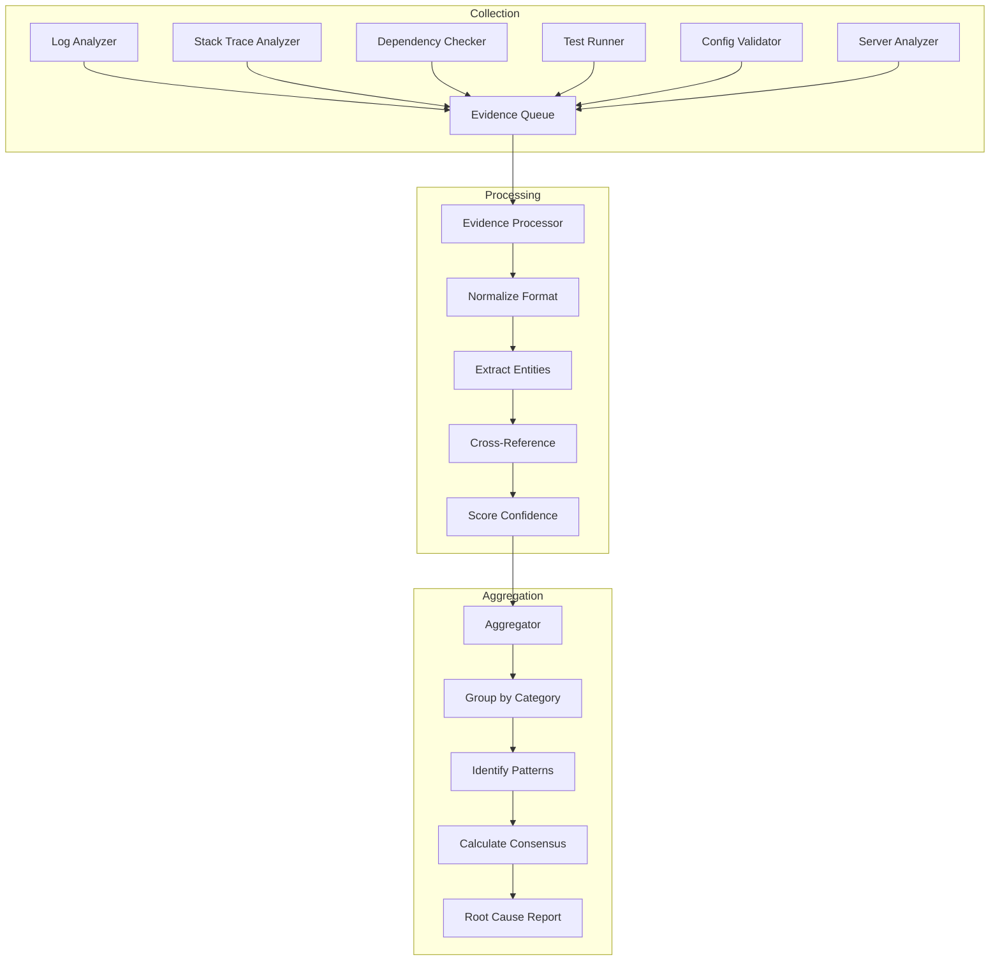
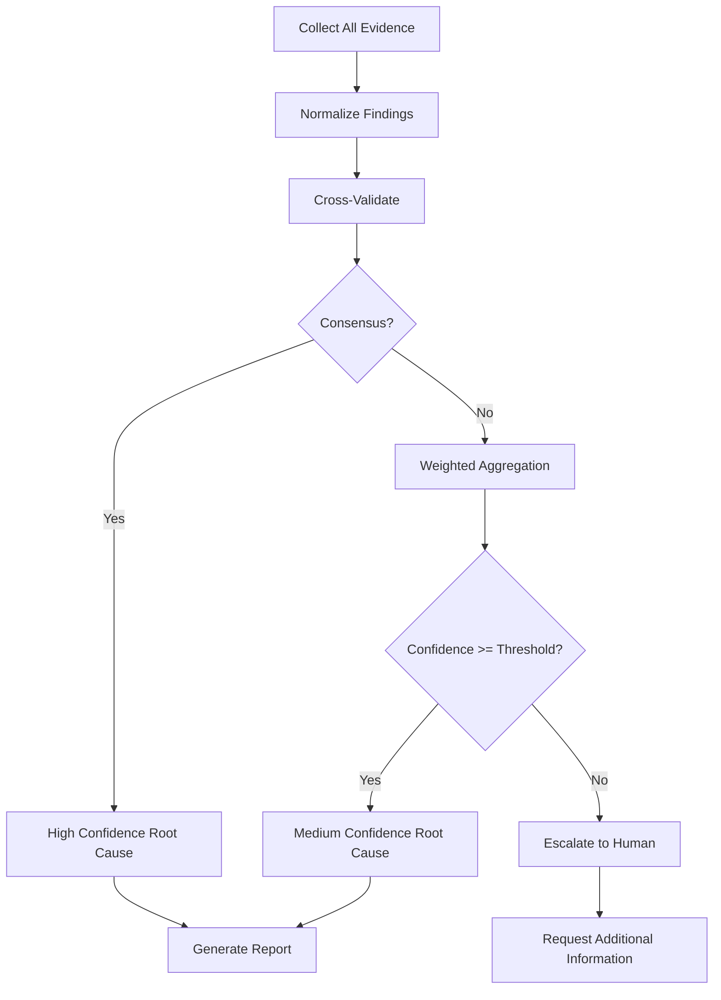

# Orchestrator Debug Template

**Purpose**: Template for orchestrating parallel debug agents
**Mode**: Debug (Orchestrator)
**Related**: [`plans/agent-shared/parallel-debug-orchestration-research.md`](../../plans/agent-shared/parallel-debug-orchestration-research.md)

---

## Overview

This template defines the orchestration strategy for coordinating multiple debug agents working in parallel. It implements the patterns from the parallel debugging research to efficiently diagnose and resolve issues.

## Orchestration Patterns

### Pattern A: Sectioning (Independent Subtasks)

Tasks are broken into independent subtasks that run in parallel, with results aggregated programmatically.



**When to use**:

- Complex issues with multiple potential causes
- Time-critical debugging requiring faster resolution
- Issues spanning multiple system components

### Pattern B: Voting (Multiple Perspectives)

The same task is run multiple times with different approaches to get diverse outputs and higher confidence.



**When to use**:

- Critical issues requiring high confidence
- Security-related debugging
- Production system failures

## Issue Routing Logic

### Routing Decision Matrix

| Issue Type        | Primary Agents                       | Secondary Agents        | Priority | Confidence Threshold |
| ----------------- | ------------------------------------ | ----------------------- | -------- | -------------------- |
| Build Failure     | Log Analyzer, Dependency Checker     | Configuration Validator | High     | 0.75                 |
| Runtime Error     | Stack Trace Analyzer, Log Analyzer   | Dependency Checker      | Critical | 0.80                 |
| Test Failure      | Test Runner, Configuration Validator | Log Analyzer            | Medium   | 0.70                 |
| Server Issue      | Server Analyzer, Log Analyzer        | Configuration Validator | Critical | 0.85                 |
| Performance Issue | Log Analyzer, Server Analyzer        | Test Runner             | Medium   | 0.70                 |
| Security Issue    | Log Analyzer, Dependency Checker     | All Others              | Critical | 0.85                 |

### Routing Flowchart



## Template Configuration

### Build Failure Orchestration

```yaml
template:
  name: build-failure-orchestration
  description: Orchestrates debugging for build and compilation failures
  trigger_conditions:
    - condition: 'npm run build exits with non-zero code'
      priority: high
    - condition: 'TypeScript compilation errors'
      priority: high
    - condition: 'Missing dependencies detected'
      priority: medium

  agents:
    - name: log-analyzer
      role: primary
      timeout: 60
      retry_count: 2
    - name: dependency-checker
      role: primary
      timeout: 120
      retry_count: 1
    - name: configuration-validator
      role: secondary
      timeout: 30
      retry_count: 1

  workflow:
    - phase: initial-analysis
      parallel: true
      agents: [log-analyzer, dependency-checker]
      aggregation: all_complete
    - phase: configuration-check
      parallel: false
      agents: [configuration-validator]
      aggregation: first_complete
      condition: 'initial-analysis.confidence < 0.7'
    - phase: synthesis
      parallel: false
      agents: [orchestrator]
      aggregation: first_complete

  output:
    format: structured
    confidence_threshold: 0.75
```

### Runtime Error Orchestration

```yaml
template:
  name: runtime-error-orchestration
  description: Orchestrates debugging for runtime errors and crashes
  trigger_conditions:
    - condition: 'Uncaught exception detected'
      priority: critical
    - condition: 'Process exit with error code'
      priority: critical
    - condition: 'Memory limit exceeded'
      priority: high

  agents:
    - name: stack-trace-analyzer
      role: primary
      timeout: 30
      retry_count: 3
    - name: log-analyzer
      role: primary
      timeout: 60
      retry_count: 2
    - name: dependency-checker
      role: secondary
      timeout: 120
      retry_count: 1
    - name: server-analyzer
      role: optional
      timeout: 60
      retry_count: 1

  workflow:
    - phase: error-analysis
      parallel: true
      agents: [stack-trace-analyzer, log-analyzer]
      aggregation: all_complete
    - phase: dependency-check
      parallel: true
      agents: [dependency-checker]
      aggregation: first_complete
      condition: 'error-analysis.suggests_dependency_issue'
    - phase: infrastructure-check
      parallel: true
      agents: [server-analyzer]
      aggregation: first_complete
      condition: 'error-analysis.suggests_infrastructure_issue'
    - phase: synthesis
      parallel: false
      agents: [orchestrator]
      aggregation: first_complete

  output:
    format: structured
    confidence_threshold: 0.80
```

### Server Issue Orchestration

```yaml
template:
  name: server-issue-orchestration
  description: Orchestrates debugging for server and infrastructure issues
  trigger_conditions:
    - condition: 'Service health check fails'
      priority: critical
    - condition: 'Container exits unexpectedly'
      priority: critical
    - condition: 'Resource usage exceeds threshold'
      priority: high

  agents:
    - name: server-analyzer
      role: primary
      timeout: 90
      retry_count: 2
    - name: log-analyzer
      role: primary
      timeout: 60
      retry_count: 2
    - name: configuration-validator
      role: secondary
      timeout: 30
      retry_count: 1

  workflow:
    - phase: health-check
      parallel: true
      agents: [server-analyzer, log-analyzer]
      aggregation: all_complete
    - phase: configuration-check
      parallel: false
      agents: [configuration-validator]
      aggregation: first_complete
      condition: 'health-check.suggests_misconfiguration'
    - phase: synthesis
      parallel: false
      agents: [orchestrator]
      aggregation: first_complete

  output:
    format: structured
    confidence_threshold: 0.85
```

## Evidence Aggregation Strategy

### Evidence Structure

```typescript
interface DebugEvidence {
  agent_id: string;
  agent_type: DebugAgentType;
  timestamp: string;
  findings: Finding[];
  confidence: number;
  metadata: {
    execution_time_ms: number;
    tools_used: string[];
    data_sources: string[];
  };
}

interface Finding {
  category: string;
  description: string;
  severity: 'low' | 'medium' | 'high' | 'critical';
  evidence: string[];
  related_files?: string[];
  suggested_actions?: string[];
}

type DebugAgentType =
  | 'log-analyzer'
  | 'stack-trace-analyzer'
  | 'dependency-checker'
  | 'test-runner'
  | 'configuration-validator'
  | 'server-analyzer';
```

### Aggregation Workflow



### Aggregation Strategies

#### Strategy 1: Weighted Confidence

```python
def aggregate_weighted_confidence(evidence_list: List[DebugEvidence]) -> float:
    """
    Calculate weighted confidence based on agent reliability and finding consistency.
    """
    weights = {
        'stack-trace-analyzer': 0.25,  # High reliability for runtime errors
        'log-analyzer': 0.20,
        'dependency-checker': 0.15,
        'test-runner': 0.15,
        'configuration-validator': 0.15,
        'server-analyzer': 0.10
    }

    total_confidence = 0.0
    total_weight = 0.0

    for evidence in evidence_list:
        weight = weights.get(evidence.agent_type, 0.1)
        total_confidence += evidence.confidence * weight
        total_weight += weight

    return total_confidence / total_weight if total_weight > 0 else 0.0
```

#### Strategy 2: Cross-Validation

```python
def cross_validate_findings(evidence_list: List[DebugEvidence]) -> List[Finding]:
    """
    Cross-validate findings across multiple agents.
    Findings supported by multiple agents get higher confidence.
    """
    finding_support = defaultdict(list)

    for evidence in evidence_list:
        for finding in evidence.findings:
            key = (finding.category, finding.description[:50])
            finding_support[key].append({
                'agent': evidence.agent_type,
                'confidence': evidence.confidence,
                'finding': finding
            })

    validated_findings = []
    for key, supporters in finding_support.items():
        if len(supporters) >= 2:  # Multi-agent validation
            avg_confidence = sum(s['confidence'] for s in supporters) / len(supporters)
            boost = 1 + (0.1 * len(supporters))  # Confidence boost for multiple sources
            validated_findings.append({
                'finding': supporters[0]['finding'],
                'confidence': min(avg_confidence * boost, 1.0),
                'supported_by': [s['agent'] for s in supporters]
            })

    return sorted(validated_findings, key=lambda x: x['confidence'], reverse=True)
```

#### Strategy 3: Voting Consensus

```python
def voting_consensus(evidence_list: List[DebugEvidence], threshold: float = 0.6) -> Optional[str]:
    """
    Use voting to determine root cause when agents disagree.
    """
    votes = defaultdict(float)

    for evidence in evidence_list:
        if evidence.findings:
            top_finding = evidence.findings[0]  # Most significant finding
            vote_key = top_finding.category
            votes[vote_key] += evidence.confidence

    total_votes = sum(votes.values())
    if total_votes == 0:
        return None

    # Check for clear winner
    sorted_votes = sorted(votes.items(), key=lambda x: x[1], reverse=True)
    top_vote, top_score = sorted_votes[0]

    if top_score / total_votes >= threshold:
        return top_vote

    return None  # No consensus - escalate to human
```

## Root Cause Synthesis



## Evidence Storage Structure

```
evidence/
├── {timestamp}/
│   ├── issue-summary.json
│   ├── agent-reports/
│   │   ├── log-analyzer.json
│   │   ├── stack-trace-analyzer.json
│   │   ├── dependency-checker.json
│   │   ├── test-runner.json
│   │   ├── configuration-validator.json
│   │   └── server-analyzer.json
│   ├── aggregated-findings.json
│   └── root-cause-report.md
```

## Error Handling

| Error Type          | Handling Strategy                          |
| ------------------- | ------------------------------------------ |
| Agent Timeout       | Mark as failed, continue with other agents |
| Agent Crash         | Log error, retry with exponential backoff  |
| No Consensus        | Escalate to human with all evidence        |
| Low Confidence      | Request additional analysis or human input |
| Resource Exhaustion | Queue agents, run sequentially             |

## Orchestration Execution

### Step 1: Issue Classification

1. Parse issue description
2. Identify keywords and patterns
3. Classify issue type
4. Select appropriate template

### Step 2: Agent Dispatch

1. Load template configuration
2. Initialize primary agents
3. Set up evidence collection
4. Execute parallel analysis

### Step 3: Evidence Collection

1. Collect agent reports
2. Normalize findings format
3. Store in evidence directory

### Step 4: Aggregation

1. Apply weighted confidence
2. Cross-validate findings
3. Calculate consensus
4. Generate root cause report

### Step 5: Resolution or Escalation

1. If confidence >= threshold: Recommend fix
2. If confidence < threshold: Escalate to human
3. Document all findings

## Related Files

- **Debug Skill**: [`.kilocode/skills/debug/SKILL.md`](../skills/debug/SKILL.md)
- **Quick Reference**: [`.kilocode/skills/debug/REFERENCE.md`](../skills/debug/REFERENCE.md)
- **Debug Workflow**: [`.kilocode/skills/debug/WORKFLOW.md`](../skills/debug/WORKFLOW.md)
- **General Debug**: [`.kilocode/workflows/debug-issue.md`](debug-issue.md)
- **Build Debug**: [`.kilocode/workflows/debug-build.md`](debug-build.md)
- **Server Debug**: [`.kilocode/workflows/debug-server.md`](debug-server.md)
- **Research**: [`plans/agent-shared/parallel-debug-orchestration-research.md`](../../plans/agent-shared/parallel-debug-orchestration-research.md)
