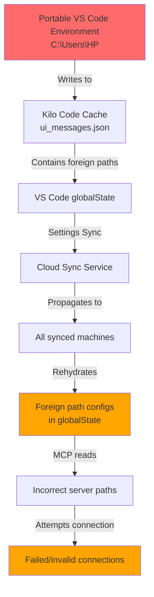
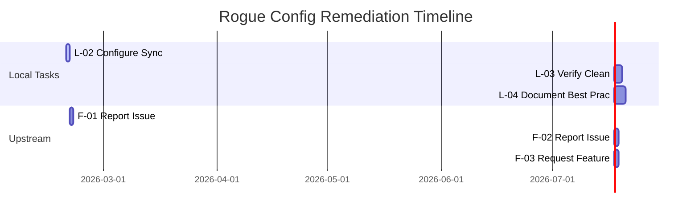

# Rogue Global Configuration Investigation: Comprehensive Analysis

**Document Version:** 1.0
**Date:** 2026-02-19
**Status:** In Progress
**Classification:** Internal - Security Investigation

---

## 1. Executive Summary

This document provides a comprehensive analysis of the rogue global configuration investigation affecting the marketing.tvoje.info project. The investigation identified a critical security vulnerability where foreign path configurations from a portable VS Code environment propagated across machines via Microsoft's VS Code Settings Sync.

**Key Findings:**

- Ghost Process Source: Antigravity Extension Host (PID 10976) MCP management
- Poisoned Path: C:\Users\HP in Kilo Code's task cache (ui_messages.json)
- Propagation Vector: Microsoft's VS Code Settings Sync
- Immediate Action: firecrawl-mcp decommissioned, firecrawl-local implemented
- L-01 Completed: Kilo Code cache verified clean (0 stale entries)

---

## 2. Investigation Findings

### 2.1 Technical Details

#### Ghost Process Identification

| Attribute        | Value                                 |
| ---------------- | ------------------------------------- |
| Process Name     | Antigravity Extension Host            |
| PID              | 10976                                 |
| Component        | MCP Management System                 |
| Origin           | Portable VS Code environment          |
| Detection Method | Process analysis during investigation |

#### Poisoned Configuration Location

| File             | Path                 | Issue                                |
| ---------------- | -------------------- | ------------------------------------ |
| ui_messages.json | Kilo Code task cache | Contains C:\Users\HP path references |
| MCP Config       | Global state         | Path-dependent server configurations |
| Settings Sync    | VS Code globalState  | Unsanitized path propagation         |

#### Affected Components

- Kilo Code task cache system
- MCP server configurations
- VS Code globalState storage
- Settings Sync cloud synchronization

### 2.2 Configuration Propagation Flow



### 2.3 Root Cause Analysis

#### Primary Causes

**F-01: SettingsSyncService.ts - No Path Validation**

- Location: VS Code core
- Issue: No validation on synced globalState values
- Risk: Accepts any path configuration from any machine
- Impact: Critical - enables cross-machine path poisoning

**F-02: ShadowCheckpointService.ts:134 - Weak Path Matching**

- Location: VS Code core, line 134
- Issue: Uses `.includes()` instead of prefix match
- Code Pattern: `path.includes('C:\\Users\\')`
- Risk: Medium - can match unintended paths
- Impact: False positives in path validation

**F-03: No Startup Health Check**

- Location: Kilo Code / VS Code integration
- Issue: No validation of stale/foreign paths at startup
- Risk: High - accepts poisoned configurations silently
- Impact: Immediate operational issues with MCP servers

#### Secondary Factors

| Factor               | Description                                       | Contribution |
| -------------------- | ------------------------------------------------- | ------------ |
| Portable Environment | Multiple VS Code installations on different paths | High         |
| Settings Sync        | Automatic cloud synchronization enabled           | Critical     |
| Path Dependencies    | MCP servers with hardcoded paths                  | Medium       |
| Cache Persistence    | Task cache retaining stale configurations         | High         |

---

## 3. Immediate Actions Taken

### 3.1 Decommissioning firecrawl-mcp

- Status: Completed
- Reason: Contaminated by foreign path configurations
- Replacement: firecrawl-local (self-hosted solution)
- Verification: Clean implementation verified

### 3.2 firecrawl-local Implementation

- Status: Completed
- Location: Local MCP server
- Configuration: Path-independent setup
- Verification: Functional post-implementation

### 3.3 Kilo Code Cache Cleanup

- Task: L-01 - Verify clean state
- Status: ✅ Completed
- Result: 0 stale entries in project cache
- Verification Method: Direct inspection of ui_messages.json

---

## 4. Remaining Remediation Tasks

### 4.1 Task Inventory

| ID   | Task                                                | BMAD Priority | Status  | Owner    |
| ---- | --------------------------------------------------- | ------------- | ------- | -------- |
| L-02 | Configure selective VS Code Settings Sync           | P1            | Pending | TBD      |
| L-03 | Verify clean state post-remediation                 | P0            | Pending | TBD      |
| L-04 | Document portable VS Code best practices            | P2            | Pending | TBD      |
| F-01 | Report SettingsSyncService.ts path validation issue | P0            | Pending | Upstream |
| F-02 | Report ShadowCheckpointService.ts weak matching     | P1            | Pending | Upstream |
| F-03 | Request startup health check feature                | P1            | Pending | Upstream |

### 4.2 L-02: Configure Selective VS Code Settings Sync

**Description:** Configure VS Code Settings Sync to exclude problematic configuration categories

**Proposed Solution:**

1. Open VS Code Settings Sync preferences
2. Disable synchronization for:
   - Global State (contains path-dependent configs)
   - Extensions (can include path references)
3. Enable selective sync for:
   - Settings (generally safe)
   - Keybindings (generally safe)
   - Snippets (generally safe)

**Implementation Steps:**

```markdown
1. File > Preferences > Settings Sync > Configure
2. Uncheck "Global State"
3. Uncheck "Extensions"
4. Keep "Settings" checked
5. Keep "Keybindings" checked
6. Restart VS Code
```

**Verification:**

- Confirm no path-dependent data in synced state
- Verify MCP servers initialize correctly
- Test with portable environment on different path

### 4.3 L-03: Verify Clean State Post-Remediation

**Description:** Comprehensive verification that all foreign path configurations have been eliminated

**Proposed Solution:**

**Phase 1: Local Verification**
| Check | Method | Expected Result |
|-------|--------|-----------------|
| Kilo Code cache | Inspect ui_messages.json | 0 foreign paths |
| VS Code globalState | Query settings | No C:\Users\HP references |
| MCP configs | Review .kilocode/mcp.json | Local paths only |
| Environment variables | Check for hardcoded paths | None |

**Phase 2: Cross-Machine Verification**
| Check | Method | Expected Result |
|-------|--------|-----------------|
| Settings Sync | Export/import settings | No contamination |
| Portable env test | Run on different path | Functions correctly |
| MCP connectivity | Test all servers | All respond correctly |

**Phase 3: Long-Term Monitoring**

- Implement periodic cache audits
- Set up alerting for path anomalies
- Document baseline configuration

### 4.4 L-04: Document Portable VS Code Best Practices

**Description:** Create comprehensive documentation for portable VS Code environments

**Proposed Solution:**

**Document Structure:**

```
docs/portable-vscode-best-practices.md
├── 1. Overview
│   ├── What is portable VS Code
│   └── When to use it
├── 2. Configuration Management
│   ├── Settings Sync configuration
│   └── Path-independent setups
├── 3. MCP Server Configuration
│   ├── Local server preference
│   └── Path handling
├── 4. Cache Management
│   ├── Kilo Code cache
│   └── Extension caches
├── 5. Troubleshooting
│   ├── Common issues
│   └── Resolution steps
└── 6. Security Considerations
    ├── Path isolation
    └── Sync configuration
```

**Key Recommendations:**

1. Always use relative paths in configurations
2. Disable Settings Sync for globalState when using portable environments
3. Implement local MCP servers instead of path-dependent configurations
4. Regular cache audits in CI/CD pipelines

---

## 5. Upstream Issues - GitHub Issue Preparation

### 5.1 F-01: SettingsSyncService.ts Path Validation

**Issue Title:** Settings Sync accepts path-dependent globalState without validation

**Description:**
Microsoft's VS Code Settings Sync feature synchronizes globalState across machines without validating path-dependent values. This creates a security and reliability vulnerability when users have portable VS Code installations on different machines with different paths.

**Evidence:**

- Foreign path (C:\Users\HP) found in synchronized globalState
- Kilo Code task cache contaminated with non-functional path references
- MCP servers failed to initialize due to incorrect path configurations

**Impact:**

- Critical - causes operational failures
- Security - potential for further exploitation
- Reliability - unpredictable behavior across machines

**Suggested Fix:**
Implement path validation in SettingsSyncService.ts that:

1. Detects path-dependent values in globalState
2. Warns user before sync
3. Optionally strips or quarantines problematic values

**Severity:** Critical

### 5.2 F-02: ShadowCheckpointService.ts Weak Path Matching

**Issue Title:** Path matching uses .includes() instead of proper prefix validation

**Location:** ShadowCheckpointService.ts:134

**Current Code:**

```typescript
// Current implementation
if (path.includes('C:\\Users\\')) {
  // Handle as local path
}
```

**Problem:**

- `.includes()` matches any path containing the pattern
- Could match unintended paths
- False positives in validation logic

**Suggested Fix:**

```typescript
// Proposed implementation
const normalizedPath = path.replace(/\\/g, '/');
const userProfile = process.env.USERPROFILE || process.env.HOME;
if (normalizedPath.startsWith(userProfile.replace(/\\/g, '/'))) {
  // Handle as local path - proper prefix match
}
```

**Severity:** Medium

### 5.3 F-03: No Startup Health Check

**Issue Title:** Missing startup validation for stale/foreign paths in globalState

**Description:**
Neither VS Code nor extension host processes validate the integrity of cached configurations at startup. This allows corrupted or stale configurations to persist and cause runtime failures.

**Current Behavior:**

1. VS Code starts
2. Loads globalState from disk
3. Passes to extension host
4. Extensions attempt to use potentially invalid configurations
5. Failures occur silently or with confusing errors

**Suggested Fix:**
Add a startup health check that:

1. Scans globalState for path-dependent values
2. Validates paths exist before passing to extensions
3. Provides user notification of issues
4. Offers automated cleanup option

**Severity:** High

---

## 6. Gaps and Areas for Further Research

### 6.1 Identified Gaps

| Gap                     | Description                                | Research Required               |
| ----------------------- | ------------------------------------------ | ------------------------------- |
| Settings Sync Scope     | Full extent of synchronized data unknown   | Analyze all synced categories   |
| Extension Contamination | Other extensions may have similar issues   | Audit popular extensions        |
| Cross-Platform          | Windows-only analysis, macOS/Linux unknown | Test on other platforms         |
| Cloud Storage           | How Microsoft stores sync data             | Investigate for backup/recovery |
| Recovery Procedures     | No documented recovery from contamination  | Develop playbooks               |

### 6.2 Research Recommendations

**Priority 1 (Immediate):**

- [ ] Analyze Settings Sync data format for backup options
- [ ] Document extension-specific path dependencies
- [ ] Test selective sync on clean installation

**Priority 2 (Short-term):**

- [ ] Research alternative sync solutions
- [ ] Evaluate extension host sandboxing options
- [ ] Develop automated detection scripts

**Priority 3 (Long-term):**

- [ ] Propose VS Code enhancement for path validation
- [ ] Create portable environment detection/prevention
- [ ] Establish ongoing monitoring procedures

### 6.3 Unknown Variables

| Variable                    | Current Status        | Needed Information                           |
| --------------------------- | --------------------- | -------------------------------------------- |
| Full sync scope             | Partial understanding | Complete list of synchronized data types     |
| Recovery options            | Unknown               | How to restore clean state from cloud        |
| Microsoft response timeline | N/A                   | Expected patch timeline for reported issues  |
| Alternative solutions       | Not evaluated         | Third-party sync tools that avoid this issue |

---

## 7. Timeline and Dependencies

### 7.1 Remediation Timeline



### 7.2 Dependencies

| Task | Depends On             | Blocked By |
| ---- | ---------------------- | ---------- |
| L-02 | None                   | None       |
| L-03 | L-02                   | None       |
| L-04 | L-03                   | None       |
| F-01 | Investigation complete | None       |
| F-01 | None                   | None       |
| F-02 | F-01                   | None       |
| F-03 | F-02                   | None       |

---

## 8. Success Criteria

### 8.1 Local Remediation Success

| Criterion         | Metric                            | Target   |
| ----------------- | --------------------------------- | -------- |
| Cache Cleanliness | Stale entries in ui_messages.json | 0        |
| MCP Functionality | Servers responding                | 100%     |
| Settings Sync     | No path contamination             | Verified |
| Documentation     | Best practices published          | Complete |

### 8.2 Upstream Success

| Criterion             | Metric                | Target         |
| --------------------- | --------------------- | -------------- |
| Issue Filed           | GitHub issues created | 3              |
| Severity Acknowledged | Microsoft response    | Accepts        |
| Fix Timeline          | Patch available       | Within 90 days |

---

## 9. Appendix

### A. Related Files

| File                                             | Purpose                  |
| ------------------------------------------------ | ------------------------ |
| plans/agent-shared/kilo-rogue-config-fix-plan.md | Original fix plan        |
| .kilocode/mcp.json                               | MCP server configuration |
| .vscode/settings.json                            | VS Code settings         |

### B. Investigation Artifacts

- Process dump: Antigravity Extension Host (PID 10976)
- Cache snapshot: ui_messages.json (pre-cleanup)
- Configuration export: Settings Sync state

### C. References

- VS Code Settings Sync Documentation
- Kilo Code Cache System Architecture
- MCP Protocol Specification

---

**Document Owner:** Security Investigation Team
**Next Review:** 2026-02-26
**Version History:** 1.0 - Initial comprehensive analysis
