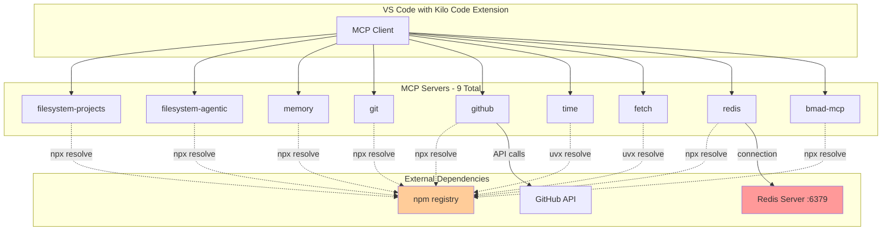

# MCP Server Restart Issues Analysis

**Date**: 2026-02-16
**Author**: Kilo Code (Architect Mode)
**Status**: Analysis Complete

---

## Executive Summary

This document analyzes the MCP (Model Context Protocol) server configuration for potential causes of unexpected server restarts in the Kilo Code VS Code extension. The analysis identifies several configuration patterns that may contribute to instability.

---

## Current MCP Configuration Overview

### Configured MCP Servers

| Server              | Command | Package                                 | Status |
| ------------------- | ------- | --------------------------------------- | ------ |
| filesystem-projects | npx     | @modelcontextprotocol/server-filesystem | Active |
| filesystem-agentic  | npx     | @modelcontextprotocol/server-filesystem | Active |
| memory              | npx     | @modelcontextprotocol/server-memory     | Active |
| git                 | npx     | git-mcp                                 | Active |
| github              | npx     | @modelcontextprotocol/server-github     | Active |
| time                | uvx     | mcp-server-time                         | Active |
| fetch               | uvx     | mcp-server-fetch                        | Active |
| redis               | npx     | @modelcontextprotocol/server-redis      | Active |
| bmad-mcp            | npx     | bmad-mcp                                | Active |

**Total**: 9 MCP servers configured

### Configuration File Location

- Primary: `.kilocode/mcp.json`
- Validation script: `scripts/validate-mcp.cjs`

---

## Root Cause Hypotheses

### Hypothesis 1: npx Package Resolution Delays (HIGH LIKELIHOOD)

**Issue**: All servers use `npx -y <package>` pattern which:

- Downloads package metadata on each spawn
- May download the package if not cached
- Introduces network latency and potential timeouts

**Evidence**:

```json
{
  "command": "npx",
  "args": ["-y", "@modelcontextprotocol/server-filesystem", "..."]
}
```

**Impact**: The `-y` flag bypasses confirmation but still requires package resolution. On slow networks or during npm registry issues, this can cause spawn timeouts leading to restarts.

**Likelihood**: ⭐⭐⭐⭐⭐ (5/5)

---

### Hypothesis 2: Redis Server Dependency (HIGH LIKELIHOOD)

**Issue**: The Redis MCP server requires a running Redis instance at `redis://localhost:6379`

**Evidence**:

```json
{
  "redis": {
    "command": "npx",
    "args": ["-y", "@modelcontextprotocol/server-redis", "redis://localhost:6379"],
    "env": {}
  }
}
```

**Problems**:

- No validation that Redis is running before MCP spawn
- Connection failures will crash the MCP server
- No retry logic or fallback configuration

**Likelihood**: ⭐⭐⭐⭐⭐ (5/5)

---

### Hypothesis 3: Environment Variable Resolution (MEDIUM LIKELIHOOD)

**Issue**: GitHub server uses template literal for environment variable

**Evidence**:

```json
{
  "github": {
    "env": { "GITHUB_TOKEN": "${GITHUB_TOKEN}" }
  }
}
```

**Problems**:

- The `${GITHUB_TOKEN}` syntax may not be properly resolved by the MCP client
- If the environment variable is not set, the server may fail silently or crash
- No validation of token presence

**Likelihood**: ⭐⭐⭐ (3/5)

---

### Hypothesis 4: Multiple Simultaneous Server Spawns (MEDIUM LIKELIHOOD)

**Issue**: 9 servers spawning simultaneously on IDE startup

**Evidence**: All servers are defined in a single `mcpServers` object with no startup ordering or delays

**Problems**:

- Resource contention during initialization
- CPU/memory spikes during concurrent npx resolutions
- Potential race conditions in stdio handling

**Likelihood**: ⭐⭐⭐ (3/5)

---

### Hypothesis 5: In-Memory Storage Volatility (LOW-MEDIUM LIKELIHOOD)

**Issue**: Memory server uses in-memory storage that resets on restart

**Evidence**:

```json
{
  "memory": {
    "command": "npx",
    "args": ["-y", "@modelcontextprotocol/server-memory"]
  }
}
```

**Validation Script Warning**:

```
Memory uses in-memory storage - will forget on session end. Use mcp-memory-keeper for persistence
```

**Problems**:

- Data loss on any restart
- No persistent storage configured
- May cause cascading failures if other servers depend on memory state

**Likelihood**: ⭐⭐ (2/5)

---

### Hypothesis 6: Windows-Specific Path Issues (MEDIUM LIKELIHOOD)

**Issue**: Mixed path formats in configuration

**Evidence**:

- Forward slashes used: `C:/Users/pavel/projects`
- Windows CMD.exe as default shell

**Validation Script Warnings**:

```javascript
if (!redis.command?.includes('cmd')) {
  warnings.push('Redis should use "cmd" command for Windows');
}
```

**Problems**:

- npx may behave differently on Windows vs Unix
- Path resolution inconsistencies
- Shell escaping issues

**Likelihood**: ⭐⭐⭐ (3/5)

---

## Configuration Issues Found

### Issue 1: Missing Redis Port Configuration

**Location**: `.kilocode/mcp.json` line 67

**Current**:

```json
"args": ["-y", "@modelcontextprotocol/server-redis", "redis://localhost:6379"]
```

**Expected** (per validation script):

```json
"args": ["-y", "@modelcontextprotocol/server-redis", "--port", "36379"]
```

**Impact**: Validation script expects port 36379, but configuration uses default 6379

---

### Issue 2: No Timeout Configuration

**Problem**: No `timeout` or `retry` settings in MCP configuration

**Impact**: Servers have no graceful degradation on slow starts

---

### Issue 3: No Health Check Configuration

**Problem**: No health check endpoints or restart policies defined

**Impact**: Failed servers may not be detected or automatically recovered

---

## Diagnostic Steps

### Step 1: Check MCP Server Logs

```bash
# In VS Code Output panel, select "MCP" or "Kilo Code" from dropdown
# Look for spawn errors, timeout messages, or connection failures
```

### Step 2: Verify Redis Availability

```bash
# Check if Redis is running
redis-cli ping
# Expected: PONG

# If not running, start Redis
redis-server
```

### Step 3: Test Individual MCP Servers

```bash
# Test filesystem server manually
npx -y @modelcontextprotocol/server-filesystem C:/Users/pavel/projects

# Test Redis server manually
npx -y @modelcontextprotocol/server-redis redis://localhost:6379
```

### Step 4: Check Environment Variables

```bash
# Verify GITHUB_TOKEN is set
echo %GITHUB_TOKEN%

# If not set, add to system environment variables
setx GITHUB_TOKEN "your_token_here"
```

### Step 5: Monitor Resource Usage

```bash
# Check Node.js processes
tasklist | findstr node

# Check memory usage
wmic process where name="node.exe" get WorkingSetSize,CommandLine
```

---

## Recommended Fixes

### Fix 1: Pre-install MCP Packages (HIGH PRIORITY)

Instead of using `npx -y` for each spawn, pre-install packages globally:

```bash
npm install -g @modelcontextprotocol/server-filesystem
npm install -g @modelcontextprotocol/server-memory
npm install -g @modelcontextprotocol/server-redis
npm install -g @modelcontextprotocol/server-github
npm install -g git-mcp
npm install -g bmad-mcp
```

Then update configuration to use direct paths:

```json
{
  "filesystem-projects": {
    "command": "node",
    "args": [
      "C:/Users/pavel/AppData/Roaming/npm/node_modules/@modelcontextprotocol/server-filesystem/dist/index.js",
      "C:/Users/pavel/projects"
    ]
  }
}
```

### Fix 2: Add Redis Health Check

Create a startup script that verifies Redis is running before VS Code starts:

```batch
@echo off
redis-cli ping >nul 2>&1
if errorlevel 1 (
    echo Starting Redis...
    start /B redis-server
    timeout /t 2 >nul
)
```

### Fix 3: Implement Staggered Startup

Add delays between server spawns to reduce resource contention:

```json
{
  "mcpServers": {
    "filesystem-projects": { ... },
    "filesystem-agentic": {
      "startupDelay": 1000,
      ...
    }
  }
}
```

Note: This may require Kilo Code extension support for the `startupDelay` property.

### Fix 4: Use Persistent Memory Storage

Replace in-memory server with persistent storage:

```json
{
  "memory": {
    "command": "npx",
    "args": ["-y", "mcp-memory-keeper", "--storage-path", "C:/Users/pavel/.mcp-memory"]
  }
}
```

### Fix 5: Add Environment Variable Validation

Create a pre-flight check script:

```javascript
// scripts/check-mcp-env.js
const requiredEnvVars = ['GITHUB_TOKEN'];
const missing = requiredEnvVars.filter((v) => !process.env[v]);
if (missing.length > 0) {
  console.error('Missing environment variables:', missing.join(', '));
  process.exit(1);
}
```

---

## Architecture Diagram



**Legend**:

- Solid lines: Direct connections
- Dashed lines: Package resolution on spawn
- Red highlight: Potential failure points

---

## Summary of Findings

| Category            | Finding                        | Likelihood | Impact                 |
| ------------------- | ------------------------------ | ---------- | ---------------------- |
| Package Resolution  | npx -y downloads on each spawn | High       | Slow startup, timeouts |
| External Dependency | Redis may not be running       | High       | Server crash           |
| Environment         | GITHUB_TOKEN may not resolve   | Medium     | Auth failures          |
| Concurrency         | 9 servers spawn simultaneously | Medium     | Resource contention    |
| Persistence         | Memory server loses state      | Low-Medium | Data loss on restart   |
| Platform            | Windows path handling          | Medium     | Spawn failures         |

---

## Next Steps

1. **Immediate**: Verify Redis is running before starting VS Code
2. **Short-term**: Pre-install MCP packages globally to avoid npx resolution delays
3. **Medium-term**: Add health checks and retry logic to MCP configuration
4. **Long-term**: Consider containerizing MCP servers for isolation and stability

---

## References

- MCP Configuration: [`.kilocode/mcp.json`](.kilocode/mcp.json)
- Validation Script: [`scripts/validate-mcp.cjs`](scripts/validate-mcp.cjs)
- Memory Bank - Agents State: [`.kilocode/rules/memory-bank/agents-state.md`](.kilocode/rules/memory-bank/agents-state.md)
- Memory Bank - Verification History: [`.kilocode/rules/memory-bank/verification-history.md`](.kilocode/rules/memory-bank/verification-history.md)
