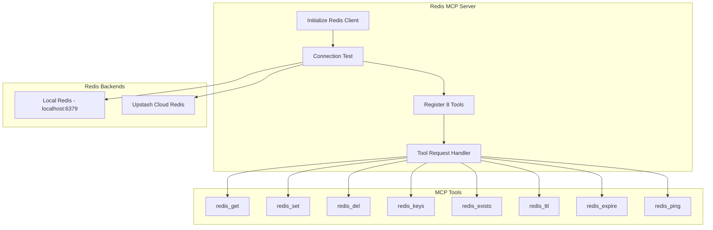
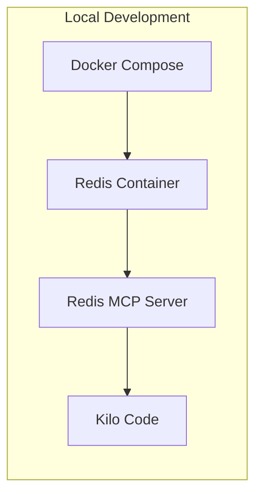
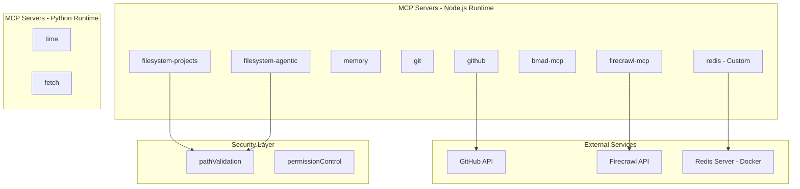

# MCP Servers Installation Plan

## Executive Summary

This document outlines the analysis and installation plan for Model Context Protocol (MCP) servers in the VS Code environment. The current configuration includes 10 MCP servers with varying states of functionality and security considerations.

**Status: Updated 2026-02-13** - Analysis complete, Redis MCP custom implementation created, security fixes applied.

---

## Current MCP Server Configuration

### Server Inventory

| #   | Server Name         | Command                                     | Status            | Dependencies            | Priority |
| --- | ------------------- | ------------------------------------------- | ----------------- | ----------------------- | -------- |
| 1   | filesystem-projects | npx @modelcontextprotocol/server-filesystem | ✅ Active         | Node.js                 | Critical |
| 2   | filesystem-agentic  | npx @modelcontextprotocol/server-filesystem | ✅ Active         | Node.js                 | Critical |
| 3   | memory              | npx @modelcontextprotocol/server-memory     | ✅ Active         | Node.js                 | High     |
| 4   | git                 | npx git-mcp                                 | ✅ Active         | git                     | High     |
| 5   | github              | npx @modelcontextprotocol/server-github     | ⚠️ Requires Token | GITHUB_TOKEN            | Medium   |
| 6   | time                | uvx mcp-server-time                         | ✅ Active         | Python/uv               | Medium   |
| 7   | fetch               | uvx mcp-server-fetch                        | ✅ Active         | Python/uv               | Medium   |
| 8   | redis               | node .kilocode/mcp-servers/redis-server.js  | ⚠️ Pending Setup  | Redis server + npm deps | Medium   |
| 9   | bmad-mcp            | npx bmad-mcp                                | ✅ Fixed          | BMAD_PROJECT_ROOT       | Medium   |
| 10  | firecrawl-mcp       | npx firecrawl-mcp                           | ⚠️ Requires Token | FIRECRAWL_API_KEY       | Low      |

---

## Analysis Findings

### Finding 1: Redis MCP - No Official Package Exists

**Problem**: The original configuration referenced `@modelcontextprotocol/server-redis` which does not exist as an official npm package.

**Solution Implemented**: Created a custom Redis MCP server implementation at [`.kilocode/mcp-servers/redis-server.js`](.kilocode/mcp-servers/redis-server.js).

**Features**:

- 8 Redis tools: `redis_get`, `redis_set`, `redis_del`, `redis_keys`, `redis_exists`, `redis_ttl`, `redis_expire`, `redis_ping`
- Supports both local Redis (`REDIS_URL`) and Upstash cloud (`UPSTASH_REDIS_REST_URL` + `UPSTASH_REDIS_REST_TOKEN`)
- Uses `ioredis` library for robust connection handling
- Includes retry logic and error handling

### Finding 2: bmad-mcp Security Vulnerability Fixed

**Problem**: `bmad-mcp` used wildcard `"*"` for `alwaysAllow`, granting unrestricted access.

**Solution Applied**: Changed from `["*"]` to `["bmad-task"]` in [`.kilocode/mcp.json`](.kilocode/mcp.json:106).

```json
// BEFORE (Insecure)
"alwaysAllow": ["*"]

// AFTER (Secure)
"alwaysAllow": ["bmad-task"]
```

### Finding 3: Path Validation Security Added

**Implementation**: Added security configuration with path validation to [`.kilocode/mcp.json`](.kilocode/mcp.json:122-161):

```json
"security": {
  "pathValidation": {
    "enabled": true,
    "allowedPaths": [
      "C:/Users/pavel/projects",
      "C:/Users/pavel/vscodeportable/agentic"
    ],
    "blockedPaths": [
      "C:/Windows",
      "C:/Program Files",
      "C:/Program Files (x86)",
      "C:/Users/pavel/.ssh",
      "C:/Users/pavel/.gnupg",
      "C:/Users/pavel/AppData"
    ]
  }
}
```

### Finding 4: Mixed Runtime Dependencies

**Status**: Acknowledged, no action required.

- **npx/Node.js**: 8 servers (filesystem-projects, filesystem-agentic, memory, git, github, redis, bmad-mcp, firecrawl-mcp)
- **uvx/Python**: 2 servers (time, fetch)

This is acceptable as both runtimes are available in the development environment.

---

## Redis MCP Implementation Details

### Custom Server Architecture



### Tool Specifications

| Tool           | Description                | Parameters                                     |
| -------------- | -------------------------- | ---------------------------------------------- |
| `redis_get`    | Get value by key           | `key: string`                                  |
| `redis_set`    | Set key-value pair         | `key: string`, `value: string`, `ttl?: number` |
| `redis_del`    | Delete key(s)              | `keys: string[]`                               |
| `redis_keys`   | Find keys matching pattern | `pattern: string`                              |
| `redis_exists` | Check if key(s) exist      | `keys: string[]`                               |
| `redis_ttl`    | Get TTL of a key           | `key: string`                                  |
| `redis_expire` | Set expiration on key      | `key: string`, `seconds: number`               |
| `redis_ping`   | Test Redis connection      | none                                           |

### Configuration in mcp.json

```json
"redis": {
  "command": "node",
  "args": [".kilocode/mcp-servers/redis-server.js"],
  "env": {
    "REDIS_URL": "${REDIS_URL}",
    "UPSTASH_REDIS_REST_URL": "${UPSTASH_REDIS_REST_URL}",
    "UPSTASH_REDIS_REST_TOKEN": "${UPSTASH_REDIS_REST_TOKEN}"
  },
  "description": "Redis for caching and context storage - requires REDIS_URL or Upstash credentials",
  "alwaysAllow": [
    "redis_get", "redis_set", "redis_del", "redis_keys",
    "redis_exists", "redis_ttl", "redis_expire", "redis_ping"
  ]
}
```

---

## Pending Setup Tasks

### Task 1: Start Docker Redis Container

The Redis server needs to be running for the MCP server to connect. Start a local Redis instance using Docker:

```bash
# Option A: Simple Redis container
docker run -d --name redis-local -p 6379:6379 redis:7-alpine

# Option B: With persistence
docker run -d --name redis-local -p 6379:6379 -v redis-data:/data redis:7-alpine redis-server --appendonly yes
```

### Task 2: Install npm Dependencies

The custom Redis MCP server requires the following npm packages:

```bash
npm install @modelcontextprotocol/server ioredis
```

**Note**: These should be installed in the project root or the MCP server directory.

### Task 3: Configure Environment Variables

Add to `.env` file:

```env
# Local Redis
REDIS_URL=redis://localhost:6379

# OR Upstash Cloud Redis (alternative)
# UPSTASH_REDIS_REST_URL=https://your-endpoint.upstash.io
# UPSTASH_REDIS_REST_TOKEN=your-token
```

### Task 4: Restart Kilo Code

After completing the above tasks, restart VS Code or reload the Kilo Code extension to load the new MCP server configuration.

---

## Docker Deployment Workflow

### Development Environment



### docker-compose.yml for Local Development

Create a `docker-compose.redis.yml` file for easy Redis management:

```yaml
version: '3.8'
services:
  redis:
    image: redis:7-alpine
    container_name: redis-local
    ports:
      - '6379:6379'
    volumes:
      - redis-data:/data
    command: redis-server --appendonly yes
    restart: unless-stopped

volumes:
  redis-data:
```

**Usage**:

```bash
# Start Redis
docker-compose -f docker-compose.redis.yml up -d

# Stop Redis
docker-compose -f docker-compose.redis.yml down

# View logs
docker-compose -f docker-compose.redis.yml logs -f
```

---

## Verification Checklist

### Pre-Deployment Verification

- [ ] **Redis Container Running**: `docker ps | grep redis`
- [ ] **Redis Connectivity**: `docker exec redis-local redis-cli ping` → returns `PONG`
- [ ] **npm Dependencies Installed**: `npm list ioredis @modelcontextprotocol/server`
- [ ] **Environment Variables Set**: Check `.env` for `REDIS_URL`
- [ ] **MCP Configuration Valid**: Validate `.kilocode/mcp.json` JSON syntax

### Post-Restart Verification

- [ ] **Kilo Code Reloaded**: Restart VS Code or reload window
- [ ] **Redis MCP Server Loaded**: Check Kilo Code output for `[Redis MCP] Connected to Redis successfully`
- [ ] **Tool Availability**: Verify `redis_ping` tool is available in Kilo Code
- [ ] **Functional Test**: Execute `redis_ping` to verify connection

### Verification Commands

```bash
# 1. Check Redis container
docker ps --filter name=redis-local

# 2. Test Redis connection
docker exec redis-local redis-cli ping

# 3. Check npm packages
npm list ioredis @modelcontextprotocol/server

# 4. Validate JSON configuration
node -e "console.log(JSON.parse(require('fs').readFileSync('.kilocode/mcp.json')))"

# 5. Test Redis MCP manually
node .kilocode/mcp-servers/redis-server.js
# Should output: [Redis MCP] Using local Redis: redis://localhost:6379
# Should output: [Redis MCP] Connected to Redis successfully
```

---

## Recommendations Summary

### Keep Active (7 servers)

1. filesystem-projects ✅
2. filesystem-agentic ✅
3. memory ✅
4. git ✅
5. time ✅
6. fetch ✅
7. bmad-mcp ✅ (security fixed)

### Setup Required (3 servers)

8. redis - Custom implementation ready, needs Docker + npm deps
9. github - Requires `GITHUB_TOKEN` environment variable
10. firecrawl-mcp - Requires `FIRECRAWL_API_KEY` environment variable

### Consider Adding

- Search/grep MCP server for code searching
- Docker MCP server for container management
- Database MCP servers (PostgreSQL, MySQL) if needed

---

## Mermaid: MCP Server Architecture



---

## Next Steps

1. **Execute Pending Setup Tasks** - Start Redis container, install npm deps
2. **Configure Environment Variables** - Add `REDIS_URL` to `.env`
3. **Restart Kilo Code** - Reload VS Code window
4. **Run Verification Checklist** - Confirm all servers operational
5. **Configure API Tokens** - Add `GITHUB_TOKEN` and `FIRECRAWL_API_KEY` if needed

---

## Changelog

| Date       | Change                                        | Author    |
| ---------- | --------------------------------------------- | --------- |
| 2026-02-13 | Initial plan creation                         | Kilo Code |
| 2026-02-13 | Added Redis MCP custom implementation details | Kilo Code |
| 2026-02-13 | Fixed bmad-mcp security vulnerability         | Kilo Code |
| 2026-02-13 | Added path validation security configuration  | Kilo Code |
| 2026-02-13 | Added Docker deployment workflow              | Kilo Code |
| 2026-02-13 | Added verification checklist                  | Kilo Code |

---

_Document created: 2026-02-13_
_Last updated: 2026-02-13_
_Status: Ready for Implementation_
