# API Config Protection & Hardening Plan

**Date**: 2026-02-19
**Orchestrator**: Antigravity (Gemini 2.5 Pro)
**Status**: 19/19 keys verified — now hardening the known-good state

---

## Problem Statement

We've reached a **verified 19/19 functional state** for the agentic API configuration. The risk now is **config drift** — agents editing `.env`, endpoint changes, key rotation, or provider deprecations silently breaking this state without detection.

## Recommended Strategy: Config Snapshot + CI Drift Detection

After researching 2026 best practices (OWASP Agentic Top 10, GitOps drift detection, HashiCorp health assessments, `driftctl`-patterns), here's the recommended architecture:

```mermaid
graph TD
    A["🟢 Known-Good State<br>(19/19 verified)"] --> B["📸 Snapshot<br>config-snapshot.json"]
    B --> C["🔒 Git Tag<br>api-config-v1.0"]
    B --> D["🤖 CI Health Check<br>GitHub Actions"]
    B --> E["🛡️ @protected<br>scripts/protected/"]
    D --> F{"Drift<br>Detected?"}
    F -->|Yes| G["🚨 Alert + PR"]
    F -->|No| H["✅ Healthy"]
```



---

## Enhancement 1: Config Snapshot System (Non-Minor)

### What

Create a JSON snapshot of the current known-good configuration state — endpoints, auth types, key prefixes, and expected responses — that serves as the **baseline** for drift detection.

### Files

#### [NEW] `scripts/protected/config-snapshot.json`

```json
{
  "version": "1.0.0",
  "snapshot_date": "2026-02-19T00:15:56Z",
  "verified_count": 19,
  "keys": {
    "OPENROUTER_API_KEY": {
      "endpoint": "https://openrouter.ai/api/v1/models",
      "auth_type": "bearer",
      "expected_status": 200,
      "key_prefix": "sk-or-v1-",
      "last_verified": "2026-02-19"
    },
    "GEMINI_API_KEY": {
      "endpoint": "https://generativelanguage.googleapis.com/v1beta/models",
      "auth_type": "param",
      "expected_status": 200,
      "key_prefix": "AIzaSy",
      "last_verified": "2026-02-19"
    }
  }
}
```

#### [NEW] `scripts/protected/snapshot_config.py`

Script to: (a) generate snapshot from current state, (b) compare live state against snapshot, (c) output drift report.

#### [NEW] Git tag: `api-config-v1.0`

Tag the current commit as the known-good state.

---

## Enhancement 2: CI Drift Detection (Non-Minor)

### What

GitHub Actions workflow that runs the verification script on a schedule (daily or on push) and fails if the live state deviates from the snapshot.

### Files

#### [NEW] `.github/workflows/api-health-check.yml`

```yaml
name: API Config Health Check
on:
  schedule:
    - cron: '0 6 * * 1' # Weekly Monday 6am UTC
  push:
    paths:
      - '.env.example'
      - 'scripts/verify_api_keys.py'
      - 'scripts/protected/**'
  workflow_dispatch:

jobs:
  health-check:
    runs-on: ubuntu-latest
    steps:
      - uses: actions/checkout@v4
      - uses: actions/setup-python@v5
        with: { python-version: '3.12' }
      - run: pip install requests python-dotenv
      - name: Run verification
        env:
          GEMINI_API_KEY: ${{ secrets.GEMINI_API_KEY }}
          NVIDIA_API_KEY: ${{ secrets.NVIDIA_API_KEY }}
          OPENROUTER_API_KEY: ${{ secrets.OPENROUTER_API_KEY }}
          # ... all keys from GH Secrets
        run: python scripts/verify_api_keys.py
      - name: Check drift
        run: python scripts/protected/snapshot_config.py --compare
```

> **Note:** This requires syncing key values to GitHub Secrets (they currently exist for infra keys; LLM keys may need adding).

---

## Enhancement 3: Protected Scripts Directory (Non-Minor)

### What

Move verified, production-critical scripts to `scripts/protected/` with `# @protected` headers. Agent rules should prevent agents from modifying these files without explicit human approval.

### Files

#### [NEW] `scripts/protected/verify_api_keys.py`

Copy of the verified v3 script, marked `# @protected — do not modify without human approval`.

#### [MODIFY] `.clinerules/protected-files.md`

Add rule: agents must not modify files in `scripts/protected/` without explicit approval.

#### [MODIFY] `.kilocode/rules/protected-files.md`

Mirror the same rule for Kilo Code.

---

## Enhancement 4: Automated Tests (Non-Minor)

### What

Proper test suite for the verification script itself — mock API responses, test edge cases, verify correct behavior for each auth type.

### Files

#### [NEW] `tests/unit/test_verify_api_keys.py`

**Test cases:**

| #   | Test                       | What it validates                                      |
| --- | -------------------------- | ------------------------------------------------------ |
| 1   | `test_bearer_auth_200`     | Bearer token sends correctly, returns OK               |
| 2   | `test_param_auth_200`      | `?key=` param sends correctly (Gemini)                 |
| 3   | `test_github_secrets_skip` | `source: github_secrets` returns True even when absent |
| 4   | `test_presence_only`       | Keys with `presence_only` bypass endpoint check        |
| 5   | `test_missing_key`         | Missing env var returns `(False, "Not found")`         |
| 6   | `test_401_unauthorized`    | 401 response returns correct error                     |
| 7   | `test_network_timeout`     | Timeout exception is caught gracefully                 |
| 8   | `test_override_env`        | `load_dotenv(override=True)` overrides system vars     |
| 9   | `test_snapshot_drift`      | Drift detection catches endpoint changes               |
| 10  | `test_all_keys_in_config`  | All 19 keys exist in `API_KEYS_CONFIG`                 |

**Implementation:** Use `pytest` + `responses` library (or `unittest.mock`) to mock HTTP calls.

---

## Enhancement 5: `.env.example` Sync Validation (Non-Minor)

### What

Create/update `.env.example` as the template that mirrors `.env` structure (without real values) and add a CI step that validates `.env` contains all required keys.

### Files

#### [NEW or MODIFY] `.env.example`

Template with all 19 keys, placeholder values, and comments.

#### [NEW] `scripts/validate_env.py`

Compares `.env` keys against `.env.example`, reports missing or extra keys.

---

## Subagent Assignments

| #   | Task                                                  | Agent             | Skill                                  | Model                     | Cost |
| --- | ----------------------------------------------------- | ----------------- | -------------------------------------- | ------------------------- | ---- |
| 1   | Create `config-snapshot.json` + `snapshot_config.py`  | Kilo CLI          | `bmad-development-execution`           | z-ai/glm4.7 (NVIDIA free) | $0   |
| 2   | Create `api-health-check.yml` CI workflow             | Cline             | `bmad-development-execution`           | minimax-m2.1:free         | $0   |
| 3   | Write `tests/unit/test_verify_api_keys.py` (10 tests) | Kilo CLI          | `bmad-development-execution` + `debug` | z-ai/glm4.7               | $0   |
| 4   | Create `scripts/protected/` + protection rules        | Cline             | `bmad-development-execution`           | minimax-m2.1:free         | $0   |
| 5   | Create/update `.env.example` + `validate_env.py`      | Gemini CLI        | —                                      | gemini-2.5-flash (free)   | $0   |
| 6   | Git tag `api-config-v1.0` + sync keys to GH Secrets   | **User** (manual) | —                                      | —                         | —    |

### Parallel Execution Plan

```
┌─────────────────────────────────────────────────────┐
│ PARALLEL WAVE 1 (no dependencies)                   │
│                                                     │
│  [Kilo CLI] Task 1: snapshot system                 │
│  [Cline]    Task 2: CI workflow                     │
│  [Kilo CLI] Task 3: unit tests                      │
│  [Cline]    Task 4: protected dir + rules           │
│  [Gemini]   Task 5: .env.example + validator        │
│                                                     │
├─────────────────────────────────────────────────────┤
│ SEQUENTIAL GATE (wait for Wave 1)                   │
│                                                     │
│  [User]     Task 6: git tag + GH Secrets sync       │
│                                                     │
├─────────────────────────────────────────────────────┤
│ VERIFICATION (after all tasks)                      │
│                                                     │
│  [Antigravity] Run full pipeline:                   │
│    • python scripts/verify_api_keys.py              │
│    • pytest tests/unit/test_verify_api_keys.py      │
│    • python scripts/protected/snapshot_config.py    │
│    • python scripts/validate_env.py                 │
│                                                     │
└─────────────────────────────────────────────────────┘
```

### Cost Estimate

- **Paid**: $0 (all tasks use free models)
- **Free**: 5 parallel tasks across Kilo CLI, Cline, Gemini CLI
- **Total**: $0

---

## Security Status Confirmed

| Check                         | Result                                           |
| ----------------------------- | ------------------------------------------------ |
| `.env` in `.gitignore`        | ✅ Confirmed                                     |
| `.env` never committed to git | ✅ Confirmed (no history)                        |
| Stale system `GEMINI_API_KEY` | ⚠️ Still exists — user action needed             |
| `GITHUB_TOKEN` type           | ⚠️ Classic PAT (`ghp_`) — recommend fine-grained |
| `KILOCODE_API_KEY` JWT expiry | ℹ️ 2031-02-17 — long-lived, monitor              |
