# MCP Server Restart Fix Plan

**Date**: 2026-02-16
**Author**: Kilo Code (Architect Mode)
**Status**: Ready for Implementation
**Related**: [`mcp-restart-analysis.md`](mcp-restart-analysis.md)

---

## Executive Summary

### Problem Statement

The Kilo Code VS Code extension experiences unexpected MCP server restarts due to configuration and infrastructure issues. Analysis identified **6 root causes** with varying likelihood and impact:

| Root Cause                      | Likelihood | Impact                 |
| ------------------------------- | ---------- | ---------------------- |
| npx Package Resolution Delays   | 5/5        | Slow startup, timeouts |
| Redis Server Not Running        | 5/5        | Server crash           |
| Environment Variable Resolution | 3/5        | Auth failures          |
| Concurrent Server Spawns        | 3/5        | Resource contention    |
| In-Memory State Loss            | 2/5        | Data loss on restart   |
| Windows Path Handling           | 3/5        | Spawn failures         |

### Impact Assessment

- **Developer Productivity**: 2-5 minutes lost per restart incident
- **Context Loss**: Memory server resets, losing conversation context
- **Workflow Disruption**: Active tasks interrupted mid-execution
- **Agent Coordination**: Multi-agent workflows lose shared state

### Recommended Approach

Implement fixes in **3 phases** prioritizing quick wins first, then infrastructure improvements, followed by long-term stability measures. Assign each fix to appropriate agent/mode based on skill requirements.

---

## Fix Implementation Plan

### P0 - Critical (Immediate)

#### Fix 1: Pre-install MCP Packages Globally

**Problem**: `npx -y` downloads/resolves packages on every spawn, causing delays and potential timeouts.

**Solution**: Install all MCP packages globally, update configuration to use direct paths.

**Assigned**: Code mode
**Skills Required**: None (standard npm operations)

**Implementation Steps**:

1. Install packages globally:
   ```bash
   npm install -g @modelcontextprotocol/server-filesystem
   npm install -g @modelcontextprotocol/server-memory
   npm install -g @modelcontextprotocol/server-redis
   npm install -g @modelcontextprotocol/server-github
   npm install -g git-mcp
   npm install -g bmad-mcp
   ```
2. Find global npm path:
   ```bash
   npm root -g
   # Output: C:\Users\pavel\AppData\Roaming\npm\node_modules
   ```
3. Update [`.kilocode/mcp.json`](.kilocode/mcp.json) to use direct node execution:
   ```json
   {
     "filesystem-projects": {
       "command": "node",
       "args": [
         "C:/Users/pavel/AppData/Roaming/npm/node_modules/@modelcontextprotocol/server-filesystem/dist/index.js",
         "C:/Users/pavel/projects"
       ]
     }
   }
   ```
4. Test each server individually before full restart

**Validation Criteria**:

- [ ] All 6 npx-based servers converted to direct node execution
- [ ] `npm list -g --depth=0` shows all MCP packages
- [ ] Manual test: `node <path-to-server>` starts without download delay
- [ ] VS Code restart shows no npx resolution delays in logs

---

#### Fix 2: Add Redis Health Check Script

**Problem**: Redis MCP server requires running Redis instance at `localhost:6379`. No validation before spawn causes immediate crash if Redis unavailable.

**Solution**: Create startup validation script that checks Redis availability and optionally starts it.

**Assigned**: Debug mode
**Skills Required**: None (diagnostic scripting)

**Implementation Steps**:

1. Create [`scripts/check-redis.cjs`](scripts/check-redis.cjs):

   ```javascript
   #!/usr/bin/env node
   const { execSync } = require('child_process');

   function checkRedis() {
     try {
       const result = execSync('redis-cli ping', { encoding: 'utf8', timeout: 5000 });
       if (result.trim() === 'PONG') {
         console.log('Redis is running');
         process.exit(0);
       }
     } catch (e) {
       console.log('Redis not running, attempting to start...');
       try {
         execSync('redis-server --daemonize yes', { timeout: 10000 });
         console.log('Redis started successfully');
         process.exit(0);
       } catch (startError) {
         console.error('Failed to start Redis:', startError.message);
         process.exit(1);
       }
     }
   }

   checkRedis();
   ```

2. Add to VS Code startup or create pre-launch task
3. Update MCP configuration to use port validation:
   ```json
   {
     "redis": {
       "command": "node",
       "args": [
         "C:/Users/pavel/AppData/Roaming/npm/node_modules/@modelcontextprotocol/server-redis/dist/index.js",
         "redis://localhost:6379"
       ],
       "env": {
         "REDIS_PORT": "6379"
       }
     }
   }
   ```

**Validation Criteria**:

- [ ] `node scripts/check-redis.cjs` returns exit 0 when Redis running
- [ ] Script starts Redis automatically if not running
- [ ] MCP Redis server connects successfully after check

---

#### Fix 3: Fix Environment Variable Syntax

**Problem**: `${GITHUB_TOKEN}` syntax may not resolve correctly in MCP configuration on Windows.

**Solution**: Use environment variable inheritance or explicit resolution.

**Assigned**: Code mode
**Skills Required**: None

**Implementation Steps**:

1. Verify GITHUB_TOKEN is set in system environment:
   ```cmd
   echo %GITHUB_TOKEN%
   ```
2. If not set, add to user environment variables:
   ```cmd
   setx GITHUB_TOKEN "your_token_here"
   ```
3. Update MCP configuration to inherit from parent process:
   ```json
   {
     "github": {
       "command": "node",
       "args": [
         "C:/Users/pavel/AppData/Roaming/npm/node_modules/@modelcontextprotocol/server-github/dist/index.js"
       ],
       "env": {}
     }
   }
   ```
   Note: Empty `env` object inherits all parent environment variables
4. Alternative: Create `.env` file and load before VS Code:
   ```bash
   # .kilocode/.env
   GITHUB_TOKEN=ghp_xxxx
   ```

**Validation Criteria**:

- [ ] `echo %GITHUB_TOKEN%` shows correct token
- [ ] GitHub MCP server can access private repositories
- [ ] No authentication errors in MCP logs

---

### P1 - High (This Week)

#### Fix 4: Create MCP Startup Validation Script

**Problem**: No comprehensive validation of MCP prerequisites before server spawn.

**Solution**: Create unified validation script that checks all dependencies.

**Assigned**: Debug mode
**Skills Required**: None

**Implementation Steps**:

1. Create [`scripts/validate-mcp-startup.cjs`](scripts/validate-mcp-startup.cjs):

   ```javascript
   #!/usr/bin/env node
   const { execSync, spawn } = require('child_process');
   const fs = require('fs');
   const path = require('path');

   const checks = {
     redis: () => {
       try {
         const result = execSync('redis-cli ping', { encoding: 'utf8', timeout: 5000 });
         return result.trim() === 'PONG';
       } catch {
         return false;
       }
     },
     githubToken: () => !!process.env.GITHUB_TOKEN,
     npmPackages: () => {
       const packages = [
         '@modelcontextprotocol/server-filesystem',
         '@modelcontextprotocol/server-memory',
         '@modelcontextprotocol/server-redis',
         '@modelcontextprotocol/server-github',
         'git-mcp',
         'bmad-mcp',
       ];
       const npmRoot = execSync('npm root -g', { encoding: 'utf8' }).trim();
       return packages.every((pkg) => fs.existsSync(path.join(npmRoot, pkg)));
     },
     paths: () => {
       const paths = ['C:/Users/pavel/projects', 'C:/Users/pavel/vscodeportable/agentic'];
       return paths.every((p) => fs.existsSync(p));
     },
   };

   console.log('MCP Startup Validation\n');
   let allPassed = true;

   for (const [name, check] of Object.entries(checks)) {
     const passed = check();
     console.log(`${passed ? 'PASS' : 'FAIL'}: ${name}`);
     if (!passed) allPassed = false;
   }

   process.exit(allPassed ? 0 : 1);
   ```

2. Add npm script: `"validate:mcp": "node scripts/validate-mcp-startup.cjs"`
3. Run before starting VS Code session

**Validation Criteria**:

- [ ] Script passes all 4 checks
- [ ] Clear error messages for failed checks
- [ ] Exit code 0 only when all checks pass

---

#### Fix 5: Implement Staggered Server Startup

**Problem**: 9 servers spawning simultaneously causes resource contention.

**Solution**: Configure startup priority and delays (if supported by Kilo Code extension).

**Assigned**: Architect mode
**Skills Required**: None

**Implementation Steps**:

1. Research if Kilo Code supports `startupDelay` or `priority` properties
2. If supported, update [`.kilocode/mcp.json`](.kilocode/mcp.json):
   ```json
   {
     "mcpServers": {
       "filesystem-projects": { "priority": 1 },
       "filesystem-agentic": { "priority": 1, "startupDelay": 500 },
       "memory": { "priority": 2, "startupDelay": 1000 },
       "git": { "priority": 2, "startupDelay": 1500 },
       "github": { "priority": 2, "startupDelay": 2000 },
       "time": { "priority": 3, "startupDelay": 2500 },
       "fetch": { "priority": 3, "startupDelay": 3000 },
       "redis": { "priority": 3, "startupDelay": 3500 },
       "bmad-mcp": { "priority": 4, "startupDelay": 4000 }
     }
   }
   ```
3. If not supported, document as feature request for Kilo Code extension

**Validation Criteria**:

- [ ] Servers start in priority order
- [ ] No resource contention errors in logs
- [ ] Total startup time within acceptable limits

---

#### Fix 6: Add Persistent Memory Storage

**Problem**: Memory server uses in-memory storage, losing all data on restart.

**Solution**: Replace with persistent storage solution.

**Assigned**: Code mode
**Skills Required**: None

**Implementation Steps**:

1. Install persistent memory package:
   ```bash
   npm install -g mcp-memory-keeper
   ```
2. Create storage directory:
   ```bash
   mkdir C:\Users\pavel\.mcp-memory
   ```
3. Update MCP configuration:
   ```json
   {
     "memory": {
       "command": "node",
       "args": [
         "C:/Users/pavel/AppData/Roaming/npm/node_modules/mcp-memory-keeper/dist/index.js",
         "--storage-path",
         "C:/Users/pavel/.mcp-memory"
       ]
     }
   }
   ```
4. Migrate existing memory data if any

**Validation Criteria**:

- [ ] Memory data persists across VS Code restarts
- [ ] Storage files created in `~/.mcp-memory`
- [ ] All memory operations work as before

---

### P2 - Medium (Next Sprint)

#### Fix 7: Create MCP Monitoring Dashboard

**Problem**: No visibility into MCP server health and performance.

**Solution**: Create monitoring script that tracks server status.

**Assigned**: Debug mode
**Skills Required**: None

**Implementation Steps**:

1. Create [`scripts/mcp-monitor.cjs`](scripts/mcp-monitor.cjs):

   ```javascript
   #!/usr/bin/env node
   const { execSync } = require('child_process');

   const servers = [
     'filesystem-projects',
     'filesystem-agentic',
     'memory',
     'git',
     'github',
     'time',
     'fetch',
     'redis',
     'bmad-mcp',
   ];

   function checkServerProcess(name) {
     try {
       const result = execSync('tasklist', { encoding: 'utf8' });
       // Check for node processes that might be MCP servers
       return result.includes('node.exe');
     } catch {
       return false;
     }
   }

   console.log('MCP Server Monitor\n');
   console.log('Time:', new Date().toISOString());
   console.log('---');

   servers.forEach((server) => {
     console.log(`${server}: ${checkServerProcess(server) ? 'RUNNING' : 'UNKNOWN'}`);
   });
   ```

2. Add to npm scripts: `"monitor:mcp": "node scripts/mcp-monitor.cjs"`
3. Consider VS Code status bar integration

**Validation Criteria**:

- [ ] Monitor shows server status
- [ ] Can detect crashed servers
- [ ] Output is human-readable

---

#### Fix 8: Implement Graceful Degradation

**Problem**: Single server failure can cascade to other servers.

**Solution**: Configure fallback behavior for non-critical servers.

**Assigned**: Architect mode
**Skills Required**: None

**Implementation Steps**:

1. Categorize servers by criticality:
   - **Critical**: filesystem-projects, memory, git
   - **Important**: github, bmad-mcp
   - **Optional**: redis, time, fetch, filesystem-agentic
2. Document fallback behavior for each category
3. Update MCP configuration with `required: false` for optional servers (if supported)
4. Create startup script that continues even if optional servers fail

**Validation Criteria**:

- [ ] Non-critical server failure doesn't block startup
- [ ] Clear logging of which servers failed
- [ ] Core functionality maintained with partial server availability

---

#### Fix 9: Add Windows-Specific Path Handling

**Problem**: Mixed path formats may cause spawn issues on Windows.

**Solution**: Standardize path handling and add Windows-specific configuration.

**Assigned**: Code mode
**Skills Required**: None

**Implementation Steps**:

1. Audit all paths in [`.kilocode/mcp.json`](.kilocode/mcp.json)
2. Convert to forward slashes (Windows compatible):
   ```json
   {
     "args": ["C:/Users/pavel/projects"] // Correct
     // Not: "args": ["C:\\Users\\pavel\\projects"]  // Avoid
   }
   ```
3. Add `shell: true` to spawn configuration if needed
4. Test with both CMD and PowerShell

**Validation Criteria**:

- [ ] All paths use forward slashes
- [ ] Servers start correctly from both CMD and PowerShell
- [ ] No path-related errors in logs

---

### P3 - Low (Future)

#### Fix 10: Migrate to Docker-based MCP Servers

**Problem**: Local MCP servers have environment dependencies and potential conflicts.

**Solution**: Containerize MCP servers for isolation and reproducibility.

**Assigned**: Architect mode
**Skills Required**: None

**Implementation Steps**:

1. Create Docker Compose configuration for MCP servers
2. Build Docker images for each server
3. Update MCP configuration to use Docker:
   ```json
   {
     "filesystem-projects": {
       "command": "docker",
       "args": ["exec", "-i", "mcp-filesystem", "node", "/app/dist/index.js"]
     }
   }
   ```
4. Document Docker setup requirements

**Validation Criteria**:

- [ ] All servers run in Docker containers
- [ ] No local npm package dependencies
- [ ] Consistent behavior across environments

---

#### Fix 11: Implement MCP Server Pooling

**Problem**: Each session spawns new server instances.

**Solution**: Implement connection pooling for frequently used servers.

**Assigned**: Architect mode
**Skills Required**: None

**Implementation Steps**:

1. Research MCP server lifecycle management
2. Design connection pool architecture
3. Implement pool manager service
4. Update MCP client to use pool

**Validation Criteria**:

- [ ] Server instances reused across sessions
- [ ] Reduced startup time
- [ ] Memory usage stable

---

## Agent Assignments Summary

| Fix                          | Priority | Assigned Mode | Skills Required |
| ---------------------------- | -------- | ------------- | --------------- |
| 1. Pre-install MCP packages  | P0       | Code          | None            |
| 2. Redis health check        | P0       | Debug         | None            |
| 3. Environment variable fix  | P0       | Code          | None            |
| 4. Startup validation script | P1       | Debug         | None            |
| 5. Staggered startup         | P1       | Architect     | None            |
| 6. Persistent memory         | P1       | Code          | None            |
| 7. Monitoring dashboard      | P2       | Debug         | None            |
| 8. Graceful degradation      | P2       | Architect     | None            |
| 9. Windows path handling     | P2       | Code          | None            |
| 10. Docker migration         | P3       | Architect     | None            |
| 11. Server pooling           | P3       | Architect     | None            |

---

## Implementation Phases

```mermaid
flowchart LR
    subgraph Phase1[Phase 1: Quick Wins]
        F1[Fix 1: Pre-install Packages]
        F2[Fix 2: Redis Health Check]
        F3[Fix 3: Env Variable Fix]
    end

    subgraph Phase2[Phase 2: Infrastructure]
        F4[Fix 4: Startup Validation]
        F5[Fix 5: Staggered Startup]
        F6[Fix 6: Persistent Memory]
    end

    subgraph Phase3[Phase 3: Long-term]
        F7[Fix 7: Monitoring]
        F8[Fix 8: Graceful Degradation]
        F9[Fix 9: Windows Paths]
        F10[Fix 10: Docker]
        F11[Fix 11: Pooling]
    end

    Phase1 --> Phase2
    Phase2 --> Phase3

    style F1 fill:#ff6b6b
    style F2 fill:#ff6b6b
    style F3 fill:#ff6b6b
    style F4 fill:#ffd93d
    style F5 fill:#ffd93d
    style F6 fill:#ffd93d
    style F7 fill:#6bcb77
    style F8 fill:#6bcb77
    style F9 fill:#6bcb77
    style F10 fill:#4d96ff
    style F11 fill:#4d96ff
```



### Phase 1: Quick Wins (Immediate)

**Goal**: Eliminate the most likely causes of restarts with minimal changes.

**Fixes**: 1, 2, 3 (P0 Critical)

**Expected Outcome**: 70% reduction in restart incidents

### Phase 2: Infrastructure Improvements (This Week)

**Goal**: Add robustness and validation to prevent future issues.

**Fixes**: 4, 5, 6 (P1 High)

**Expected Outcome**: 90% reduction in restart incidents, persistent memory

### Phase 3: Long-term Stability (Next Sprint+)

**Goal**: Comprehensive monitoring, graceful degradation, and future-proofing.

**Fixes**: 7, 8, 9, 10, 11 (P2-P3)

**Expected Outcome**: Near-zero restart incidents, full observability

---

## Validation Checklist

### Pre-Implementation

- [ ] Backup current [`.kilocode/mcp.json`](.kilocode/mcp.json)
- [ ] Document current server startup times
- [ ] Record baseline restart frequency

### Post-Phase 1

- [ ] All packages installed globally
- [ ] Redis health check passes
- [ ] GITHUB_TOKEN accessible
- [ ] No npx resolution delays in logs
- [ ] All 9 servers start successfully

### Post-Phase 2

- [ ] Validation script passes all checks
- [ ] Memory persists across restarts
- [ ] Startup time reduced by 50%+

### Post-Phase 3

- [ ] Monitoring dashboard operational
- [ ] Graceful degradation tested
- [ ] No path-related errors

### Final Validation

Run comprehensive test:

```bash
# 1. Validate all prerequisites
npm run validate:mcp

# 2. Check Redis
node scripts/check-redis.cjs

# 3. Monitor server status
npm run monitor:mcp

# 4. Test each server manually
node <path-to-server> --test
```

---

## Test Procedures

### Manual Test Procedure

1. **Close VS Code completely**
2. **Run validation script**: `npm run validate:mcp`
3. **Start Redis if needed**: `redis-server`
4. **Open VS Code**
5. **Check MCP logs** for errors
6. **Test each MCP tool**:
   - Filesystem: Read a file
   - Memory: Create an entity
   - Git: Check status
   - GitHub: List repositories
   - Redis: Set/get a key
   - Time: Get current time
   - Fetch: Fetch a URL

### Automated Test Script

Create [`scripts/test-mcp.cjs`](scripts/test-mcp.cjs):

```javascript
#!/usr/bin/env node
const { execSync } = require('child_process');

const tests = [
  { name: 'Redis', cmd: 'redis-cli ping' },
  { name: 'Node', cmd: 'node --version' },
  { name: 'npm', cmd: 'npm --version' },
  { name: 'Git', cmd: 'git --version' },
];

console.log('MCP Test Suite\n');

let passed = 0;
tests.forEach((test) => {
  try {
    execSync(test.cmd, { timeout: 5000 });
    console.log(`PASS: ${test.name}`);
    passed++;
  } catch (e) {
    console.log(`FAIL: ${test.name} - ${e.message}`);
  }
});

console.log(`\nResults: ${passed}/${tests.length} passed`);
process.exit(passed === tests.length ? 0 : 1);
```

---

## Rollback Plan

If fixes cause issues:

1. **Restore backup**: `cp .kilocode/mcp.json.backup .kilocode/mcp.json`
2. **Revert global packages**: `npm uninstall -g <package>`
3. **Restart VS Code**
4. **Document issue** for future investigation

---

## References

- Analysis Document: [`mcp-restart-analysis.md`](mcp-restart-analysis.md)
- MCP Configuration: [`.kilocode/mcp.json`](.kilocode/mcp.json)
- Validation Script: [`scripts/validate-mcp.cjs`](scripts/validate-mcp.cjs)
- Memory Bank - Servers: [`.kilocode/rules/memory-bank/servers.md`](.kilocode/rules/memory-bank/servers.md)
- Agent Registry: [`AGENTS.md`](AGENTS.md)

---

## Changelog

| Date       | Change                | Author                |
| ---------- | --------------------- | --------------------- |
| 2026-02-16 | Initial plan creation | Kilo Code (Architect) |
