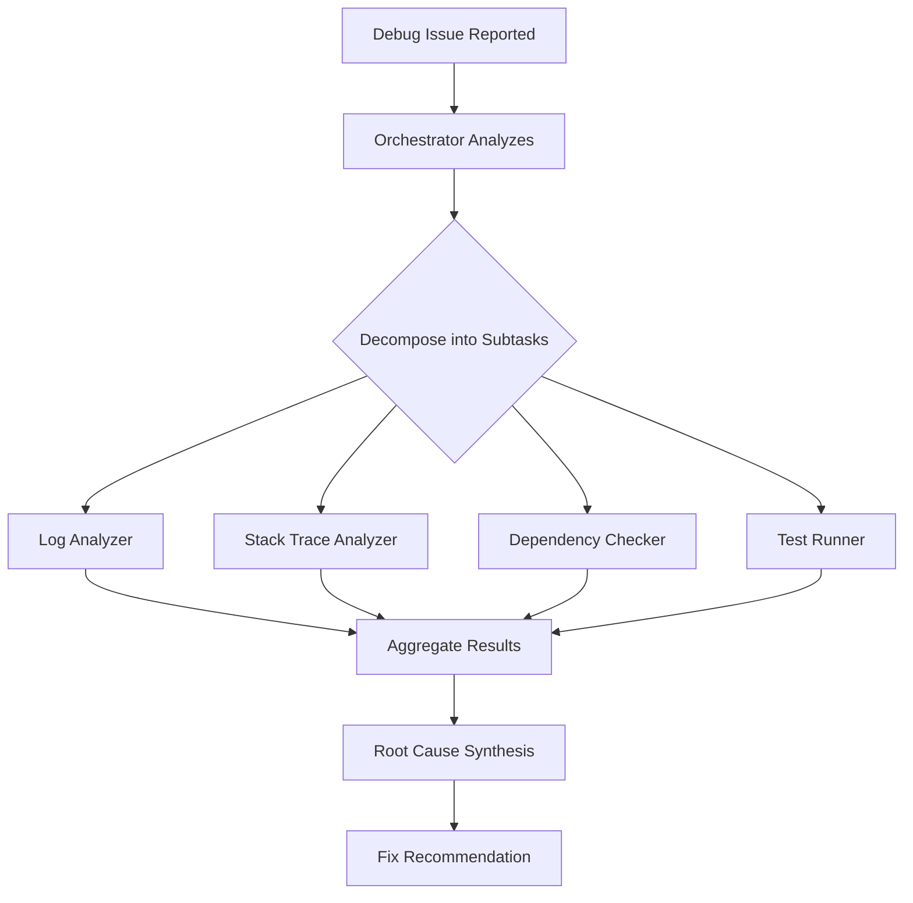
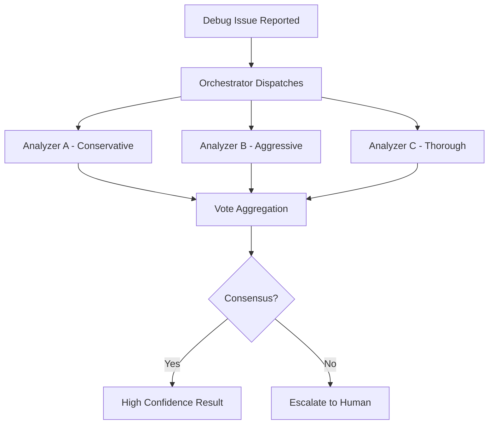
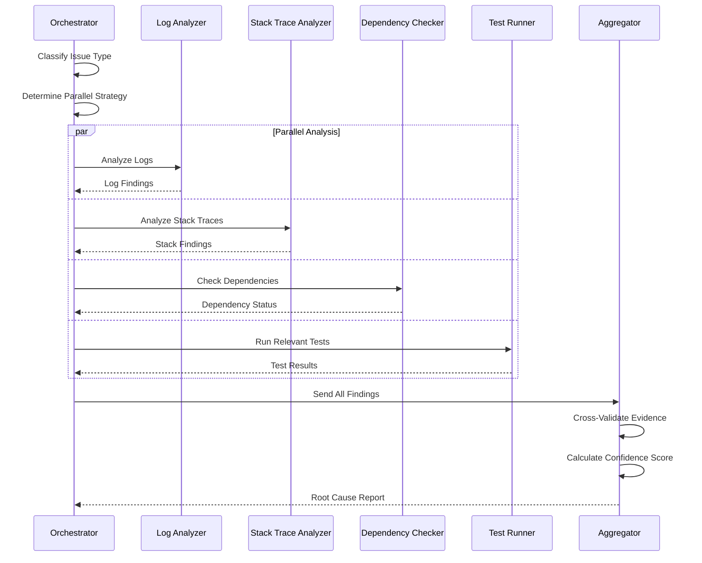
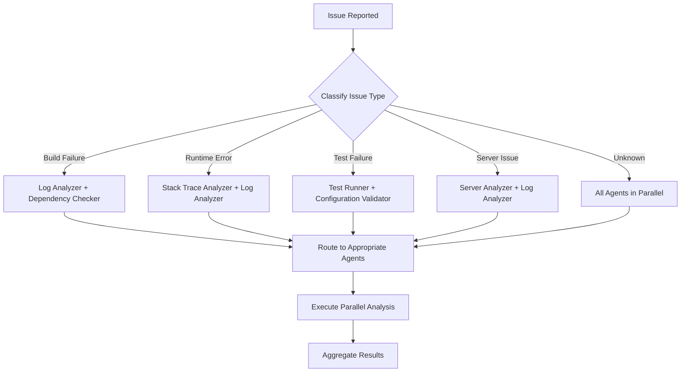
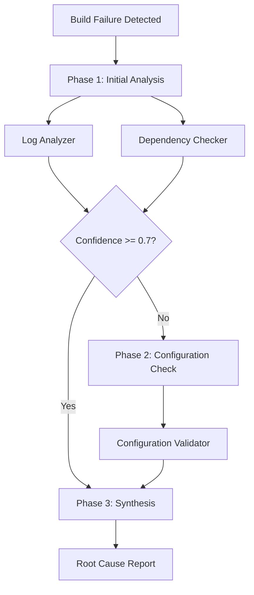
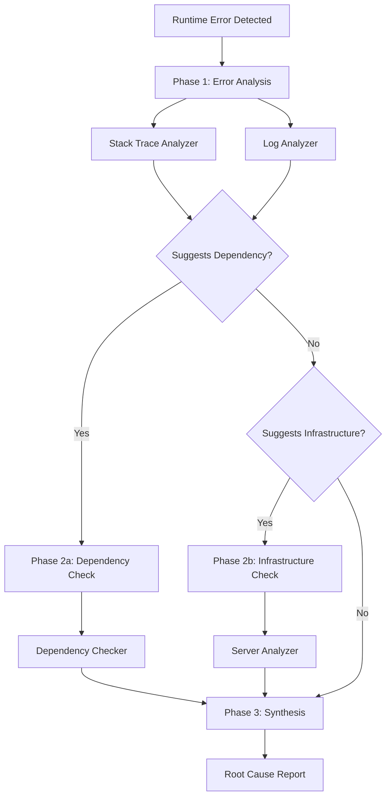
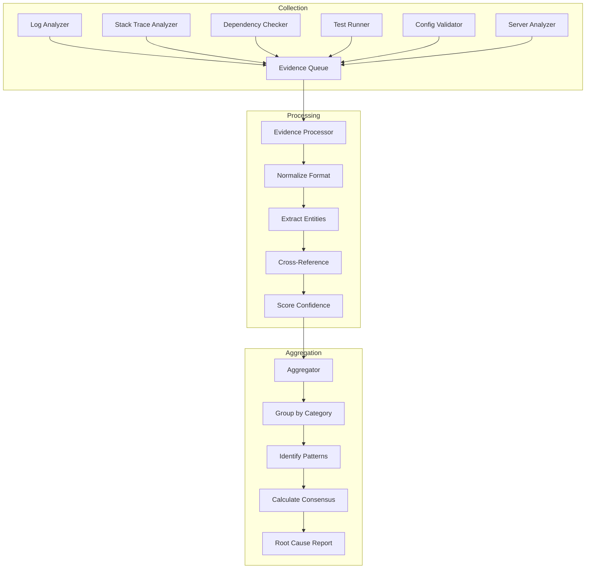
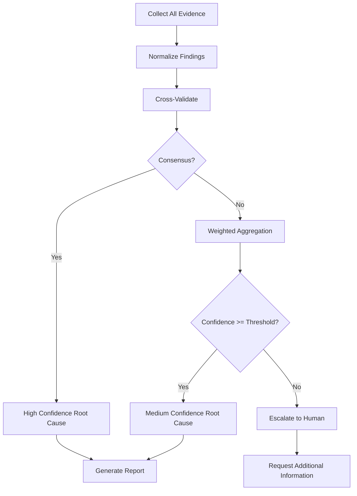
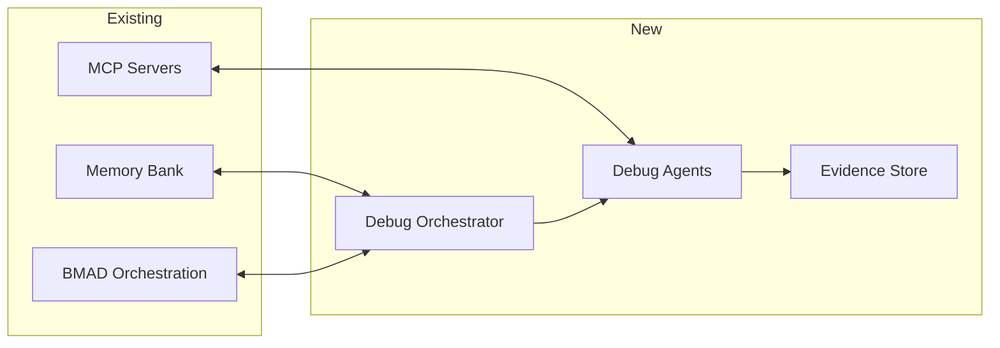

# Parallel Debugging Orchestration Research

**Created**: 2026-02-14
**Author**: Kilo Code (Architect Mode)
**Status**: Research Complete

---

## Executive Summary

This document presents research findings and best practices for implementing a parallel debugging orchestration system for AI agent projects. The system coordinates multiple debug subagents working in parallel on different aspects of a debugging problem.

### Key Findings

1. **Parallelization Patterns**: Two primary patterns emerge - **Sectioning** (independent subtasks) and **Voting** (multiple perspectives)
2. **Orchestrator-Workers Model**: Central orchestrator dynamically decomposes tasks and synthesizes results
3. **Specialized Debug Agents**: 6 core agent types identified for effective debugging coverage
4. **Evidence Aggregation**: Structured collection with confidence scoring and cross-validation

---

## 1. Parallel Debugging Patterns

### 1.1 Pattern Classification

Based on Anthropic's research on building effective agents and our existing 8-step debugging protocol, we identify two primary parallelization patterns:

#### Pattern A: Sectioning (Independent Subtasks)

Tasks are broken into independent subtasks that run in parallel, with results aggregated programmatically.



**When to use**:

- Complex issues with multiple potential causes
- Time-critical debugging requiring faster resolution
- Issues spanning multiple system components

**Best Practices**:

- Each subtask should have clear boundaries and no dependencies on other subtasks
- Define explicit input/output contracts for each agent
- Implement timeout handling for each parallel branch

#### Pattern B: Voting (Multiple Perspectives)

The same task is run multiple times with different approaches to get diverse outputs and higher confidence.



**When to use**:

- Critical issues requiring high confidence
- Security-related debugging
- Production system failures

**Best Practices**:

- Use different model configurations or prompts for each analyzer
- Implement weighted voting based on historical accuracy
- Define clear consensus thresholds

### 1.2 Task Dependency Matrix

| Task Type                | Can Run Parallel | Must Run Sequential | Dependencies          |
| ------------------------ | ---------------- | ------------------- | --------------------- |
| Log Analysis             | ✅ Yes           | -                   | None                  |
| Stack Trace Analysis     | ✅ Yes           | -                   | None                  |
| Dependency Check         | ✅ Yes           | -                   | None                  |
| Test Execution           | ✅ Yes           | -                   | None                  |
| Configuration Validation | ✅ Yes           | -                   | None                  |
| Root Cause Synthesis     | -                | ✅ Yes              | All parallel tasks    |
| Fix Implementation       | -                | ✅ Yes              | Root cause identified |
| Verification             | -                | ✅ Yes              | Fix implemented       |

### 1.3 Parallel Execution Workflow



---

## 2. Debug Agent Specialization

### 2.1 Core Debug Agent Types

Based on the existing 8-step debugging protocol and project infrastructure, we recommend 6 specialized debug agent types:

#### Agent 1: Log Analyzer

| Property          | Description                                             |
| ----------------- | ------------------------------------------------------- |
| **Role**          | Analyzes application and system logs for error patterns |
| **Inputs**        | Log file paths, time range, severity filters            |
| **Outputs**       | Error patterns, timestamps, correlated events           |
| **Tools**         | grep, awk, log parsing libraries                        |
| **Parallel Safe** | ✅ Yes                                                  |

**Responsibilities**:

- Parse and filter log files
- Identify error patterns and anomalies
- Correlate events across multiple log sources
- Extract relevant context around errors

**Evidence Output Format**:

```json
{
  "agent": "log-analyzer",
  "findings": [
    {
      "pattern": "ERROR",
      "count": 15,
      "first_occurrence": "2026-02-14T10:30:00Z",
      "last_occurrence": "2026-02-14T10:45:00Z",
      "sample_message": "Connection refused to database",
      "confidence": 0.85
    }
  ]
}
```

#### Agent 2: Stack Trace Analyzer

| Property          | Description                                           |
| ----------------- | ----------------------------------------------------- |
| **Role**          | Parses and interprets stack traces and error messages |
| **Inputs**        | Stack trace files, error messages, source code access |
| **Outputs**       | Error locations, call chains, likely causes           |
| **Tools**         | Symbol parsers, source mapping                        |
| **Parallel Safe** | ✅ Yes                                                |

**Responsibilities**:

- Parse stack traces from multiple languages
- Map minified code to source
- Identify error propagation paths
- Suggest likely fix locations

#### Agent 3: Dependency Checker

| Property          | Description                                             |
| ----------------- | ------------------------------------------------------- |
| **Role**          | Validates dependency versions and compatibility         |
| **Inputs**        | package.json, lock files, version constraints           |
| **Outputs**       | Version conflicts, deprecated packages, security issues |
| **Tools**         | npm, pip, dependency scanners                           |
| **Parallel Safe** | ✅ Yes                                                  |

**Responsibilities**:

- Check for version conflicts
- Identify deprecated or vulnerable packages
- Validate peer dependency requirements
- Compare against known working configurations

#### Agent 4: Test Runner

| Property          | Description                                       |
| ----------------- | ------------------------------------------------- |
| **Role**          | Executes tests and analyzes failures              |
| **Inputs**        | Test files, test configuration, environment setup |
| **Outputs**       | Test results, failure analysis, coverage data     |
| **Tools**         | Vitest, Jest, pytest                              |
| **Parallel Safe** | ✅ Yes (with isolated environments)               |

**Responsibilities**:

- Run relevant test suites
- Isolate failing tests
- Analyze test failure patterns
- Generate reproduction steps

#### Agent 5: Configuration Validator

| Property          | Description                                            |
| ----------------- | ------------------------------------------------------ |
| **Role**          | Validates configuration files and environment settings |
| **Inputs**        | Config files, environment variables, schemas           |
| **Outputs**       | Config errors, missing values, invalid settings        |
| **Tools**         | Schema validators, linters                             |
| **Parallel Safe** | ✅ Yes                                                 |

**Responsibilities**:

- Validate configuration schemas
- Check environment variable requirements
- Compare with reference configurations
- Identify misconfigurations

#### Agent 6: Server/Infrastructure Analyzer

| Property          | Description                                       |
| ----------------- | ------------------------------------------------- |
| **Role**          | Analyzes server health and infrastructure status  |
| **Inputs**        | Server access, monitoring data, container status  |
| **Outputs**       | Resource issues, service status, network problems |
| **Tools**         | SSH, Docker CLI, monitoring APIs                  |
| **Parallel Safe** | ⚠️ Partial (read-only operations)                 |

**Responsibilities**:

- Check server resource usage
- Verify service availability
- Analyze container health
- Review network connectivity

### 2.2 Issue Routing Logic



### 2.3 Routing Decision Matrix

| Issue Type        | Primary Agents                       | Secondary Agents        | Priority |
| ----------------- | ------------------------------------ | ----------------------- | -------- |
| Build Failure     | Log Analyzer, Dependency Checker     | Configuration Validator | High     |
| Runtime Error     | Stack Trace Analyzer, Log Analyzer   | Dependency Checker      | Critical |
| Test Failure      | Test Runner, Configuration Validator | Log Analyzer            | Medium   |
| Server Issue      | Server Analyzer, Log Analyzer        | Configuration Validator | Critical |
| Performance Issue | Log Analyzer, Server Analyzer        | Test Runner             | Medium   |
| Security Issue    | Log Analyzer, Dependency Checker     | All Others              | Critical |

---

## 3. Orchestration Templates

### 3.1 Template Structure

Each orchestration template follows this structure:

```yaml
template:
  name: string
  description: string
  trigger_conditions:
    - condition: string
      priority: enum [low, medium, high, critical]
  agents:
    - name: string
      role: enum [primary, secondary, optional]
      timeout: number (seconds)
      retry_count: number
  workflow:
    - phase: string
      parallel: boolean
      agents: [string]
      aggregation: enum [first_complete, all_complete, voting]
  output:
    format: enum [json, markdown, structured]
    confidence_threshold: number (0-1)
```

### 3.2 Template: Build Failure

```yaml
template:
  name: build-failure-orchestration
  description: Orchestrates debugging for build and compilation failures
  trigger_conditions:
    - condition: 'npm run build exits with non-zero code'
      priority: high
    - condition: 'TypeScript compilation errors'
      priority: high
    - condition: 'Missing dependencies detected'
      priority: medium

  agents:
    - name: log-analyzer
      role: primary
      timeout: 60
      retry_count: 2
    - name: dependency-checker
      role: primary
      timeout: 120
      retry_count: 1
    - name: configuration-validator
      role: secondary
      timeout: 30
      retry_count: 1

  workflow:
    - phase: initial-analysis
      parallel: true
      agents: [log-analyzer, dependency-checker]
      aggregation: all_complete
    - phase: configuration-check
      parallel: false
      agents: [configuration-validator]
      aggregation: first_complete
      condition: 'initial-analysis.confidence < 0.7'
    - phase: synthesis
      parallel: false
      agents: [orchestrator]
      aggregation: first_complete

  output:
    format: structured
    confidence_threshold: 0.75
```

**Workflow Diagram**:



### 3.3 Template: Runtime Error

```yaml
template:
  name: runtime-error-orchestration
  description: Orchestrates debugging for runtime errors and crashes
  trigger_conditions:
    - condition: 'Uncaught exception detected'
      priority: critical
    - condition: 'Process exit with error code'
      priority: critical
    - condition: 'Memory limit exceeded'
      priority: high

  agents:
    - name: stack-trace-analyzer
      role: primary
      timeout: 30
      retry_count: 3
    - name: log-analyzer
      role: primary
      timeout: 60
      retry_count: 2
    - name: dependency-checker
      role: secondary
      timeout: 120
      retry_count: 1
    - name: server-analyzer
      role: optional
      timeout: 60
      retry_count: 1

  workflow:
    - phase: error-analysis
      parallel: true
      agents: [stack-trace-analyzer, log-analyzer]
      aggregation: all_complete
    - phase: dependency-check
      parallel: true
      agents: [dependency-checker]
      aggregation: first_complete
      condition: 'error-analysis.suggests_dependency_issue'
    - phase: infrastructure-check
      parallel: true
      agents: [server-analyzer]
      aggregation: first_complete
      condition: 'error-analysis.suggests_infrastructure_issue'
    - phase: synthesis
      parallel: false
      agents: [orchestrator]
      aggregation: first_complete

  output:
    format: structured
    confidence_threshold: 0.8
```

**Workflow Diagram**:



### 3.4 Template: Server Issue

```yaml
template:
  name: server-issue-orchestration
  description: Orchestrates debugging for server and infrastructure issues
  trigger_conditions:
    - condition: 'Service health check fails'
      priority: critical
    - condition: 'Container exits unexpectedly'
      priority: critical
    - condition: 'Resource usage exceeds threshold'
      priority: high

  agents:
    - name: server-analyzer
      role: primary
      timeout: 90
      retry_count: 2
    - name: log-analyzer
      role: primary
      timeout: 60
      retry_count: 2
    - name: configuration-validator
      role: secondary
      timeout: 30
      retry_count: 1

  workflow:
    - phase: health-check
      parallel: true
      agents: [server-analyzer, log-analyzer]
      aggregation: all_complete
    - phase: configuration-check
      parallel: false
      agents: [configuration-validator]
      aggregation: first_complete
      condition: 'health-check.suggests_misconfiguration'
    - phase: synthesis
      parallel: false
      agents: [orchestrator]
      aggregation: first_complete

  output:
    format: structured
    confidence_threshold: 0.85
```

### 3.5 Template: Test Failure

```yaml
template:
  name: test-failure-orchestration
  description: Orchestrates debugging for test failures
  trigger_conditions:
    - condition: 'Test suite exits with failures'
      priority: medium
    - condition: 'CI/CD pipeline test stage fails'
      priority: high
    - condition: 'Flaky test detected'
      priority: low

  agents:
    - name: test-runner
      role: primary
      timeout: 300
      retry_count: 1
    - name: configuration-validator
      role: secondary
      timeout: 30
      retry_count: 1
    - name: log-analyzer
      role: secondary
      timeout: 60
      retry_count: 1

  workflow:
    - phase: test-analysis
      parallel: false
      agents: [test-runner]
      aggregation: first_complete
    - phase: context-gathering
      parallel: true
      agents: [configuration-validator, log-analyzer]
      aggregation: all_complete
      condition: 'test-analysis.needs_context'
    - phase: synthesis
      parallel: false
      agents: [orchestrator]
      aggregation: first_complete

  output:
    format: structured
    confidence_threshold: 0.7
```

---

## 4. Evidence Collection & Aggregation

### 4.1 Evidence Structure

Each debug agent produces evidence in a standardized format:

```typescript
interface DebugEvidence {
  agent_id: string;
  agent_type: DebugAgentType;
  timestamp: string;
  findings: Finding[];
  confidence: number;
  metadata: {
    execution_time_ms: number;
    tools_used: string[];
    data_sources: string[];
  };
}

interface Finding {
  category: string;
  description: string;
  severity: 'low' | 'medium' | 'high' | 'critical';
  evidence: string[];
  related_files?: string[];
  suggested_actions?: string[];
}

type DebugAgentType =
  | 'log-analyzer'
  | 'stack-trace-analyzer'
  | 'dependency-checker'
  | 'test-runner'
  | 'configuration-validator'
  | 'server-analyzer';
```

### 4.2 Evidence Collection Workflow



### 4.3 Aggregation Strategies

#### Strategy 1: Weighted Confidence

```python
def aggregate_weighted_confidence(evidence_list: List[DebugEvidence]) -> float:
    """
    Calculate weighted confidence based on agent reliability and finding consistency.
    """
    weights = {
        'stack-trace-analyzer': 0.25,  # High reliability for runtime errors
        'log-analyzer': 0.20,
        'dependency-checker': 0.15,
        'test-runner': 0.15,
        'configuration-validator': 0.15,
        'server-analyzer': 0.10
    }

    total_confidence = 0.0
    total_weight = 0.0

    for evidence in evidence_list:
        weight = weights.get(evidence.agent_type, 0.1)
        total_confidence += evidence.confidence * weight
        total_weight += weight

    return total_confidence / total_weight if total_weight > 0 else 0.0
```

#### Strategy 2: Cross-Validation

```python
def cross_validate_findings(evidence_list: List[DebugEvidence]) -> List[Finding]:
    """
    Cross-validate findings across multiple agents.
    Findings supported by multiple agents get higher confidence.
    """
    finding_support = defaultdict(list)

    for evidence in evidence_list:
        for finding in evidence.findings:
            key = (finding.category, finding.description[:50])
            finding_support[key].append({
                'agent': evidence.agent_type,
                'confidence': evidence.confidence,
                'finding': finding
            })

    validated_findings = []
    for key, supporters in finding_support.items():
        if len(supporters) >= 2:  # Multi-agent validation
            avg_confidence = sum(s['confidence'] for s in supporters) / len(supporters)
            boost = 1 + (0.1 * len(supporters))  # Confidence boost for multiple sources
            validated_findings.append({
                'finding': supporters[0]['finding'],
                'confidence': min(avg_confidence * boost, 1.0),
                'supported_by': [s['agent'] for s in supporters]
            })

    return sorted(validated_findings, key=lambda x: x['confidence'], reverse=True)
```

#### Strategy 3: Voting Consensus

```python
def voting_consensus(evidence_list: List[DebugEvidence], threshold: float = 0.6) -> Optional[str]:
    """
    Use voting to determine root cause when agents disagree.
    """
    votes = defaultdict(float)

    for evidence in evidence_list:
        if evidence.findings:
            top_finding = evidence.findings[0]  # Most significant finding
            vote_key = top_finding.category
            votes[vote_key] += evidence.confidence

    total_votes = sum(votes.values())
    if total_votes == 0:
        return None

    # Check for clear winner
    sorted_votes = sorted(votes.items(), key=lambda x: x[1], reverse=True)
    top_vote, top_score = sorted_votes[0]

    if top_score / total_votes >= threshold:
        return top_vote

    return None  # No consensus - escalate to human
```

### 4.4 Root Cause Synthesis



### 4.5 Evidence Storage Structure

```
evidence/
├── {timestamp}/
│   ├── issue-summary.json
│   ├── agent-reports/
│   │   ├── log-analyzer.json
│   │   ├── stack-trace-analyzer.json
│   │   ├── dependency-checker.json
│   │   ├── test-runner.json
│   │   ├── configuration-validator.json
│   │   └── server-analyzer.json
│   ├── aggregated-findings.json
│   └── root-cause-report.md
```

---

## 5. Implementation Recommendations

### 5.1 Technology Stack

Based on the existing project infrastructure:

| Component           | Recommended Technology        | Rationale                                              |
| ------------------- | ----------------------------- | ------------------------------------------------------ |
| Orchestrator        | Python + LangGraph            | Existing Python infrastructure, agent workflow support |
| Agent Communication | Redis MCP                     | Already configured, pub/sub support                    |
| Evidence Storage    | JSON files + Markdown reports | Human-readable, version-controllable                   |
| Confidence Scoring  | Custom algorithm              | Tailored to debugging domain                           |
| Parallel Execution  | asyncio + concurrent.futures  | Native Python async support                            |

### 5.2 Integration with Existing Systems



### 5.3 Configuration Example

```yaml
# .kilocode/debug-orchestration.yaml
orchestrator:
  max_parallel_agents: 4
  default_timeout: 120
  evidence_dir: evidence/
  confidence_threshold: 0.75

agents:
  log-analyzer:
    enabled: true
    timeout: 60
    tools: [filesystem, grep]

  stack-trace-analyzer:
    enabled: true
    timeout: 30
    tools: [filesystem, source-mapper]

  dependency-checker:
    enabled: true
    timeout: 120
    tools: [npm, pip]

  test-runner:
    enabled: true
    timeout: 300
    tools: [vitest, pytest]

  configuration-validator:
    enabled: true
    timeout: 30
    tools: [schema-validator]

  server-analyzer:
    enabled: true
    timeout: 90
    tools: [ssh, docker]

templates:
  - build-failure-orchestration
  - runtime-error-orchestration
  - server-issue-orchestration
  - test-failure-orchestration
```

### 5.4 Error Handling

| Error Type          | Handling Strategy                          |
| ------------------- | ------------------------------------------ |
| Agent Timeout       | Mark as failed, continue with other agents |
| Agent Crash         | Log error, retry with exponential backoff  |
| No Consensus        | Escalate to human with all evidence        |
| Low Confidence      | Request additional analysis or human input |
| Resource Exhaustion | Queue agents, run sequentially             |

---

## 6. Summary

### Key Takeaways

1. **Parallelization improves speed** - Independent debugging tasks can run concurrently, reducing time-to-resolution
2. **Specialization improves accuracy** - Dedicated agents for specific analysis types produce better results
3. **Aggregation requires structure** - Standardized evidence formats enable effective cross-validation
4. **Confidence scoring enables automation** - Threshold-based decisions allow autonomous operation with human escalation

### Recommended Implementation Order

1. Implement core orchestrator with sequential execution
2. Add parallel execution capability
3. Implement evidence aggregation
4. Add confidence scoring
5. Implement voting consensus
6. Add human escalation workflows

### Future Enhancements

- Machine learning for confidence score calibration
- Historical analysis for agent weight optimization
- Automated fix suggestion and implementation
- Integration with CI/CD pipelines for proactive debugging

---

## References

- Anthropic Research: "Building Effective Agents" (2024)
- Existing project debug rules: `.kilocode/rules-debug/`
- BMAD Orchestration framework: `plans/parallel-subagents-audit-mcp-playwright.md`
- Memory Bank system: `.kilocode/rules/memory-bank/`
