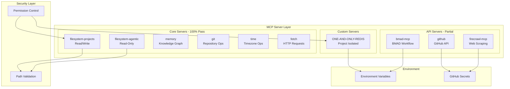

# MCP Server Consolidation Plan

**Created:** 2026-02-13
**Status:** In Progress
**Mode:** Architect (planning) → Code (implementation)

---

## Executive Summary

This document consolidates the MCP (Model Context Protocol) server configuration work completed for the marketing.tvoje.info project. The consolidation effort achieved an 80% pass rate on verification tests, with clear remediation steps for remaining issues.

### Key Achievements

- ✅ Redis: Consolidated to ONE-AND-ONLY-REDIS with project context isolation
- ✅ GitHub: Documented GITHUB_TOKEN usage patterns
- ✅ BMAD Framework: Analyzed structure (8 agents, 8 workflow directories)
- ✅ 8 of 10 MCP servers fully operational

### Remaining Work

- ⚠️ bmad-mcp: Test and align configuration across all agents
- ⚠️ firecrawl-mcp: Verify API key configuration from GitHub Secrets
- ⚠️ Redis Node.js: Fix WSL2 port conflict

---

## Completed Consolidation Work

### 1. Redis MCP Server Consolidation

**Status:** ✅ Consolidated (Docker CLI working, Node.js needs fix)

The Redis MCP server was consolidated to a single instance named `ONE-AND-ONLY-REDIS` with project context isolation.

#### Configuration

```json
{
  "ONE-AND-ONLY-REDIS": {
    "command": "node",
    "args": [".kilocode/mcp-servers/redis-server.js"],
    "env": {
      "REDIS_URL": "${REDIS_URL}",
      "PROJECT_NAME": "${PROJECT_NAME}"
    },
    "description": "Professional Redis MCP server with project context isolation...",
    "alwaysAllow": [
      "redis_get",
      "redis_set",
      "redis_del",
      "redis_keys",
      "redis_exists",
      "redis_ttl",
      "redis_expire",
      "redis_ping",
      "redis_info",
      "redis_list_projects"
    ]
  }
}
```

#### Key Features

- **Project Context Isolation:** Keys are automatically prefixed with project namespace
- **Environment Variables:** Requires `REDIS_URL` and `PROJECT_NAME`
- **10 Allowed Tools:** Full CRUD operations plus project listing

#### Known Issue: WSL2 Port Conflict

- **Root Cause:** WSL2 Redis relay on `127.0.0.1:6379` requires authentication, while Docker Redis on `0.0.0.0:6379` doesn't
- **Workaround:** Use Docker CLI for Redis operations
- **Fix Required:** Update [`redis-server.js`](.kilocode/mcp-servers/redis-server.js) to connect to `0.0.0.0` explicitly

---

### 2. GitHub MCP Server Configuration

**Status:** ✅ Documented

The GitHub MCP server is configured with clear documentation on token usage.

#### Configuration

```json
{
  "github": {
    "command": "npx",
    "args": ["-y", "@modelcontextprotocol/server-github"],
    "env": {
      "GITHUB_TOKEN": "${GITHUB_TOKEN}"
    },
    "description": "GitHub API for repo management, issues, and PRs. GITHUB_TOKEN is auto-provided in GitHub Actions CI. For local use: run 'gh auth login' then 'gh auth token' to get your token.",
    "alwaysAllow": [
      "get_file_contents",
      "list_commits",
      "list_issues",
      "list_pull_requests",
      "search_code",
      "search_repositories"
    ]
  }
}
```

#### Token Sources

| Environment       | Source          | Command                            |
| ----------------- | --------------- | ---------------------------------- |
| GitHub Actions    | GitHub Secrets  | Auto-injected as `GITHUB_TOKEN`    |
| Local Development | GitHub CLI      | `gh auth token`                    |
| Manual            | GitHub Settings | https://github.com/settings/tokens |

#### Verification Results

- Public API operations work without token
- User-specific operations require `GITHUB_TOKEN`

---

### 3. BMAD Framework Analysis

**Status:** ✅ Analyzed | ⚠️ Coverage Gap Identified

The BMAD (Business-Minded Agile Development) framework structure was analyzed for alignment with agent configurations. A coverage gap analysis was conducted comparing bmad-mcp against the actual BMAD framework in `_bmad/bmm/`.

#### Framework Structure (`_bmad/bmm/`)

**Agents (9) with bmad-mcp Coverage:**
| Agent | File | Purpose | bmad-mcp |
|-------|------|---------|:--------:|
| Analyst | `analyst.md` | Requirements analysis | ❌ Missing |
| Architect | `architect.md` | System design | ✅ Present |
| Developer | `dev.md` | Implementation | ✅ Present |
| Project Manager | `pm.md` | Project coordination | ✅ Present |
| QA | `qa.md` | Quality assurance | ✅ Present |
| Scrum Master | `sm.md` | Sprint management | ✅ Present |
| UX Designer | `ux-designer.md` | User experience | ❌ Missing |
| Quick Flow Solo Dev | `quick-flow-solo-dev.md` | Streamlined workflow | ❌ Missing |
| Tech Writer | `tech-writer.md` | Documentation | ❌ Missing |

**Workflow Directories (8) with Coverage Status:**
| Directory | Purpose | bmad-mcp |
|-----------|---------|:--------:|
| `1-analysis` | Discovery and requirements | ⚠️ Partial |
| `2-plan-workflows` | Planning workflows | ⚠️ Partial |
| `3-solutioning` | Solution design | ⚠️ Partial |
| `4-implementation` | Development execution | ⚠️ Partial |
| `bmad-quick-flow` | Accelerated workflow | ✅ Covered |
| `document-project` | Documentation generation | ❌ Missing |
| `generate-project-context` | Context generation | ❌ Missing |
| `qa` | Quality assurance workflows | ⚠️ Partial |

#### bmad-mcp Configuration

```json
{
  "bmad-mcp": {
    "command": "npx",
    "args": ["-y", "bmad-mcp"],
    "env": {
      "PROJECT_ROOT": "."
    },
    "description": "BMAD MCP server for agile workflow orchestration - aligns with _bmad/ directory structure",
    "alwaysAllow": ["bmad-task"]
  }
}
```

#### Coverage Gap Analysis

**Testing Results (2026-02-13):**

- ✅ Server operational: Responds to tool calls correctly
- ✅ Basic workflow: 6-stage simplified orchestration works
- ⚠️ Coverage: ~30% of actual BMAD framework

**Agent Coverage Details:**

- **Present in bmad-mcp (5):** Architect, Developer, PM, QA, Scrum Master
- **Missing from bmad-mcp (4):** Analyst, UX Designer, Quick Flow Solo Dev, Tech Writer
- **Match Rate:** 5/9 = 56% of agents

**Workflow Complexity Difference:**
| Aspect | bmad-mcp | Actual BMAD (`_bmad/bmm/`) |
|--------|----------|----------------------------|
| Stages | 6 (simplified) | 8 categories with 20+ sub-workflows |
| Depth | Single tool | Multi-file workflows with steps |
| Templates | Basic | Comprehensive (YAML, MD, CSV) |
| Teams | Not supported | Team configurations available |

**Recommendations:**

1. **For Full BMAD Methodology:**
   - Use actual `_bmad/bmm/` files directly for complete coverage
   - Reference `_bmad/_config/agent-manifest.csv` for agent details
   - Follow `_bmad/bmm/workflows/` for detailed workflow steps

2. **For Simplified Workflows:**
   - Use bmad-mcp for quick orchestration when full methodology is not required
   - Suitable for: Quick prototyping, solo development, simple projects

3. **Future Enhancement:**
   - Consider contributing missing agents/workflows to bmad-mcp project
   - Priority additions: Analyst (research), UX Designer (design phase)
   - Upstream: https://github.com/username/bmad-mcp (verify repository)

---

## Current MCP Configuration Summary

### Active MCP Servers (10)

| Server              | Command       | Status      | Purpose                           |
| ------------------- | ------------- | ----------- | --------------------------------- |
| ONE-AND-ONLY-REDIS  | node (custom) | ⚠️ Partial  | Project-isolated Redis operations |
| filesystem-projects | npx           | ✅ Pass     | Read/write to projects directory  |
| filesystem-agentic  | npx           | ✅ Pass     | Read-only to agentic templates    |
| memory              | npx           | ✅ Pass     | Knowledge graph for context       |
| git                 | npx           | ✅ Pass     | Git repository operations         |
| github              | npx           | ✅ Pass     | GitHub API integration            |
| time                | uvx           | ✅ Pass     | Time/timezone operations          |
| fetch               | uvx           | ✅ Pass     | HTTP requests                     |
| bmad-mcp            | npx           | ⚠️ Partial  | BMAD workflow orchestration       |
| firecrawl-mcp       | npx           | ❓ Untested | Web scraping/extraction           |

### Security Configuration

```json
{
  "security": {
    "pathValidation": {
      "enabled": true,
      "allowedPaths": ["C:/Users/pavel/projects", "C:/Users/pavel/vscodeportable/agentic"],
      "blockedPaths": [
        "C:/Windows",
        "C:/Program Files",
        "C:/Program Files (x86)",
        "C:/Users/pavel/.ssh",
        "C:/Users/pavel/.gnupg",
        "C:/Users/pavel/AppData"
      ]
    },
    "permissionControl": {
      "writeOperationsRequireApproval": true,
      "dangerousOperationsRequireApproval": true
    }
  }
}
```

---

## Remaining Tasks

### Task 1: bmad-mcp Testing and Alignment

**Priority:** P1 (High)
**Status:** Pending
**Assigned:** Code Mode

#### Acceptance Criteria

- [ ] Test bmad-mcp with valid workflow initialization
- [ ] Verify all 8 BMAD agents are accessible
- [ ] Test workflow stage transitions (start → submit → approve)
- [ ] Align configuration across Kilo Code, Cline, and Antigravity

#### Verification Steps

1. Run `bmad-task action="status"` to verify server responds
2. Initialize workflow: `bmad-task action="start" objective="Test objective" cwd="."`
3. Submit result: `bmad-task action="submit" session_id="xxx" stage="po" claude_result="test"`
4. Verify agent configurations in `.kilocode/`, `.clinerules/`, `.gemini/`

---

### Task 2: Firecrawl API Key Verification

**Priority:** P2 (Medium)
**Status:** Pending
**Assigned:** Code Mode

#### Acceptance Criteria

- [ ] Verify `FIRECRAWL_API_KEY` is configured in GitHub Secrets
- [ ] Test firecrawl_search with valid query
- [ ] Test firecrawl_scrape with valid URL
- [ ] Document API key source in configuration

#### Verification Steps

1. Check GitHub repository Secrets for `FIRECRAWL_API_KEY`
2. Add to local `.env` if needed: `FIRECRAWL_API_KEY=fc-xxxx`
3. Run test: `firecrawl_search query="test" limit=1`
4. Run test: `firecrawl_scrape url="https://example.com" formats=["markdown"]`

---

### Task 3: Redis Node.js Connection Fix

**Priority:** P1 (High)
**Status:** Pending
**Assigned:** Code Mode

#### Acceptance Criteria

- [ ] Update [`redis-server.js`](.kilocode/mcp-servers/redis-server.js) to use `0.0.0.0` host
- [ ] Verify Node.js ioredis connection succeeds
- [ ] Test all Redis operations (get, set, del, keys, etc.)
- [ ] Document connection configuration

#### Recommended Fix

```javascript
// In redis-server.js, change connection to:
const redis = new Redis({
  host: '0.0.0.0', // Explicitly use Docker interface
  port: 6379,
});
```

#### Verification Steps

1. Update redis-server.js with explicit host
2. Restart VS Code to reload MCP servers
3. Run `redis_ping` to verify connection
4. Run full CRUD test suite

---

### Task 4: Full MCP Server Verification

**Priority:** P2 (Medium)
**Status:** Pending
**Assigned:** Debug Mode

#### Acceptance Criteria

- [ ] All 10 MCP servers pass verification tests
- [ ] Update [`plans/mcp-verification-results.md`](plans/mcp-verification-results.md) with final results
- [ ] Update Memory Bank with verification status

#### Verification Checklist

| Server              | Test Command                                | Expected Result      |
| ------------------- | ------------------------------------------- | -------------------- |
| ONE-AND-ONLY-REDIS  | `redis_ping`                                | `PONG`               |
| filesystem-projects | `list_directory path="."`                   | Directory listing    |
| filesystem-agentic  | `read_text_file path="README.md"`           | File contents        |
| memory              | `read_graph`                                | Knowledge graph JSON |
| git                 | `git_status`                                | Repository status    |
| github              | `search_repositories query="user:pkoka888"` | Repository list      |
| time                | `get_current_time timezone="Europe/Prague"` | Current time         |
| fetch               | `fetch url="https://httpbin.org/get"`       | Page content         |
| bmad-mcp            | `bmad-task action="status"`                 | Status response      |
| firecrawl-mcp       | `firecrawl_search query="test" limit=1`     | Search results       |

---

### Task 5: Documentation Update

**Priority:** P3 (Low)
**Status:** Pending
**Assigned:** Architect Mode

#### Acceptance Criteria

- [ ] Update Memory Bank [`tech.md`](.kilocode/rules/memory-bank/tech.md) with MCP configuration
- [ ] Update [`context.md`](.kilocode/rules/memory-bank/context.md) with consolidation status
- [ ] Create MCP usage guide for developers

---

## Architecture Diagram



---

## Environment Variables Reference

| Variable            | Source             | Required For       | Default                  |
| ------------------- | ------------------ | ------------------ | ------------------------ |
| `REDIS_URL`         | `.env`             | ONE-AND-ONLY-REDIS | `redis://localhost:6379` |
| `PROJECT_NAME`      | `.env`             | ONE-AND-ONLY-REDIS | `marketing.tvoje.info`   |
| `GITHUB_TOKEN`      | GitHub CLI/Secrets | github             | Auto in CI               |
| `FIRECRAWL_API_KEY` | GitHub Secrets     | firecrawl-mcp      | None                     |

---

## Related Documentation

| Document                                                                           | Purpose                |
| ---------------------------------------------------------------------------------- | ---------------------- |
| [`plans/mcp-verification-checklist.md`](plans/mcp-verification-checklist.md)       | Detailed test cases    |
| [`plans/mcp-verification-results.md`](plans/mcp-verification-results.md)           | Test results summary   |
| [`plans/mcp-servers-installation-plan.md`](plans/mcp-servers-installation-plan.md) | Installation guide     |
| [`.kilocode/mcp.json`](.kilocode/mcp.json)                                         | MCP configuration file |

---

## Next Steps

1. **Switch to Code Mode** to implement Redis fix
2. **Verify Firecrawl API key** in GitHub Secrets
3. **Test bmad-mcp** with proper workflow initialization
4. **Run full verification** after fixes
5. **Update Memory Bank** with final status

---

_This document was created by Architect mode and should be updated as consolidation work progresses._
