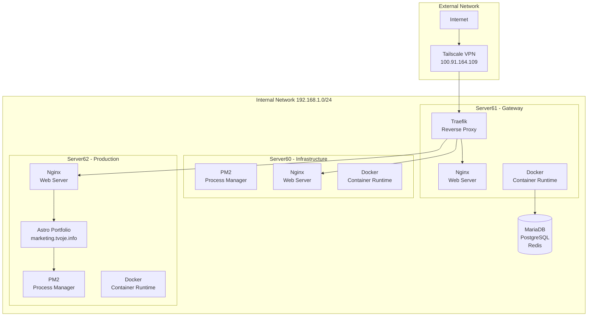
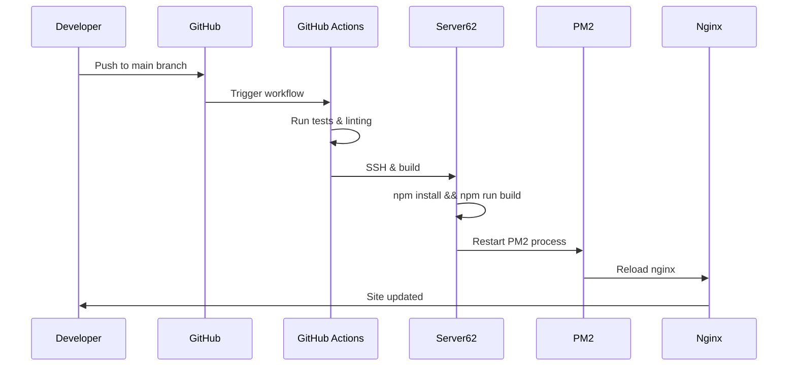

# Server Infrastructure & Deployment Manual

**Project:** marketing.tvoje.info
**Repository:** <https://github.com/pkoka888/marketing.tvoje.info>
**Last Updated:** 2026-02-19
**Version:** 1.0

---

## Table of Contents

1. [Server Architecture Overview](#1-server-architecture-overview)
2. [Access Methods & Credentials](#2-access-methods--credentials)
3. [Deployment Workflow](#3-deployment-workflow)
4. [Service Inventory Per Server](#4-service-inventory-per-server)
5. [Security Configuration](#5-security-configuration)
6. [Monitoring & Logging](#6-monitoring--logging)
7. [Troubleshooting Guide](#7-troubleshooting-guide)
8. [Important Warnings](#8-important-warnings)

---

## 1. Server Architecture Overview

### 1.1 Network Topology



### 1.2 Server Inventory

| Server       | Hostname | IP Address   | Purpose            | Primary Services                                                 |
| ------------ | -------- | ------------ | ------------------ | ---------------------------------------------------------------- |
| **Server60** | server60 | 192.168.1.60 | Infrastructure/VPS | PM2, Nginx, Docker                                               |
| **Server61** | server61 | 192.168.1.61 | Gateway/Traefik    | Traefik, MariaDB, PostgreSQL, Redis, PHP, GitLab Runner, Netdata |
| **Server62** | server62 | 192.168.1.62 | Production/Web     | PM2, Nginx, Docker, Portfolio                                    |

### 1.3 Application Stack

| Layer           | Technology     | Version |
| --------------- | -------------- | ------- |
| Framework       | Astro          | 5.0     |
| Styling         | Tailwind CSS   | 4.0     |
| Language        | TypeScript     | 5.7+    |
| Runtime         | Node.js        | 20+     |
| OS              | Debian         | 13      |
| Process Manager | PM2            | Latest  |
| Web Server      | Nginx          | Latest  |
| SSL/TLS         | Let's Encrypt  | -       |
| CI/CD           | GitHub Actions | -       |

---

## 2. Access Methods & Credentials

### 2.1 Network Access

| Method               | Status     | Notes                             |
| -------------------- | ---------- | --------------------------------- |
| **Tailscale VPN**    | ✅ Primary | 100.91.164.109/32 - Most reliable |
| **Internal Network** | ✅ Backup  | 192.168.1.0/24 fallback           |
| **Direct Public IP** | ❌ Blocked | ISP/Router issues                 |

### 2.2 SSH Configuration

| Property                     | Value         |
| ---------------------------- | ------------- |
| **User**                     | admin         |
| **Auth Method**              | SSH key-based |
| **Primary Port (Tailscale)** | 20            |
| **Internal Port Server60**   | 2260          |
| **Internal Port Server61**   | 2261          |
| **Internal Port Server62**   | 2262          |

### 2.3 Connecting to Servers

```bash
# Via Tailscale (Primary - Recommended)
ssh admin@192.168.1.60 -p 20  # Server60
ssh admin@192.168.1.61 -p 20  # Server61
ssh admin@192.168.1.62 -p 20  # Server62

# Via Internal Network (Backup)
ssh admin@192.168.1.60 -p 2260  # Server60
ssh admin@192.168.1.61 -p 2261  # Server61
ssh admin@192.168.1.62 -p 2262  # Server62
```

### 2.4 SSH Hardening Features

- Key-based authentication enabled
- Root login disabled
- Modern ciphers configured
- Fail2ban installed (2026-02-12)

---

## 3. Deployment Workflow

### 3.1 CI/CD Pipeline Overview



### 3.2 Deployment Steps

#### Automated Deployment (via GitHub Actions)

1. **Push to main branch** triggers `.github/workflows/deploy.yml`
2. **GitHub Actions** runs:
   - `npm install`
   - `npm run build` (outputs to `dist/`)
   - SSH to Server62
   - Copy dist/ contents to `/var/www/portfolio/`
   - Restart PM2 process

#### Manual Deployment

```bash
# On Server62
cd /var/www/portfolio

# Pull latest changes
git pull origin main

# Install dependencies
npm install

# Build production
npm run build

# Restart PM2
pm2 restart portfolio

# Verify status
pm2 status
```

### 3.3 PM2 Ecosystem Configuration

Location: `/var/www/portfolio/ecosystem.config.js`

```javascript
module.exports = {
  apps: [
    {
      name: 'portfolio',
      script: 'npm',
      args: 'start',
      cwd: '/var/www/portfolio',
      instances: 1,
      autorestart: true,
      watch: false,
      max_memory_restart: '500M',
      env: {
        NODE_ENV: 'production',
        PORT: 4321,
      },
    },
  ],
};
```

### 3.4 Nginx Configuration

- Document root: `/var/www/portfolio/dist/`
- SSL: Let's Encrypt certificates
- Configuration: `/etc/nginx/sites-available/portfolio`

---

## 4. Service Inventory Per Server

### 4.1 Server60 - Infrastructure/VPS

| Service | Status     | Purpose                   |
| ------- | ---------- | ------------------------- |
| PM2     | ✅ Running | Process manager           |
| Nginx   | ✅ Running | Web server                |
| Docker  | ✅ Running | Container runtime         |
| Node.js | ✅ Running | Runtime environment (20+) |

### 4.2 Server61 - Gateway/Traefik ⚠️

| Service       | Status             | Purpose               |
| ------------- | ------------------ | --------------------- |
| Traefik       | ✅ Running         | Reverse proxy/gateway |
| Nginx         | ✅ Running         | Web server            |
| Docker        | ✅ Running         | Container runtime     |
| MariaDB       | ✅ Running 11.8.3  | Primary database      |
| PostgreSQL    | ✅ Running 17      | Secondary database    |
| Redis         | ✅ Running         | Cache/session store   |
| PHP           | ✅ Running 8.3 FPM | PHP runtime           |
| GitLab Runner | ✅ Running         | CI/CD runner          |
| Netdata       | ✅ Running         | System monitoring     |
| Tinyproxy     | ✅ Running         | Proxy service         |

#### ⚠️ Failed Containers (Known Issues)

| Container         | Status          | Notes   |
| ----------------- | --------------- | ------- |
| dash-prometheus-1 | ❌ Exited (255) | 7+ days |
| dash-grafana-1    | ❌ Exited (255) | 7+ days |
| dash-redis-1      | ❌ Exited (255) | 7+ days |

### 4.3 Server62 - Production/Web

| Service | Status         | Purpose                     |
| ------- | -------------- | --------------------------- |
| PM2     | ✅ Running     | Process manager (portfolio) |
| Nginx   | ✅ Running     | Web server                  |
| Docker  | ✅ Running     | Container runtime           |
| Node.js | ✅ Running 20+ | Runtime environment         |

---

## 5. Security Configuration

### 5.1 Firewall Status

| Firewall | Status        | Servers     |
| -------- | ------------- | ----------- |
| UFW      | ✅ Active     | All servers |
| iptables | ✅ Configured | All servers |
| Fail2ban | ✅ Installed  | All servers |

### 5.2 SSH Hardening

- Key-based authentication: ✅ Enabled
- Root login: ❌ Disabled
- Password authentication: ❌ Disabled
- Modern ciphers: ✅ Configured

### 5.3 Network Security

- **Tailscale VPN**: Primary access method (encrypted)
- **Internal Network**: 192.168.1.0/24 (isolated)
- **Direct Public IP**: Blocked (ISP issues)

### 5.4 Security Best Practices

1. **Never expose SSH directly** - Always use Tailscale or internal network
2. **Keep secrets in .env** - Never commit secrets to git
3. **Use fail2ban** - Monitors for brute force attacks
4. **Regular updates** - Keep system packages updated
5. **SSL/TLS only** - All traffic encrypted via Let's Encrypt

---

## 6. Monitoring & Logging

### 6.1 Log Locations

| Log Type     | Path                            | Server   |
| ------------ | ------------------------------- | -------- |
| Nginx Access | `/var/log/nginx/access.log`     | All      |
| Nginx Error  | `/var/log/nginx/error.log`      | All      |
| PM2 Logs     | `/var/www/portfolio/.pm2/logs/` | Server62 |
| SSH Auth     | `/var/log/auth.log`             | All      |
| System       | `/var/log/syslog`               | All      |

### 6.2 Monitoring Commands

```bash
# PM2 Process Monitoring
pm2 status
pm2 logs portfolio --lines 50
pm2 monit

# System Resources
htop
free -h
df -h
docker ps

# Nginx Status
nginx -t
systemctl status nginx

# Service Status
systemctl status <service-name>
```

### 6.3 Netdata (Server61)

- Access: <http://192.168.1.61:19999>
- Provides real-time system metrics

---

## 7. Troubleshooting Guide

### 7.1 Common Issues

#### Site Not Loading

```bash
# Check PM2 status
pm2 status

# Restart portfolio
pm2 restart portfolio

# Check nginx
nginx -t
systemctl restart nginx

# Check logs
pm2 logs portfolio --err --lines 20
tail -f /var/log/nginx/error.log
```

#### Deployment Fails

```bash
# Check disk space
df -h

# Check Node version
node -v

# Manual build test
cd /var/www/portfolio
npm run build

# Check PM2 logs
pm2 logs portfolio --lines 50
```

#### SSH Connection Issues

```bash
# Test Tailscale connection
tailscale status

# Test internal network
ping 192.168.1.62

# Check SSH service
systemctl status sshd
```

#### Database Connection Issues

```bash
# MariaDB
mysql -u root -p -e "SHOW DATABASES;"

# PostgreSQL
psql -U postgres -l

# Redis
redis-cli ping
```

### 7.2 Service Recovery Commands

```bash
# Restart all services on Server62
pm2 restart all
systemctl restart nginx
systemctl restart docker

# Check container health
docker ps -a
docker logs <container-name>

# Full system restart (use with caution)
reboot
```

---

## 8. Important Warnings

### ⚠️ CRITICAL: Server61 Disk Space Issue

**DO NOT ATTEMPT TO FIX THE DISK ISSUE ON SERVER61**

**Status:** Server61 disk usage at **88%**

**Rule:** Document only - never attempt remediation

**Rationale:**

- This is a known infrastructure issue
- Requires careful planning before action
- Risk of data loss if handled incorrectly
- Manual intervention needed by infrastructure owner only

**What to do instead:**

- Document the issue
- Note impact on services
- Monitor but do not act
- Escalate to infrastructure team

### ⚠️ Failed Monitoring Containers

The following containers on Server61 have failed and are in exited state:

- dash-prometheus-1
- dash-grafana-1
- dash-redis-1

**Impact:** Dashboard monitoring stack is unavailable

**Recommendation:** Do not attempt to restart - these require disk space remediation first

### ⚠️ General Warnings

1. **Never restart Server61 without planning** - Many critical services
2. **Backup before any changes** - Always create backups
3. **Test in development first** - Never test on production
4. **Document all changes** - Keep audit trail
5. **Use Tailscale for access** - Most reliable method

---

## Appendix A: Quick Reference Commands

### Server Connection

```bash
# Quick connect shortcuts (add to ~/.ssh/config)
Host server60
    HostName 192.168.1.60
    Port 20
    User admin

Host server61
    HostName 192.168.1.61
    Port 20
    User admin

Host server62
    HostName 192.168.1.62
    Port 20
    User admin
```

### Common Commands

```bash
# Deployment
pm2 restart portfolio

# Logs
pm2 logs portfolio --lines 100

# Status
pm2 status
nginx -t
docker ps

# Disk
df -h
```

---

## Appendix B: Related Documentation

| Document          | Location                                  |
| ----------------- | ----------------------------------------- |
| Security Audit    | `SERVER62_SECURITY_AUDIT.md`              |
| Deployment Guide  | `SERVER62_DEPLOYMENT_GUIDE.md`            |
| NAT Analysis      | `NAT_ANALYSIS.md`                         |
| Infrastructure KB | `SERVER_INFRASTRUCTURE_KNOWLEDGE_BASE.md` |
| GitHub Actions    | `.github/workflows/deploy.yml`            |
| PM2 Config        | `ecosystem.config.js`                     |

---

_This manual is maintained for project orchestrators. Update this document when infrastructure changes occur._
